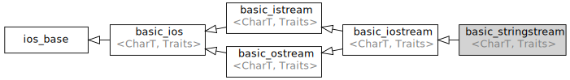

# C++ stringstream 简单使用

## 简介

`stringstream` 定义于头文件 `<sstream>`，它其实是个别名，具体定义如下：

```cpp
typedef basic_stringstream<char> stringstream;
```

类模板 `std::basic_stringstream` 实现基于字符串的流上的输入与输出操作。它等效地存储一个 `std::basic_string` 的实例，并在其上进行输入与输出操作。继承图如下：



## 简单使用

### 构造函数

`stringstream`  的构造函数有很多，这里列举最为常用的两个构造函数：

1. 创建一个对象，向对象输入字符串：

```cpp
stringstream ss;
ss << str;
```

2. 在创建对象的时候使用字符串初始化：

```cpp
streamstring ss(str);
```

两种方式都可以创建对象，但创建后的对象用法不一样，详见后面的示例。

### 输出字符串

`stringstream`  可以将存储于内部的字符串输出，需要调用 `str()` 函数，不可直接输出：

```cpp
std::cout << ss.str() << std::endl;

// std::cout << ss << std::endl; 		// 错误不可直接输出
```

## 示例

### 两种构造函数带来的不同

上面阐述了两种构造函数，利用不同的构造函数创建对象，对象具体的操作也不同：

1. 第一种构造方式

```cpp
#include <iostream>
#include <sstream>
using namespace std;

int main()
{
    stringstream ss1;
    ss1 << "fre";
    ss3 << "gre";
    cout << ss1.str() << endl;
    
    return 0;
}

/*
输出：
fregre
*/
```

2. 第二种构造方式

```cpp
#include <iostream>
#include <sstream>
using namespace std;

int main()
{
    string str("asd");
    stringstream ss2(str);
    cout << ss2.str() << endl;

    ss2 << "r";
    cout << ss2.str() << endl;

    ss2 << "13";
    cout << ss2.str() << endl;

    ss2 << "hy";
    cout << ss2.str() << endl;
    
    return 0;
}

/*
输出：
asd
rsd
r13
r13hy
*/
```

可以发现，利用第一种构造函数创建对象时，输入字符串后直接进行字符串拼接，**而第二种构造方式，在进行字符串拼接时，首先把原本的字符串覆盖掉，之后再进行拼接。**

如果不想原来的字符串被覆盖，则需要换一种构造方式，如下：

```cpp
#include <iostream>
#include <sstream>
using namespace std;

int main()
{
    ostringstream ss("1 2 3 4 ", std::ios_base::ate);	// append 方式追加
    cout << ss.str() << endl;

    ss << "5 3 4";
    cout << ss.str() << endl;
    
    return 0;
}
/*
输出：
1 2 3 4 
1 2 3 4 5 3 4
*/
```

### 修改、清空 streamstring 内容

`streamstring` 的内容可以通过 `str()` 函数进行修改、清空：

```cpp
#include <iostream>
#include <sstream>
using namespace std;

int main()
{
    stringstream ss("fghewoo");
    cout << ss.str() << endl;

    // 修改内容
    ss.str("123456");
    cout << ss.str() << endl;

    // 清空内容
    ss.str("");
    cout << ss.str() << endl;

    return 0;
}

/*
输出：
fghewoo
123456

*/
```

### 利用 streamstring 去除字符串空格

`streamstring ` 默认是以空格来分割字符串的，利用 `streamstring` 去除字符串空格非常方便：

```cpp
#include <iostream>
#include <sstream>
using namespace std;

int main()
{
    stringstream ss("2 dfjho 43");
    cout << ss.str() << endl;
    
	cout<< endl;
    
    string str;
    while (ss >> str)
    {
        cout << str << endl;
    }
    
    return 0;
}

/*
输出：
2 dfjho 43

2 
dfjho 
43
*/
```

### 利用 streamstring 指定字符分割字符串

上面描述了利用 `streamstring` 去除字符串空格，其实就是利用空格来分割字符串，同样，也可以指定其他字符对字符串进行分割，这需要与 `getline()` 函数搭配使用，下面以逗号分割字符串为例：

```cpp
#include <iostream>
#include <sstream>
using namespace std;

int main()
{
    string source = "abc,123,<!>";
    stringstream ss(source);
    cout << ss.str() << endl;
    
	cout<< endl;

    string str;
    while (getline(ss, str, ','))
    {
        cout << str << endl;
    }

    return 0;
}

/*
输出：
abc,123,<!>

abc
123
<!>
*/
```

上述代码以逗号作为分割依据来分割字符串，同样的还可以扩展到其他字符。


**以上几个示例非常实用，如果能够熟练使用将会大大提高编码效率，后续再遇到什么实用的例子继续更新~~**