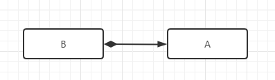
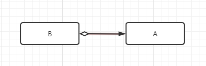

# 类和对象

## 第四节 类与类之间的组合关系与委托关系

### 组合关系

组合关系（复合关系）：Composition

**组合：一个类的定义中含有其他类类型成员变量。**

#### has - a 关系

has - a 关系也称 is - part - of 关系。

```cpp
class A {};

class B {
public:
    ...
private: 
    A a;	// 含有 A 类的对象
};
```

#### is - implemented - in - terms - of 关系

is - implemented - in - terms - of 关系是指通过包含其他类来实现自己。典型的例子就是 STL 中的容器适配器 stack 和 queue，他们内部包函了一个 deque 对象，通过调用 deque 对象的方法来实现自己的功能。

### 委托关系

委托关系也称聚合关系，一个类中包含另一个类的指针。

```cpp
class A {};

class B {
public:
    ...
private: 
    A* a;	// 含有 A 类的指针类型
};
```

**总结：**

==**组合关系中，两个类对象的生命周期相同。委托关系中，两个类对象生命周期没有关联。**==

### UML类图

**组合关系：**



**委托关系：**

