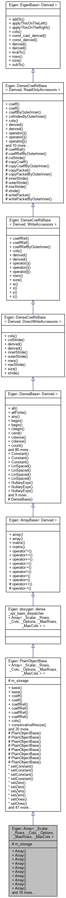

# Array

[密集矩阵和数组操作](https://eigen.tuxfamily.org/dox/group__DenseMatrixManipulation__chapter.html)»[参考](https://eigen.tuxfamily.org/dox/group__DenseMatrixManipulation__Reference.html)»[核心模块](https://eigen.tuxfamily.org/dox/group__Core__Module.html)

## 详细说明

```cpp
template<typename _Scalar, int _Rows, int _Cols, int _Options, int _MaxRows, int _MaxCols> 
class Eigen::Array< _Scalar, _Rows, _Cols, _Options, _MaxRows, _MaxCols >
```

具有简单 API 的通用数组，用于系数操作。

Array 类与[Matrix](https://eigen.tuxfamily.org/dox/classEigen_1_1Matrix.html)类非常相似。它提供通用的一维和二维数组。Array 和 Matrix 类之间的区别主要在于 API：Array 类的 API 提供了对系数操作的轻松访问，而 Matrix 类的 API 提供了对线性代数运算的轻松访问。

有关模板参数存储布局的详细信息，请参阅[Matrix](https://eigen.tuxfamily.org/dox/classEigen_1_1Matrix.html)类的文档。

通过定义预处理器符号，可以在[扩展 MatrixBase（和其他类）](https://eigen.tuxfamily.org/dox/TopicCustomizing_Plugins.html)页面上描述的插件机制的帮助下[扩展此类](https://eigen.tuxfamily.org/dox/TopicCustomizing_Plugins.html)`EIGEN_ARRAY_PLUGIN`。

- 也可以看看

    [Array 类和系数操作](https://eigen.tuxfamily.org/dox/group__TutorialArrayClass.html)，[类层次结构](https://eigen.tuxfamily.org/dox/TopicClassHierarchy.html)



## 成员函数

### 构造函数（11个）

1. 默认构造函数

```cpp
template<typename _Scalar , int _Rows, int _Cols, int _Options, int _MaxRows, int _MaxCols>
Eigen::Array< _Scalar, _Rows, _Cols, _Options, _MaxRows, _MaxCols >::Array()    
    
/*
对于固定大小的矩阵，什么都不做。

对于动态大小的矩阵，创建一个大小为 0 的空矩阵。不分配任何数组。这样的矩阵称为空矩阵。此构造函数是创建空矩阵的独特方法：不支持将矩阵大小调整为 0。
*/    
```

2. 

```cpp
template<typename _Scalar , int _Rows, int _Cols, int _Options, int _MaxRows, int _MaxCols>
template<typename... ArgTypes>
Eigen::Array< _Scalar, _Rows, _Cols, _Options, _MaxRows, _MaxCols >::Array(	
    const Scalar & 	a0,
	const Scalar & 	a1,
	const Scalar & 	a2,
	const Scalar & 	a3,
	const ArgTypes &... 	args 
)	

/*
Example: 
Array<int, 1, 6> a(1, 2, 3, 4, 5, 6);
Array<int, 3, 1> b {1, 2, 3};
cout << a << "\n\n" << b << endl;

Output:
1 2 3 4 5 6

1
2
3
*/
```

3. 

```cpp
template<typename _Scalar , int _Rows, int _Cols, int _Options, int _MaxRows, int _MaxCols>
Eigen::Array< _Scalar, _Rows, _Cols, _Options, _MaxRows, _MaxCols >::Array(	
    const std::initializer_list< std::initializer_list< Scalar >> & list)	

/*

构造一个数组并从作为按行分组的初始化列表给出的系数初始化它。[c++11]
在一般情况下，构造函数接受一个行列表，每一行表示为一个系数列表：

Example: 
ArrayXXi a {
  {1, 2, 3},
  {3, 4, 5}
};
cout << a << endl;

Output:
1 2 3
3 4 5

每个内部初始化列表必须包含完全相同数量的元素，否则会触发断言。
在编译时列一维数组的情况下，允许从单行进行隐式转置。因此Array<int,Dynamic,1>{{1,2,3,4,5}}是合法的，Array<int,Dynamic,1>{{1},{2},{3},{4},{5}}可以避免更冗长的语法：

例子：

Array<int, Dynamic, 1> v {{1, 2, 3, 4, 5}};
cout << v << endl;

输出：

1 
2 
3 
4 
5
对于固定大小的数组，初始化器列表大小必须与数组大小完全匹配，并且仅对编译时一维数组允许隐式转置。
*/    
```

4. 

```cpp
template<typename _Scalar , int _Rows, int _Cols, int _Options, int _MaxRows, int _MaxCols>
Eigen::Array< _Scalar, _Rows, _Cols, _Options, _MaxRows, _MaxCols >::Array(Index dim)	

/*
构造具有给定维度的向量或行向量。这仅适用于向量（行向量或列向量），即在编译时已知具有一行或一列的矩阵。

请注意，这仅对动态大小的向量有用。对于固定大小的向量，这里传递维度是多余的，因此使用默认构造函数Array()更有意义。
*/
```

5. 

```cpp
template<typename _Scalar , int _Rows, int _Cols, int _Options, int _MaxRows, int _MaxCols>
Eigen::Array< _Scalar, _Rows, _Cols, _Options, _MaxRows, _MaxCols >::Array(const Scalar& value)	

// 用给定的系数构造一个初始化的 1x1数组    
```

6. 

```cpp
template<typename _Scalar , int _Rows, int _Cols, int _Options, int _MaxRows, int _MaxCols>
Eigen::Array< _Scalar, _Rows, _Cols, _Options, _MaxRows, _MaxCols >::Array(Index rows, Index cols)	

/*
构建带有一个未初始化的阵列的rows行和cols列。
这对于动态大小的数组很有用。对于固定大小的数组，传递这些参数是多余的，因此应该使用默认构造函数Array()代替。
*/
```

7. 

```cpp
Eigen::Array< _Scalar, _Rows, _Cols, _Options, _MaxRows, _MaxCols >::Array(	
    const Scalar& val0,
    const Scalar& val1)
    
// 构造一个具有给定系数的初始化二维向量    
```

8. 

```cpp
template<typename _Scalar , int _Rows, int _Cols, int _Options, int _MaxRows, int _MaxCols>
Eigen::Array< _Scalar, _Rows, _Cols, _Options, _MaxRows, _MaxCols >::Array(	
    const Scalar& val0,
    const Scalar& val1,
    const Scalar& val2)	
    
// 构造一个具有给定系数的初始化 3D 向量
```

9. 

```cpp
template<typename _Scalar , int _Rows, int _Cols, int _Options, int _MaxRows, int _MaxCols>
Eigen::Array< _Scalar, _Rows, _Cols, _Options, _MaxRows, _MaxCols >::Array(	
    const Scalar& val0,
    const Scalar& val1,
    const Scalar& val2,
    const Scalar& val3)
// 构造一个具有给定系数的初始化 4D 向量
```

10. 拷贝构造函数

```cpp
template<typename _Scalar , int _Rows, int _Cols, int _Options, int _MaxRows, int _MaxCols>
Eigen::Array< _Scalar, _Rows, _Cols, _Options, _MaxRows, _MaxCols >::Array(	
    const Array< _Scalar, _Rows, _Cols, _Options, _MaxRows, _MaxCols > & other)
```

11. 

```cpp
template<typename _Scalar , int _Rows, int _Cols, int _Options, int _MaxRows, int _MaxCols>
template<typename OtherDerived >
Eigen::Array< _Scalar, _Rows, _Cols, _Options, _MaxRows, _MaxCols >::Array(
    const EigenBase< OtherDerived >& other,
    typename internal::enable_if< internal::is_convertible< typename OtherDerived::Scalar, Scalar >::value, PrivateType >::type = PrivateType() 
)	
```

### coeff()

```cpp
// 这是DenseCoeffsBase<Derived,ReadOnlyAccessors>::coeff(Index) const的重载版本，用于绕过表达式的求值器的创建，从而节省编译工作。 
template<typename _Scalar , int _Rows, int _Cols, int _Options, int _MaxRows, int _MaxCols>
const Scalar& Eigen::PlainObjectBase< Derived >::coeff
    
    
// 这是DenseCoeffsBase<Derived,ReadOnlyAccessors>::coeff(Index,Index) const的重载版本，用于绕过表达式的求值器的创建，从而节省编译工作。   
template<typename _Scalar , int _Rows, int _Cols, int _Options, int _MaxRows, int _MaxCols>
const Scalar& Eigen::PlainObjectBase< Derived >::coeff
```

### coeffRef()

```cpp
//这是 DenseCoeffsBase<Derived,WriteAccessors>::coeffRef(Index) const 的重载版本，用于绕过表达式的求值器的创建，从而节省编译工作。
template<typename _Scalar , int _Rows, int _Cols, int _Options, int _MaxRows, int _MaxCols>
Scalar& Eigen::PlainObjectBase< Derived >::coeffRef
    

// 这是coeffRef(Index)的常量版本，因此是 coeff(Index) 的同义词。提供它是为了方便。
template<typename _Scalar , int _Rows, int _Cols, int _Options, int _MaxRows, int _MaxCols>
const Scalar& Eigen::PlainObjectBase< Derived >::coeffRef

    
// 这是 DenseCoeffsBase<Derived,WriteAccessors>::coeffRef(Index,Index) const 的重载版本，用于绕过表达式的求值器的创建，从而节省编译工作。
template<typename _Scalar , int _Rows, int _Cols, int _Options, int _MaxRows, int _MaxCols>
Scalar& Eigen::PlainObjectBase< Derived >::coeffRef

    
// 这是coeffRef(Index,Index)的常量版本，因此是 coeff(Index,Index) 的同义词。提供它是为了方便。
template<typename _Scalar , int _Rows, int _Cols, int _Options, int _MaxRows, int _MaxCols>
const Scalar& Eigen::PlainObjectBase< Derived >::coeffRef
```

### operator=()

```cpp
// 这是模板化 operator= 的一个特例。其目的是防止默认 operator= 隐藏模板化 operator=
template<typename _Scalar , int _Rows, int _Cols, int _Options, int _MaxRows, int _MaxCols>
Array& Eigen::Array< _Scalar, _Rows, _Cols, _Options, _MaxRows, _MaxCols >::operator=(	
    const Array< _Scalar, _Rows, _Cols, _Options, _MaxRows, _MaxCols >& other)	

/*    
将表达式other的值复制到*this自动调整大小中。
*这可能会调整大小以匹配其他. 如果 *this 是一个空矩阵（尚未初始化），它将被初始化。
请注意，允许将行向量复制到向量中（反之亦然）。然后以适当的方式调整大小（如果有），以便行向量仍然是行向量，而向量仍然是向量。
*/
template<typename _Scalar , int _Rows, int _Cols, int _Options, int _MaxRows, int _MaxCols>
template<typename OtherDerived >
Array& Eigen::Array< _Scalar, _Rows, _Cols, _Options, _MaxRows, _MaxCols >::operator=(	
    const DenseBase< OtherDerived >& other)	


// 使用Base::operator=的用法；在 MSVC 上失败。由于下面的代码适用于 GCC 和 MSVC，我们跳过了“使用”的用法。这应该只对 operator= 执行  
template<typename _Scalar , int _Rows, int _Cols, int _Options, int _MaxRows, int _MaxCols>
template<typename OtherDerived >
Array& Eigen::Array< _Scalar, _Rows, _Cols, _Options, _MaxRows, _MaxCols >::operator=(	
    const EigenBase< OtherDerived >& other)	
 

// 将所有条目设置为value    
template<typename _Scalar , int _Rows, int _Cols, int _Options, int _MaxRows, int _MaxCols>
Array& Eigen::Array< _Scalar, _Rows, _Cols, _Options, _MaxRows, _MaxCols >::operator=(	
    const Scalar& value)	   
```

