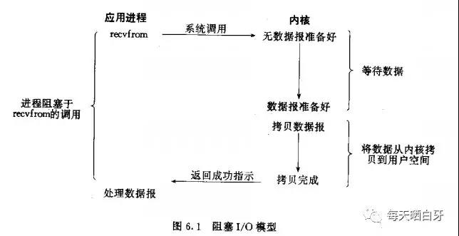
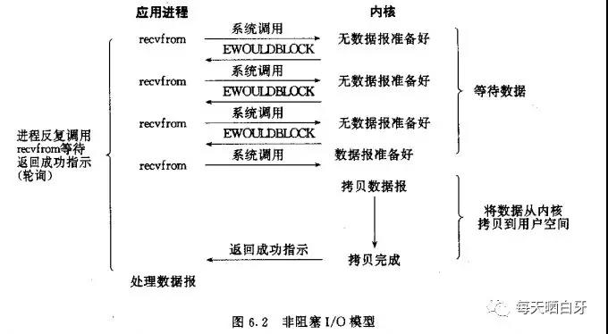
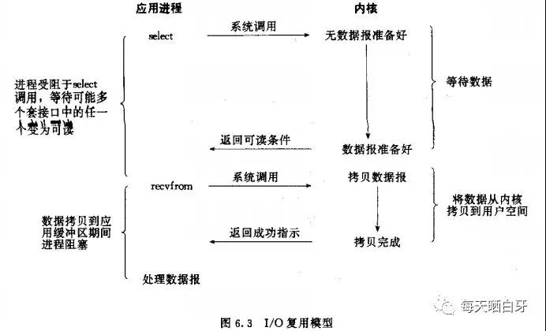
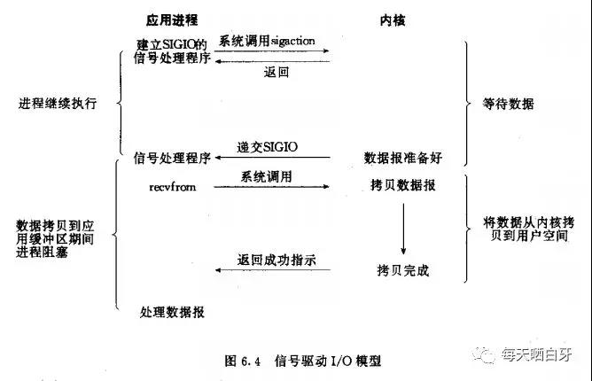
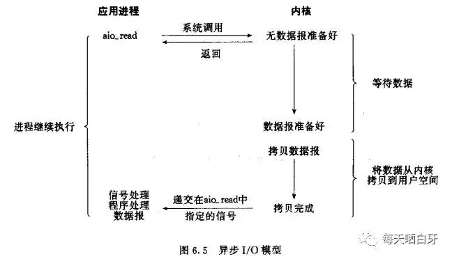
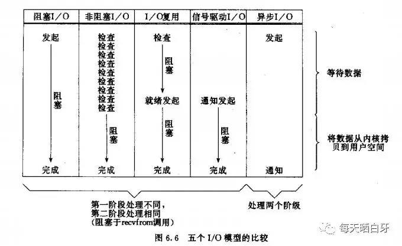

# 五大 IO 模型

> 面试的时候也许你被问到过 IO 模型，可能你知道有五种，可是却不一定能准确指出他们之间的关系，下面我们介绍下这五种 IO 模型

## 五种 IO 模型

1. 阻塞 IO
2. 非阻塞 IO
3. IO 复用（ select 和 poll ）
4. 信号驱动
5. 异步 IO（Posix.1 的 aio...系列函数）

**备注**

> 一个输入操作一般分为两个阶段：
>
> 1. 等待数据准备好
> 2. 把数据从内核拷贝到进程
>
> 一个套接字的输入操作，第一步是等待数据到达网络，当分组到达时，它被拷贝到内核中的某个缓冲区，第二步是将数据从内核缓冲区拷贝到应用缓冲区

那我们来分别看下这五种 IO 模型

### 阻塞 IO 模型

阻塞 IO 是最通用的 IO 模型，使用该模型接收数据时，在数据没有到之前程序会一直等待。例如函数 recvfrom，内核会一直阻塞该请求直到有数据到才返回，如下图所示：

如上图所示，进程在调用 recvfrom 时，该系统调用直到数据到达且拷贝到应用缓冲区或出错才返回。那阻塞的时间就是从调用 recvfrom 开始到返回的这段时间，当进程返回成功指示时，应用进程开始处理数据报。

### 非阻塞 IO 模型

当把套接字设置成非阻塞方式时，即通知内核：当请求的 IO 操作非得让进程睡眠不能完成时，不要让进程睡眠，而应返回一个错误，直到数据准备好，并将数据拷贝到应用缓冲区返回成功指示，进程调用结束。如下图所示：

从图中我们可以看出，进程会反复调用 recvfrom，前三次调用一直没有数据返回，因此立即返回一个 EWOULDBLOCK 错误，在第四次调用的时候，数据才准备好，并拷贝到了应用缓冲区，recvfrom 返回成功指示，然后就时进程处理数据

> 当一个应用进程像这样对一个非阻塞描述字循环调用 recvfrom 时，我们称之为**轮询**。应用进程连续不断的查询内核，验证某操作是否准备好，这样会极大的浪费 CPU 的时间

### IO 复用模型

**IO 复用模型支持调用 select 或 poll，会阻塞在 select 或 poll 上，而不是阻塞于真正的 IO 系统调用。**阻塞在 select 调用，等待数据报套接口可读。当 select 返回套接口可读条件时，再调用 recvfrom 将数据拷贝到应用缓冲区。如下入所示：

通过阻塞 IO 模型和 IO 复用模型的对比，我们发现由之前的一次系统调用变成了两次系统调用，好像变差了，其实并没有，**select 可以等待多个描述字准备好，同时 select 可以设置超时时间。**

### 信号驱动 IO 模型

信号驱动 IO 是让内核在描述字准备好时用信号 SIGIO 通知我们。首先允许套接口进行信号驱动 IO，然后通过系统调用 sigacation 安装信号处理程序。此系统调用立即返回，进程继续工作，是**非阻塞**的。当数据报准备好被读时，为该进程生成一个 SIGIO 信号，随后在信号处理程序中调用 recvfrom 读取数据报，并通知主循环数据已经准备好被处理或者通知主循环让它来读取数据报，如下图所示：

### 异步IO模型

异步 IO 让内核启动操作，并在**整个操作完成后**（包括将数据从内核拷贝到用户空间）通知我们。如下图所示：

异步 IO 模型和信号驱动 IO 模型的主要区别是：==信号驱动 IO 是由内核通知我们**何时启动** IO 操作，而异步 IO 是由内核通知我们 IO 操作**何时完成**。==

## 五种 IO 模型的对比

通过上面对五种 IO 模型的介绍，我们发现前四种 IO 模型的主要区别点在于第一阶段，第二阶段基本相同：在数据从内核拷贝到调用者的缓冲区时，进程阻塞在 recvfrom 调用。异步 IO 模型的两个阶段是和前四种不同的，对比如下图所示：

我们发现五种 IO 模型没有提到同步 IO 模型，却提到了异步 IO 模型，这是为什么？

首先我们看下 Posix 对同步 IO 和异步 IO 的定义：

> 同步 IO 操作引起请求进程阻塞，直到 IO 操作完成
>
> 异步 IO 操作不引起请求进程阻塞

### 同步/异步

> 针对的对象是被调用者的情况

- 同步

  指的是被调用者在被调用后，操作完函数所包含的所有动作后，再返回返回值

- 异步

  指的是被调用者在被调用后，先返回返回值，然后再进行函数所包含的其他动作。

我们可以发现，根据上面的定义，前四种模式：**阻塞 IO 模型、非阻塞 IO 模型、IO 多路复用模型和信号驱动模型，其实都属于同步 IO 模型**，因为他们四个都会经历真正的 IO 操作（recvfrom）且阻塞了进程，只有异步 IO 模型与异步 IO 的定义匹配。

同步 IO 和异步 IO 的区别就在于第二个步骤是否阻塞，如果实际的 IO 读写阻塞请求进程，那么就是同步 IO；如果不阻塞，而是操作系统帮你做完 IO 操作再将结果返回给你，那么就是异步 IO。