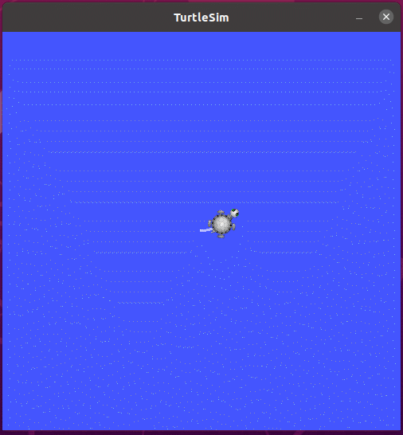
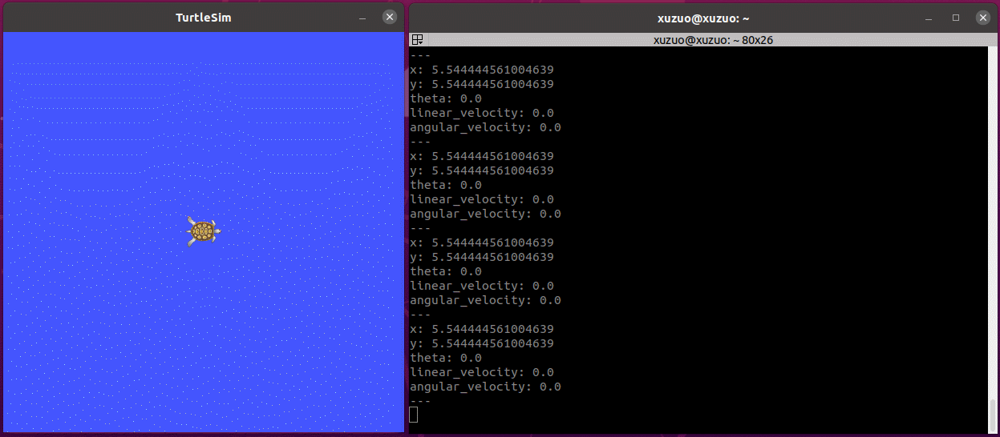
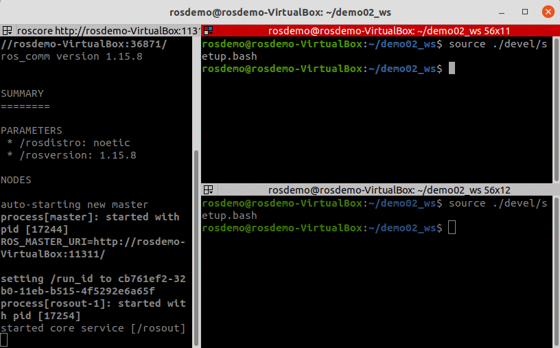
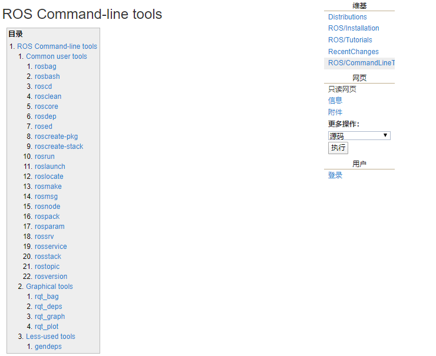
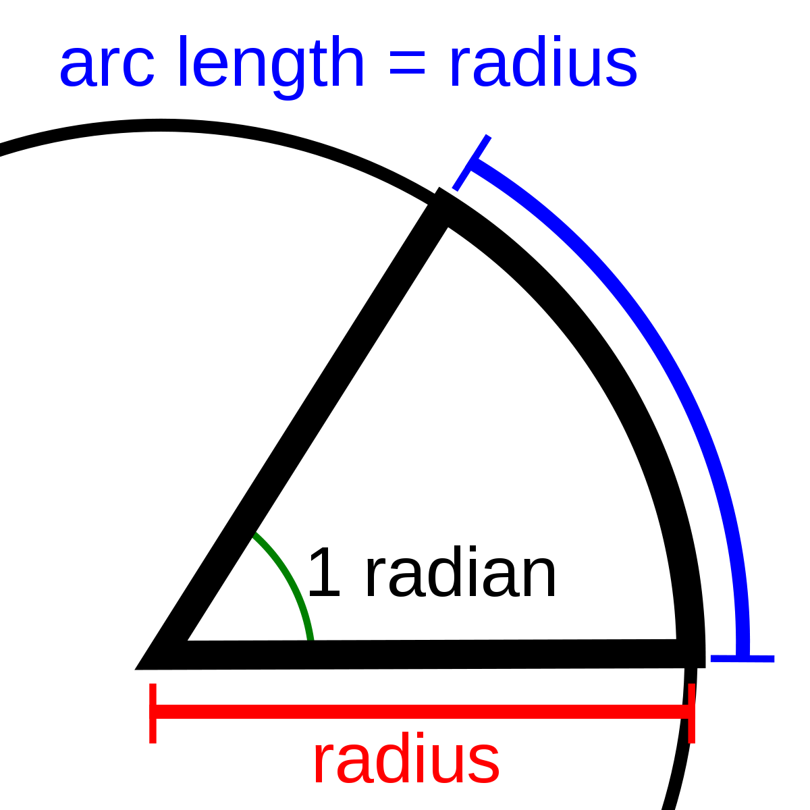
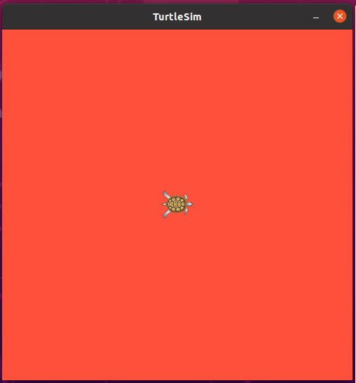

# ROS理论与实践

# 第 2 章 ROS通信机制

机器人是一种高度复杂的系统性实现，在机器人上可能集成各种传感器(雷达、摄像头、GPS...)以及运动控制实现，为了解耦合，在ROS中每一个功能点都是一个单独的进程，每一个进程都是独立运行的。更确切的讲，**ROS是进程（也称为*Nodes*）**的分布式框架。 因为这些进程甚至还可分布于不同主机，不同主机协同工作，从而分散计算压力。不过随之也有一个问题: 不同的进程是如何通信的？也即不同进程间如何实现数据交换的？在此我们就需要介绍一下ROS中的通信机制了。

ROS 中的基本通信机制主要有如下三种实现策略:

- 话题通信(发布订阅模式)
- 服务通信(请求响应模式)
- 参数服务器(参数共享模式)

本章的主要内容就是是介绍各个通信机制的应用场景、理论模型、代码实现以及相关操作命令。本章预期达成学习目标如下:

- 能够熟练介绍ROS中常用的通信机制
- 能够理解ROS中每种通信机制的理论模型
- 能够以代码的方式实现各种通信机制对应的案例
- 能够熟练使用ROS中的一些操作命令
- 能够独立完成相关实操案例

案例演示:

1.话题演示案例:

控制小乌龟做圆周运动



获取乌龟位姿



2.服务演示案例:在指定位置生成乌龟


3.参数演示案例:改变乌龟窗口的背景颜色


## 2.1 话题通信

话题通信是ROS中使用频率最高的一种通信模式，话题通信是基于**发布订阅**模式的，也即:一个节点发布消息，另一个节点订阅该消息。话题通信的应用场景也极其广泛，比如下面一个常见场景:

> 机器人在执行导航功能，使用的传感器是激光雷达，机器人会采集激光雷达感知到的信息并计算，然后生成运动控制信息驱动机器人底盘运动。

在上述场景中，就不止一次使用到了话题通信。

- 以激光雷达信息的采集处理为例，在 ROS 中有一个节点需要时时的发布当前雷达采集到的数据，导航模块中也有节点会订阅并解析雷达数据。
- 再以运动消息的发布为例，导航模块会根据传感器采集的数据时时的计算出运动控制信息并发布给底盘，底盘也可以有一个节点订阅运动信息并最终转换成控制电机的脉冲信号。

以此类推，像雷达、摄像头、GPS.... 等等一些传感器数据的采集，也都是使用了话题通信，换言之，话题通信适用于不断更新的数据传输相关的应用场景。

------

#### **概念**

以发布订阅的方式实现不同节点之间数据交互的通信模式。

#### **作用**

用于不断更新的、少逻辑处理的数据传输场景。

#### **案例**

1.实现最基本的发布订阅模型，发布方以固定频率发送一段文本，订阅方接收文本并输出。(2.1.2 -- 2.1.3)


2.实现对自定义消息的发布与订阅。(2.1.4 -- 2.1.6)


------

**另请参考:**

- [http://wiki.ros.org/ROS/Tutorials/CreatingMsgAndSrv](http://www.autolabor.com.cn/book/ROSTutorials/di-2-zhang-ros-jia-gou-she-ji/22hua-ti-tong-xin.html#)
- [http://wiki.ros.org/ROS/Tutorials/WritingPublisherSubscriber%28c%2B%2B%29](http://www.autolabor.com.cn/book/ROSTutorials/di-2-zhang-ros-jia-gou-she-ji/22hua-ti-tong-xin.html#)
- [http://wiki.ros.org/ROS/Tutorials/WritingPublisherSubscriber%28python%29](http://www.autolabor.com.cn/book/ROSTutorials/di-2-zhang-ros-jia-gou-she-ji/22hua-ti-tong-xin.html#)

### 2.1.1 理论模型

话题通信实现模型是比较复杂的，该模型如下图所示,该模型中涉及到三个角色:

- ROS Master (管理者)
- Talker (发布者)
- Listener (订阅者)

ROS Master 负责保管 Talker 和 Listener 注册的信息，并匹配话题相同的 Talker 与 Listener，帮助 Talker 与 Listener 建立连接，连接建立后，Talker 可以发布消息，且发布的消息会被 Listener 订阅。

整个流程由以下步骤实现:

#### 0.Talker注册

Talker启动后，会通过RPC在 ROS Master 中注册自身信息，其中包含所发布消息的话题名称。ROS Master 会将节点的注册信息加入到注册表中。

#### 1.Listener注册

Listener启动后，也会通过RPC在 ROS Master 中注册自身信息，包含需要订阅消息的话题名。ROS Master 会将节点的注册信息加入到注册表中。

#### 2.ROS Master实现信息匹配

ROS Master 会根据注册表中的信息匹配Talker 和 Listener，并通过 RPC 向 Listener 发送 Talker 的 RPC 地址信息。

#### 3.Listener向Talker发送请求

Listener 根据接收到的 RPC 地址，通过 RPC 向 Talker 发送连接请求，传输订阅的话题名称、消息类型以及通信协议(TCP/UDP)。

#### 4.Talker确认请求

Talker 接收到 Listener 的请求后，也是通过 RPC 向 Listener 确认连接信息，并发送自身的 TCP 地址信息。

#### 5.Listener与Talker件里连接

Listener 根据步骤4 返回的消息使用 TCP 与 Talker 建立网络连接。

#### 6.Talker向Listener发送消息

连接建立后，Talker 开始向 Listener 发布消息。

> 注意1:上述实现流程中，前五步使用的 RPC协议，最后两步使用的是 TCP 协议
>
> 注意2: Talker 与 Listener 的启动无先后顺序要求
>
> 注意3: Talker 与 Listener 都可以有多个
>
> 注意4: Talker 与 Listener 连接建立后，不再需要 ROS Master。也即，即便关闭ROS Master，Talker 与 Listern 照常通信。

### 2.1.2 话题通信基本操作A(C++)

**需求:**

> 编写发布订阅实现，要求发布方以10HZ(每秒10次)的频率发布文本消息，订阅方订阅消息并将消息内容打印输出。

**分析:**

在模型实现中，ROS master 不需要实现，而连接的建立也已经被封装了，需要关注的关键点有三个:

1. 发布方
2. 接收方
3. 数据(此处为普通文本)

**流程:**

1. 编写发布方实现；
2. 编写订阅方实现；
3. 编辑配置文件；
4. 编译并执行。

#### 1.发布方

```cpp
/*
    需求: 实现基本的话题通信，一方发布数据，一方接收数据，
         实现的关键点:
         1.发送方
         2.接收方
         3.数据(此处为普通文本)

         PS: 二者需要设置相同的话题


    消息发布方:
        循环发布信息:HelloWorld 后缀数字编号

    实现流程:
        1.包含头文件 
        2.初始化 ROS 节点:命名(唯一)
        3.实例化 ROS 句柄
        4.实例化 发布者 对象
        5.组织被发布的数据，并编写逻辑发布数据

*/
// 1.包含头文件 
#include "ros/ros.h"
#include "std_msgs/String.h" //普通文本类型的消息
#include <sstream>

int main(int argc, char  *argv[])
{   
    //设置编码
    setlocale(LC_ALL,"");

    //2.初始化 ROS 节点:命名(唯一)
    // 参数1和参数2 后期为节点传值会使用
    // 参数3 是节点名称，是一个标识符，需要保证运行后，在 ROS 网络拓扑中唯一
    ros::init(argc,argv,"talker");
    //3.实例化 ROS 句柄
    ros::NodeHandle nh;//该类封装了 ROS 中的一些常用功能

    //4.实例化 发布者 对象
    //泛型: 发布的消息类型
    //参数1: 要发布到的话题
    //参数2: 队列中最大保存的消息数，超出此阀值时，先进的先销毁(时间早的先销毁)
    ros::Publisher pub = nh.advertise<std_msgs::String>("chatter",10);

    //5.组织被发布的数据，并编写逻辑发布数据
    //数据(动态组织)
    std_msgs::String msg; 
    // msg.data = "你好啊！！！";
    std::string msg_front = "Hello 你好！"; //消息前缀
    int count = 0; //消息计数器

    //逻辑(一秒10次)
    ros::Rate r(1);

    //节点不死
    while (ros::ok())
    {
        //使用 stringstream 拼接字符串与编号
        std::stringstream ss;
        ss << msg_front << count;
        msg.data = ss.str();
        //发布消息
        pub.publish(msg);
        //加入调试，打印发送的消息
        ROS_INFO("发送的消息:%s",msg.data.c_str());

        //根据前面制定的发送贫频率自动休眠 休眠时间 = 1/频率；
        r.sleep();
        count++;//循环结束前，让 count 自增
        //暂无应用
        ros::spinOnce();
    }
    return 0;
}
```

#### 2.订阅方

```cpp
/*
    需求: 实现基本的话题通信，一方发布数据，一方接收数据，
         实现的关键点:
         1.发送方
         2.接收方
         3.数据(此处为普通文本)


    消息订阅方:
        订阅话题并打印接收到的消息

    实现流程:
        1.包含头文件 
        2.初始化 ROS 节点:命名(唯一)
        3.实例化 ROS 句柄
        4.实例化 订阅者 对象
        5.处理订阅的消息(回调函数)
        6.设置循环调用回调函数

*/
// 1.包含头文件 
#include "ros/ros.h"
#include "std_msgs/String.h"

void doMsg(const std_msgs::String::ConstPtr& msg_p){
    ROS_INFO("我听见:%s",msg_p->data.c_str());
    // ROS_INFO("我听见:%s",(*msg_p).data.c_str());
}
int main(int argc, char  *argv[])
{
    setlocale(LC_ALL,"");
    //2.初始化 ROS 节点:命名(唯一)
    ros::init(argc,argv,"listener");
    //3.实例化 ROS 句柄
    ros::NodeHandle nh;

    //4.实例化 订阅者 对象
    ros::Subscriber sub = nh.subscribe<std_msgs::String>("chatter",10,doMsg);
    //5.处理订阅的消息(回调函数)

    //     6.设置循环调用回调函数
    ros::spin();//循环读取接收的数据，并调用回调函数处理

    return 0;
}
```

#### 3.配置 CMakeLists.txt

```cmake
add_executable(Hello_pub
  src/Hello_pub.cpp
)
add_executable(Hello_sub
  src/Hello_sub.cpp
)

target_link_libraries(Hello_pub
  ${catkin_LIBRARIES}
)
target_link_libraries(Hello_sub
  ${catkin_LIBRARIES}
)
```

#### 4.执行

1.启动 roscore;

2.启动发布节点;

3.启动订阅节点。

运行结果与引言部分的演示案例1类似。

#### 5.注意

补充0:

vscode 中的 main 函数 声明 int main(int argc, char const *argv[]){}，默认生成 argv 被 const 修饰，需要去除该修饰符

补充1:

ros/ros.h No such file or directory .....

检查 CMakeList.txt find_package 出现重复,删除内容少的即可

参考资料:https://answers.ros.org/question/237494/fatal-error-rosrosh-no-such-file-or-directory/

补充2:

find_package 不添加一些包，也可以运行啊， ros.wiki 答案如下

```
You may notice that sometimes your project builds fine even if you did not call find_package with all dependencies. This is because catkin combines all your projects into one, so if an earlier project calls find_package, yours is configured with the same values. But forgetting the call means your project can easily break when built in isolation.
```

补充3:

订阅时，第一条数据丢失

原因: 发送第一条数据时， publisher 还未在 roscore 注册完毕

解决: 注册后，加入休眠 ros::Duration(3.0).sleep(); 延迟第一条数据的发送

------

PS：可以使用 rqt_graph 查看节点关系。

### 2.1.3 话题通信基本操作B(Python)

**需求:**

> 编写发布订阅实现，要求发布方以10HZ(每秒10次)的频率发布文本消息，订阅方订阅消息并将消息内容打印输出。

**分析:**

在模型实现中，ROS master 不需要实现，而连接的建立也已经被封装了，需要关注的关键点有三个:

1. 发布方
2. 接收方
3. 数据(此处为普通文本)

**流程:**

1. 编写发布方实现；
2. 编写订阅方实现；
3. 为python文件添加可执行权限；
4. 编辑配置文件；
5. 编译并执行。

#### 1.发布方

```python
#! /usr/bin/env python
"""
    需求: 实现基本的话题通信，一方发布数据，一方接收数据，
         实现的关键点:
         1.发送方
         2.接收方
         3.数据(此处为普通文本)

         PS: 二者需要设置相同的话题


    消息发布方:
        循环发布信息:HelloWorld 后缀数字编号

    实现流程:
        1.导包 
        2.初始化 ROS 节点:命名(唯一)
        3.实例化 发布者 对象
        4.组织被发布的数据，并编写逻辑发布数据


"""
#1.导包 
import rospy
from std_msgs.msg import String

if __name__ == "__main__":
    #2.初始化 ROS 节点:命名(唯一)
    rospy.init_node("talker_p")
    #3.实例化 发布者 对象
    pub = rospy.Publisher("chatter",String,queue_size=10)
    #4.组织被发布的数据，并编写逻辑发布数据
    msg = String()  #创建 msg 对象
    msg_front = "hello 你好"
    count = 0  #计数器 
    # 设置循环频率
    rate = rospy.Rate(1)
    while not rospy.is_shutdown():

        #拼接字符串
        msg.data = msg_front + str(count)

        pub.publish(msg)
        rate.sleep()
        rospy.loginfo("写出的数据:%s",msg.data)
        count += 1
```

#### 2.订阅方

```python
#! /usr/bin/env python
"""
    需求: 实现基本的话题通信，一方发布数据，一方接收数据，
         实现的关键点:
         1.发送方
         2.接收方
         3.数据(此处为普通文本)


    消息订阅方:
        订阅话题并打印接收到的消息

    实现流程:
        1.导包 
        2.初始化 ROS 节点:命名(唯一)
        3.实例化 订阅者 对象
        4.处理订阅的消息(回调函数)
        5.设置循环调用回调函数


"""
#1.导包 
import rospy
from std_msgs.msg import String

def doMsg(msg):
    rospy.loginfo("I heard:%s",msg.data)

if __name__ == "__main__":
    #2.初始化 ROS 节点:命名(唯一)
    rospy.init_node("listener_p")
    #3.实例化 订阅者 对象
    sub = rospy.Subscriber("chatter",String,doMsg,queue_size=10)
    #4.处理订阅的消息(回调函数)
    #5.设置循环调用回调函数
    rospy.spin()
```

#### 3.添加可执行权限

终端下进入 scripts 执行:`chmod +x *.py`

#### 4.配置 CMakeLists.txt

```cmake
catkin_install_python(PROGRAMS
  scripts/talker_p.py
  scripts/listener_p.py
  DESTINATION ${CATKIN_PACKAGE_BIN_DESTINATION}
)
```

#### 5.执行

1.启动 roscore;

2.启动发布节点;

3.启动订阅节点。

运行结果与引言部分的演示案例1类似。

------

PS：可以使用 rqt_graph 查看节点关系。

### 2.1.4 话题通信自定义msg

在 ROS 通信协议中，数据载体是一个较为重要组成部分，ROS 中通过 std_msgs 封装了一些原生的数据类型,比如：String、Int32、Int64、Char、Bool、Empty.... 但是，这些数据一般只包含一个 data 字段，结构的单一意味着功能上的局限性，当传输一些复杂的数据，比如: 激光雷达的信息... std_msgs 由于描述性较差而显得力不从心，这种场景下可以使用自定义的消息类型

msgs 只是简单的文本文件，每行具有字段类型和字段名称，可以使用的字段类型有：

- int8, int16, int32, int64 (或者无符号类型: uint*)
- float32, float64
- string
- time, duration
- other msg files
- variable-length array[] and fixed-length array[C]

ROS 中还有一种特殊类型：`Header`，标头包含时间戳和 ROS 中常用的坐标帧信息。会经常看到 msg 文件的第一行具有`Header标头`。

------

**需求:**创建自定义消息，该消息包含人的信息:姓名、身高、年龄等。

**流程:**

1. 按照固定格式创建 msg 文件
2. 编辑配置文件
3. 编译生成可以被 Python 或 C++ 调用的中间文件

#### 1.定义msg文件

功能包下新建 msg 目录，添加文件 Person.msg

```cpp
string name
uint16 age
float64 height
```

#### 2.编辑配置文件

**package.xml**中添加编译依赖与执行依赖

```xml
  <build_depend>message_generation</build_depend>
  <exec_depend>message_runtime</exec_depend>
  <!-- 
  exce_depend 以前对应的是 run_depend 现在非法
  -->
```

**CMakeLists.txt** 编辑 msg 相关配置

```cmake
find_package(catkin REQUIRED COMPONENTS
  roscpp
  rospy
  std_msgs
  message_generation
)
# 需要加入 message_generation,必须有 std_msgs
## 配置 msg 源文件
add_message_files(
  FILES
  Person.msg
)
# 生成消息时依赖于 std_msgs
generate_messages(
  DEPENDENCIES
  std_msgs
)
#执行时依赖
catkin_package(
#  INCLUDE_DIRS include
#  LIBRARIES demo02_talker_listener
  CATKIN_DEPENDS roscpp rospy std_msgs message_runtime
#  DEPENDS system_lib
)
```

#### 3.编译

**编译后的中间文件查看:**

C++ 需要调用的中间文件(.../工作空间/devel/include/包名/xxx.h)

.PNG)

Python 需要调用的中间文件(.../工作空间/devel/lib/python3/dist-packages/包名/msg)

.PNG)

后续调用相关 msg 时，是从这些中间文件调用的

### 2.1.5 话题通信自定义msg调用A(C++)

**需求:**

> 编写发布订阅实现，要求发布方以10HZ(每秒10次)的频率发布自定义消息，订阅方订阅自定义消息并将消息内容打印输出。

**分析:**

在模型实现中，ROS master 不需要实现，而连接的建立也已经被封装了，需要关注的关键点有三个:

1. 发布方
2. 接收方
3. 数据(此处为自定义消息)

**流程:**

1. 编写发布方实现；
2. 编写订阅方实现；
3. 编辑配置文件；
4. 编译并执行。

#### 0.vscode 配置

为了方便代码提示以及避免误抛异常，需要先配置 vscode，将前面生成的 head 文件路径配置进 c_cpp_properties.json 的 includepath属性:

```json
{
    "configurations": [
        {
            "browse": {
                "databaseFilename": "",
                "limitSymbolsToIncludedHeaders": true
            },
            "includePath": [
                "/opt/ros/noetic/include/**",
                "/usr/include/**",
                "/xxx/yyy工作空间/devel/include/**" //配置 head 文件的路径 
            ],
            "name": "ROS",
            "intelliSenseMode": "gcc-x64",
            "compilerPath": "/usr/bin/gcc",
            "cStandard": "c11",
            "cppStandard": "c++17"
        }
    ],
    "version": 4
}
```

#### 1.发布方

```cpp
/*
    需求: 循环发布人的信息

*/

#include "ros/ros.h"
#include "demo02_talker_listener/Person.h"

int main(int argc, char *argv[])
{
    setlocale(LC_ALL,"");

    //1.初始化 ROS 节点
    ros::init(argc,argv,"talker_person");

    //2.创建 ROS 句柄
    ros::NodeHandle nh;

    //3.创建发布者对象
    ros::Publisher pub = nh.advertise<demo02_talker_listener::Person>("chatter_person",1000);

    //4.组织被发布的消息，编写发布逻辑并发布消息
    demo02_talker_listener::Person p;
    p.name = "sunwukong";
    p.age = 2000;
    p.height = 1.45;

    ros::Rate r(1);
    while (ros::ok())
    {
        pub.publish(p);
        p.age += 1;
        ROS_INFO("我叫:%s,今年%d岁,高%.2f米", p.name.c_str(), p.age, p.height);

        r.sleep();
        ros::spinOnce();
    }


    return 0;
}
```

#### 2.订阅方

```cpp
/*
    需求: 订阅人的信息

*/

#include "ros/ros.h"
#include "demo02_talker_listener/Person.h"

void doPerson(const demo02_talker_listener::Person::ConstPtr& person_p){
    ROS_INFO("订阅的人信息:%s, %d, %.2f", person_p->name.c_str(), person_p->age, person_p->height);
}

int main(int argc, char *argv[])
{   
    setlocale(LC_ALL,"");

    //1.初始化 ROS 节点
    ros::init(argc,argv,"listener_person");
    //2.创建 ROS 句柄
    ros::NodeHandle nh;
    //3.创建订阅对象
    ros::Subscriber sub = nh.subscribe<demo02_talker_listener::Person>("chatter_person",10,doPerson);

    //4.回调函数中处理 person

    //5.ros::spin();
    ros::spin();    
    return 0;
}
```

#### 3.配置 CMakeLists.txt

需要添加 **add_dependencies** 用以设置所依赖的消息相关的中间文件。

```cmake
add_executable(person_talker src/person_talker.cpp)
add_executable(person_listener src/person_listener.cpp)


add_dependencies(person_talker ${PROJECT_NAME}_generate_messages_cpp)
add_dependencies(person_listener ${PROJECT_NAME}_generate_messages_cpp)


target_link_libraries(person_talker
  ${catkin_LIBRARIES}
)
target_link_libraries(person_listener
  ${catkin_LIBRARIES}
)
```

#### 4.执行

1.启动 roscore;

2.启动发布节点;

3.启动订阅节点。

运行结果与引言部分的演示案例2类似。

------

PS：可以使用 rqt_graph 查看节点关系。

### 2.1.6 话题通信自定义msg调用B(Python)

**需求:**

> 编写发布订阅实现，要求发布方以1HZ(每秒1次)的频率发布自定义消息，订阅方订阅自定义消息并将消息内容打印输出。

**分析:**

在模型实现中，ROS master 不需要实现，而连接的建立也已经被封装了，需要关注的关键点有三个:

1. 发布方
2. 接收方
3. 数据(此处为自定义消息)

**流程:**

1. 编写发布方实现；
2. 编写订阅方实现；
3. 为python文件添加可执行权限；
4. 编辑配置文件；
5. 编译并执行。

#### 0.vscode配置

为了方便代码提示以及误抛异常，需要先配置 vscode，将前面生成的 python 文件路径配置进 settings.json

```json
{
    "python.autoComplete.extraPaths": [
        "/opt/ros/noetic/lib/python3/dist-packages",
        "/xxx/yyy工作空间/devel/lib/python3/dist-packages"
    ]
}
```

#### 1.发布方

```python
#! /usr/bin/env python
"""
    发布方:
        循环发送消息

"""
import rospy
from demo02_talker_listener.msg import Person


if __name__ == "__main__":
    #1.初始化 ROS 节点
    rospy.init_node("talker_person_p")
    #2.创建发布者对象
    pub = rospy.Publisher("chatter_person",Person,queue_size=10)
    #3.组织消息
    p = Person()
    p.name = "葫芦瓦"
    p.age = 18
    p.height = 0.75

    #4.编写消息发布逻辑
    rate = rospy.Rate(1)
    while not rospy.is_shutdown():
        pub.publish(p)  #发布消息
        rate.sleep()  #休眠
        rospy.loginfo("姓名:%s, 年龄:%d, 身高:%.2f",p.name, p.age, p.height)
```

#### 2.订阅方

```python
#! /usr/bin/env python
"""
    订阅方:
        订阅消息

"""
import rospy
from demo02_talker_listener.msg import Person

def doPerson(p):
    rospy.loginfo("接收到的人的信息:%s, %d, %.2f",p.name, p.age, p.height)


if __name__ == "__main__":
    #1.初始化节点
    rospy.init_node("listener_person_p")
    #2.创建订阅者对象
    sub = rospy.Subscriber("chatter_person",Person,doPerson,queue_size=10)
    rospy.spin() #4.循环
```

#### 3.权限设置

终端下进入 scripts 执行:`chmod +x *.py`

#### 4.配置 CMakeLists.txt

```cmake
catkin_install_python(PROGRAMS
  scripts/talker_p.py
  scripts/listener_p.py
  scripts/person_talker.py
  scripts/person_listener.py
  DESTINATION ${CATKIN_PACKAGE_BIN_DESTINATION}
)
```

#### 5.执行

1.启动 roscore;

2.启动发布节点;

3.启动订阅节点。

运行结果与引言部分的演示案例2类似。

------

PS：可以使用 rqt_graph 查看节点关系。

## 2.2 服务通信

服务通信也是ROS中一种极其常用的通信模式，服务通信是基于**请求响应**模式的，是一种应答机制。也即: 一个节点A向另一个节点B发送请求，B接收处理请求并产生响应结果返回给A。比如如下场景:

> 机器人巡逻过程中，控制系统分析传感器数据发现可疑物体或人... 此时需要拍摄照片并留存。

在上述场景中，就使用到了服务通信。

- 一个节点需要向相机节点发送拍照请求，相机节点处理请求，并返回处理结果

与上述应用类似的，服务通信更适用于对时时性有要求、具有一定逻辑处理的应用场景。

------

#### **概念**

以请求响应的方式实现不同节点之间数据交互的通信模式。

#### **作用**

用于偶然的、对时时性有要求、有一定逻辑处理需求的数据传输场景。

#### 案例

实现两个数字的求和，客户端节点，运行会向服务器发送两个数字，服务器端节点接收两个数字求和并将结果响应回客户端。



------

**另请参考:**

- http://wiki.ros.org/ROS/Tutorials/CreatingMsgAndSrv
- [http://wiki.ros.org/ROS/Tutorials/WritingServiceClient%28c%2B%2B%29](http://wiki.ros.org/ROS/Tutorials/WritingServiceClient(c%2B%2B))
- [http://wiki.ros.org/ROS/Tutorials/WritingServiceClient%28python%29](http://wiki.ros.org/ROS/Tutorials/WritingServiceClient(python))

### 2.2.1 服务通信理论模型

服务通信较之于话题通信更简单些，理论模型如下图所示，该模型中涉及到三个角色:

- ROS master(管理者)
- Server(服务端)
- Client(客户端)

ROS Master 负责保管 Server 和 Client 注册的信息，并匹配话题相同的 Server 与 Client ，帮助 Server 与 Client 建立连接，连接建立后，Client 发送请求信息，Server 返回响应信息。


整个流程由以下步骤实现:

#### 0.Server注册

Server 启动后，会通过RPC在 ROS Master 中注册自身信息，其中包含提供的服务的名称。ROS Master 会将节点的注册信息加入到注册表中。

#### 1.Client注册

Client 启动后，也会通过RPC在 ROS Master 中注册自身信息，包含需要请求的服务的名称。ROS Master 会将节点的注册信息加入到注册表中。

#### 2.ROS Master实现信息匹配

ROS Master 会根据注册表中的信息匹配Server和 Client，并通过 RPC 向 Client 发送 Server 的 **TCP** 地址信息。

#### 3.Client发送请求

Client 根据步骤2 响应的信息，使用 TCP 与 Server 建立网络连接，并发送请求数据。

#### 4.Server发送响应

Server 接收、解析请求的数据，并产生响应结果返回给 Client。

> 注意:
>
> 1.客户端请求被处理时，需要保证服务器已经启动；
>
> 2.服务端和客户端都可以存在多个。

### 2.2.2 服务通信自定义srv

**需求:**

> 服务通信中，客户端提交两个整数至服务端，服务端求和并响应结果到客户端，请创建服务器与客户端通信的数据载体。

**流程:**

srv 文件内的可用数据类型与 msg 文件一致，且定义 srv 实现流程与自定义 msg 实现流程类似:

1. 按照固定格式创建srv文件
2. 编辑配置文件
3. 编译生成中间文件

#### 1.定义srv文件

服务通信中，数据分成两部分，请求与响应，在 srv 文件中请求和响应使用`---`分割，具体实现如下:

功能包下新建 srv 目录，添加 xxx.srv 文件，内容:

```python
# 客户端请求时发送的两个数字
int32 num1
int32 num2
---
# 服务器响应发送的数据
int32 sum
```

#### 2.编辑配置文件

**package.xml**中添加编译依赖与执行依赖

```xml
  <build_depend>message_generation</build_depend>
  <exec_depend>message_runtime</exec_depend>
  <!-- 
  exce_depend 以前对应的是 run_depend 现在非法
  -->
```

**CMakeLists.txt**编辑 srv 相关配置

```cmake
find_package(catkin REQUIRED COMPONENTS
  roscpp
  rospy
  std_msgs
  message_generation
)
# 需要加入 message_generation,必须有 std_msgs
add_service_files(
  FILES
  AddInts.srv
)
generate_messages(
  DEPENDENCIES
  std_msgs
)
```

注意: 官网没有在 catkin_package 中配置 message_runtime,经测试配置也可以

#### 3.编译

编译后的中间文件查看:

C++ 需要调用的中间文件(.../工作空间/devel/include/包名/xxx.h)

.PNG)

Python 需要调用的中间文件(.../工作空间/devel/lib/python3/dist-packages/包名/srv)

.PNG)

后续调用相关 srv 时，是从这些中间文件调用的

### 2.2.3 服务通信自定义srv调用A(C++)

**需求:**

> 编写服务通信，客户端提交两个整数至服务端，服务端求和并响应结果到客户端。

**分析:**

在模型实现中，ROS master 不需要实现，而连接的建立也已经被封装了，需要关注的关键点有三个:

1. 服务端
2. 客户端
3. 数据

**流程:**

1. 编写服务端实现；
2. 编写客户端实现；
3. 编辑配置文件；
4. 编译并执行。

#### 0.vscode配置

需要像之前自定义 msg 实现一样配置c_cpp_properies.json 文件，如果以前已经配置且没有变更工作空间，可以忽略，如果需要配置，配置方式与之前相同:

```json
{
    "configurations": [
        {
            "browse": {
                "databaseFilename": "",
                "limitSymbolsToIncludedHeaders": true
            },
            "includePath": [
                "/opt/ros/noetic/include/**",
                "/usr/include/**",
                "/xxx/yyy工作空间/devel/include/**" //配置 head 文件的路径 
            ],
            "name": "ROS",
            "intelliSenseMode": "gcc-x64",
            "compilerPath": "/usr/bin/gcc",
            "cStandard": "c11",
            "cppStandard": "c++17"
        }
    ],
    "version": 4
}
```

#### 1.服务端

```cpp
/*
    需求: 
        编写两个节点实现服务通信，客户端节点需要提交两个整数到服务器
        服务器需要解析客户端提交的数据，相加后，将结果响应回客户端，
        客户端再解析

    服务器实现:
        1.包含头文件
        2.初始化 ROS 节点
        3.创建 ROS 句柄
        4.创建 服务 对象
        5.回调函数处理请求并产生响应
        6.由于请求有多个，需要调用 ros::spin()

*/
#include "ros/ros.h"
#include "demo03_server_client/AddInts.h"

// bool 返回值由于标志是否处理成功
bool doReq(demo03_server_client::AddInts::Request& req,
          demo03_server_client::AddInts::Response& resp){
    int num1 = req.num1;
    int num2 = req.num2;

    ROS_INFO("服务器接收到的请求数据为:num1 = %d, num2 = %d",num1, num2);

    //逻辑处理
    if (num1 < 0 || num2 < 0)
    {
        ROS_ERROR("提交的数据异常:数据不可以为负数");
        return false;
    }

    //如果没有异常，那么相加并将结果赋值给 resp
    resp.sum = num1 + num2;
    return true;


}

int main(int argc, char *argv[])
{
    setlocale(LC_ALL,"");
    // 2.初始化 ROS 节点
    ros::init(argc,argv,"AddInts_Server");
    // 3.创建 ROS 句柄
    ros::NodeHandle nh;
    // 4.创建 服务 对象
    ros::ServiceServer server = nh.advertiseService("AddInts",doReq);
    ROS_INFO("服务已经启动....");
    //     5.回调函数处理请求并产生响应
    //     6.由于请求有多个，需要调用 ros::spin()
    ros::spin();
    return 0;
}
```

#### 2.客户端

```cpp
/*
    需求: 
        编写两个节点实现服务通信，客户端节点需要提交两个整数到服务器
        服务器需要解析客户端提交的数据，相加后，将结果响应回客户端，
        客户端再解析

    服务器实现:
        1.包含头文件
        2.初始化 ROS 节点
        3.创建 ROS 句柄
        4.创建 客户端 对象
        5.请求服务，接收响应

*/
// 1.包含头文件
#include "ros/ros.h"
#include "demo03_server_client/AddInts.h"

int main(int argc, char *argv[])
{
    setlocale(LC_ALL,"");

    // 调用时动态传值,如果通过 launch 的 args 传参，需要传递的参数个数 +3
    if (argc != 3)
    // if (argc != 5)//launch 传参(0-文件路径 1传入的参数 2传入的参数 3节点名称 4日志路径)
    {
        ROS_ERROR("请提交两个整数");
        return 1;
    }


    // 2.初始化 ROS 节点
    ros::init(argc,argv,"AddInts_Client");
    // 3.创建 ROS 句柄
    ros::NodeHandle nh;
    // 4.创建 客户端 对象
    ros::ServiceClient client = nh.serviceClient<demo03_server_client::AddInts>("AddInts");
    //等待服务启动成功
    //方式1
    ros::service::waitForService("AddInts");
    //方式2
    // client.waitForExistence();
    // 5.组织请求数据
    demo03_server_client::AddInts ai;
    ai.request.num1 = atoi(argv[1]);
    ai.request.num2 = atoi(argv[2]);
    // 6.发送请求,返回 bool 值，标记是否成功
    bool flag = client.call(ai);
    // 7.处理响应
    if (flag)
    {
        ROS_INFO("请求正常处理,响应结果:%d",ai.response.sum);
    }
    else
    {
        ROS_ERROR("请求处理失败....");
        return 1;
    }

    return 0;
}
```

#### 3.配置 CMakeLists.txt

```cmake
add_executable(AddInts_Server src/AddInts_Server.cpp)
add_executable(AddInts_Client src/AddInts_Client.cpp)


add_dependencies(AddInts_Server ${PROJECT_NAME}_gencpp)
add_dependencies(AddInts_Client ${PROJECT_NAME}_gencpp)


target_link_libraries(AddInts_Server
  ${catkin_LIBRARIES}
)
target_link_libraries(AddInts_Client
  ${catkin_LIBRARIES}
)
```

#### 4.执行

**流程:**

- 需要先启动服务:`rosrun 包名 服务`
- 然后再调用客户端 :`rosrun 包名 客户端 参数1 参数2`

**结果:**

会根据提交的数据响应相加后的结果。

**注意:**

如果先启动客户端，那么会导致运行失败

**优化:**

在客户端发送请求前添加:`client.waitForExistence();`

或:`ros::service::waitForService("AddInts");`

这是一个阻塞式函数，只有服务启动成功后才会继续执行

此处可以使用 launch 文件优化，但是需要注意 args 传参特点

### 2.2.4 服务通信自定义srv调用B(Python)

**需求:**

> 编写服务通信，客户端提交两个整数至服务端，服务端求和并响应结果到客户端。

**分析:**

在模型实现中，ROS master 不需要实现，而连接的建立也已经被封装了，需要关注的关键点有三个:

1. 服务端
2. 客户端
3. 数据

**流程:**

1. 编写服务端实现；
2. 编写客户端实现；
3. 为python文件添加可执行权限；
4. 编辑配置文件；
5. 编译并执行。

#### 0.vscode配置

需要像之前自定义 msg 实现一样配置settings.json 文件，如果以前已经配置且没有变更工作空间，可以忽略，如果需要配置，配置方式与之前相同:

```json
{
    "python.autoComplete.extraPaths": [
        "/opt/ros/noetic/lib/python3/dist-packages",
    ]
}
```

#### 1.服务端

```python
#! /usr/bin/env python
"""
    需求: 
        编写两个节点实现服务通信，客户端节点需要提交两个整数到服务器
        服务器需要解析客户端提交的数据，相加后，将结果响应回客户端，
        客户端再解析

    服务器端实现:
        1.导包
        2.初始化 ROS 节点
        3.创建服务对象
        4.回调函数处理请求并产生响应
        5.spin 函数

"""
# 1.导包
import rospy
from demo03_server_client.srv import AddInts,AddIntsRequest,AddIntsResponse
# 回调函数的参数是请求对象，返回值是响应对象
def doReq(req):
    # 解析提交的数据
    sum = req.num1 + req.num2
    rospy.loginfo("提交的数据:num1 = %d, num2 = %d, sum = %d",req.num1, req.num2, sum)

    # 创建响应对象，赋值并返回
    # resp = AddIntsResponse()
    # resp.sum = sum
    resp = AddIntsResponse(sum)
    return resp


if __name__ == "__main__":
    # 2.初始化 ROS 节点
    rospy.init_node("addints_server_p")
    # 3.创建服务对象
    server = rospy.Service("AddInts",AddInts,doReq)
    # 4.回调函数处理请求并产生响应
    # 5.spin 函数
    rospy.spin()
```

#### 2.客户端

```python
#! /usr/bin/env python

"""
    需求: 
        编写两个节点实现服务通信，客户端节点需要提交两个整数到服务器
        服务器需要解析客户端提交的数据，相加后，将结果响应回客户端，
        客户端再解析

    客户端实现:
        1.导包
        2.初始化 ROS 节点
        3.创建请求对象
        4.发送请求
        5.接收并处理响应

    优化:
        加入数据的动态获取


"""
#1.导包
import rospy
from demo03_server_client.srv import *
import sys

if __name__ == "__main__":

    #优化实现
    if len(sys.argv) != 3:
        rospy.logerr("请正确提交参数")
        sys.exit(1)


    # 2.初始化 ROS 节点
    rospy.init_node("AddInts_Client_p")
    # 3.创建请求对象
    client = rospy.ServiceProxy("AddInts",AddInts)
    # 请求前，等待服务已经就绪
    # 方式1:
    # rospy.wait_for_service("AddInts")
    # 方式2
    client.wait_for_service()
    # 4.发送请求,接收并处理响应
    # 方式1
    # resp = client(3,4)
    # 方式2
    # resp = client(AddIntsRequest(1,5))
    # 方式3
    req = AddIntsRequest()
    # req.num1 = 100
    # req.num2 = 200 

    #优化
    req.num1 = int(sys.argv[1])
    req.num2 = int(sys.argv[2]) 

    resp = client.call(req)
    rospy.loginfo("响应结果:%d",resp.sum)
```

#### 3.设置权限

终端下进入 scripts 执行:`chmod +x *.py`

#### 4.配置 CMakeLists.txt

**CMakeLists.txt**

```cmake
catkin_install_python(PROGRAMS
  scripts/AddInts_Server_p.py 
  scripts/AddInts_Client_p.py
  DESTINATION ${CATKIN_PACKAGE_BIN_DESTINATION}
)
```

#### 5.执行

**流程:**

- 需要先启动服务:`rosrun 包名 服务`
- 然后再调用客户端 :`rosrun 包名 客户端 参数1 参数2`

**结果:**

会根据提交的数据响应相加后的结果。

## 2.3 参数服务器

参数服务器在ROS中主要用于实现不同节点之间的数据共享。参数服务器相当于是独立于所有节点的一个公共容器，可以将数据存储在该容器中，被不同的节点调用，当然不同的节点也可以往其中存储数据，关于参数服务器的典型应用场景如下:

> 导航实现时，会进行路径规划，比如: 全局路径规划，设计一个从出发点到目标点的大致路径。本地路径规划，会根据当前路况生成时时的行进路径

上述场景中，全局路径规划和本地路径规划时，就会使用到参数服务器：

- 路径规划时，需要参考小车的尺寸，我们可以将这些尺寸信息存储到参数服务器，全局路径规划节点与本地路径规划节点都可以从参数服务器中调用这些参数

参数服务器，一般适用于存在数据共享的一些应用场景。

------

**概念**

以共享的方式实现不同节点之间数据交互的通信模式。

**作用**

存储一些多节点共享的数据，类似于全局变量。

**案例**

实现参数增删改查操作。

------

**另请参考:**

- [http://wiki.ros.org/Parameter%20Server](http://wiki.ros.org/Parameter Server)
- [http://wiki.ros.org/roscpp/Overview/Parameter%20Server](http://wiki.ros.org/roscpp/Overview/Parameter Server)
- [http://wiki.ros.org/rospy/Overview/Parameter%20Server](http://wiki.ros.org/rospy/Overview/Parameter Server)

### 2.3.1 参数服务器理论模型

参数服务器实现是最为简单的，该模型如下图所示,该模型中涉及到三个角色:

- ROS Master (管理者)
- Talker (参数设置者)
- Listener (参数调用者)

ROS Master 作为一个公共容器保存参数，Talker 可以向容器中设置参数，Listener 可以获取参数。


整个流程由以下步骤实现:

#### 1.Talker 设置参数

Talker 通过 RPC 向参数服务器发送参数(包括参数名与参数值)，ROS Master 将参数保存到参数列表中。

#### 2.Listener 获取参数

Listener 通过 RPC 向参数服务器发送参数查找请求，请求中包含要查找的参数名。

#### 3.ROS Master 向 Listener 发送参数值

ROS Master 根据步骤2请求提供的参数名查找参数值，并将查询结果通过 RPC 发送给 Listener。

------

参数可使用数据类型:

- 32-bit integers
- booleans
- strings
- doubles
- iso8601 dates
- lists
- base64-encoded binary data
- 字典

> 注意:参数服务器不是为高性能而设计的，因此最好用于存储静态的非二进制的简单数据

### 2.3.2 参数操作A(C++)

**需求:**实现参数服务器参数的增删改查操作。

在 C++ 中实现参数服务器数据的增删改查，可以通过两套 API 实现:

- ros::NodeHandle
- ros::param

下面为具体操作演示

#### 1.参数服务器新增(修改)参数

```cpp
/*
    参数服务器操作之新增与修改(二者API一样)_C++实现:
    在 roscpp 中提供了两套 API 实现参数操作
    ros::NodeHandle
        setParam("键",值)
    ros::param
        set("键","值")

    示例:分别设置整形、浮点、字符串、bool、列表、字典等类型参数
        修改(相同的键，不同的值)
*/
#include "ros/ros.h"

int main(int argc, char *argv[])
{
    ros::init(argc,argv,"set_update_param");

    std::vector<std::string> stus;
    stus.push_back("zhangsan");
    stus.push_back("李四");
    stus.push_back("王五");
    stus.push_back("孙大脑袋");

    std::map<std::string,std::string> friends;
    friends["guo"] = "huang";
    friends["yuang"] = "xiao";

    //NodeHandle--------------------------------------------------------
    ros::NodeHandle nh;
    nh.setParam("nh_int",10); //整型
    nh.setParam("nh_double",3.14); //浮点型
    nh.setParam("nh_bool",true); //bool
    nh.setParam("nh_string","hello NodeHandle"); //字符串
    nh.setParam("nh_vector",stus); // vector
    nh.setParam("nh_map",friends); // map

    //修改演示(相同的键，不同的值)
    nh.setParam("nh_int",10000);

    //param--------------------------------------------------------
    ros::param::set("param_int",20);
    ros::param::set("param_double",3.14);
    ros::param::set("param_string","Hello Param");
    ros::param::set("param_bool",false);
    ros::param::set("param_vector",stus);
    ros::param::set("param_map",friends);

    //修改演示(相同的键，不同的值)
    ros::param::set("param_int",20000);

    return 0;
}
```

#### 2.参数服务器获取参数

```cpp
/*
    参数服务器操作之查询_C++实现:
    在 roscpp 中提供了两套 API 实现参数操作
    ros::NodeHandle

        param(键,默认值) 
            存在，返回对应结果，否则返回默认值

        getParam(键,存储结果的变量)
            存在,返回 true,且将值赋值给参数2
            若果键不存在，那么返回值为 false，且不为参数2赋值

        getParamCached键,存储结果的变量)--提高变量获取效率
            存在,返回 true,且将值赋值给参数2
            若果键不存在，那么返回值为 false，且不为参数2赋值

        getParamNames(std::vector<std::string>)
            获取所有的键,并存储在参数 vector 中 

        hasParam(键)
            是否包含某个键，存在返回 true，否则返回 false

        searchParam(参数1，参数2)
            搜索键，参数1是被搜索的键，参数2存储搜索结果的变量

    ros::param ----- 与 NodeHandle 类似
*/

#include "ros/ros.h"

int main(int argc, char *argv[])
{
    setlocale(LC_ALL,"");
    ros::init(argc,argv,"get_param");

    //NodeHandle--------------------------------------------------------
    /*
    ros::NodeHandle nh;
    // param 函数
    int res1 = nh.param("nh_int",100); // 键存在
    int res2 = nh.param("nh_int2",100); // 键不存在
    ROS_INFO("param获取结果:%d,%d",res1,res2);

    // getParam 函数
    int nh_int_value;
    double nh_double_value;
    bool nh_bool_value;
    std::string nh_string_value;
    std::vector<std::string> stus;
    std::map<std::string, std::string> friends;

    nh.getParam("nh_int",nh_int_value);
    nh.getParam("nh_double",nh_double_value);
    nh.getParam("nh_bool",nh_bool_value);
    nh.getParam("nh_string",nh_string_value);
    nh.getParam("nh_vector",stus);
    nh.getParam("nh_map",friends);

    ROS_INFO("getParam获取的结果:%d,%.2f,%s,%d",
            nh_int_value,
            nh_double_value,
            nh_string_value.c_str(),
            nh_bool_value
            );
    for (auto &&stu : stus)
    {
        ROS_INFO("stus 元素:%s",stu.c_str());        
    }

    for (auto &&f : friends)
    {
        ROS_INFO("map 元素:%s = %s",f.first.c_str(), f.second.c_str());
    }

    // getParamCached()
    nh.getParamCached("nh_int",nh_int_value);
    ROS_INFO("通过缓存获取数据:%d",nh_int_value);

    //getParamNames()
    std::vector<std::string> param_names1;
    nh.getParamNames(param_names1);
    for (auto &&name : param_names1)
    {
        ROS_INFO("名称解析name = %s",name.c_str());        
    }
    ROS_INFO("----------------------------");

    ROS_INFO("存在 nh_int 吗? %d",nh.hasParam("nh_int"));
    ROS_INFO("存在 nh_intttt 吗? %d",nh.hasParam("nh_intttt"));

    std::string key;
    nh.searchParam("nh_int",key);
    ROS_INFO("搜索键:%s",key.c_str());
    */
    //param--------------------------------------------------------
    ROS_INFO("++++++++++++++++++++++++++++++++++++++++");
    int res3 = ros::param::param("param_int",20); //存在
    int res4 = ros::param::param("param_int2",20); // 不存在返回默认
    ROS_INFO("param获取结果:%d,%d",res3,res4);

    // getParam 函数
    int param_int_value;
    double param_double_value;
    bool param_bool_value;
    std::string param_string_value;
    std::vector<std::string> param_stus;
    std::map<std::string, std::string> param_friends;

    ros::param::get("param_int",param_int_value);
    ros::param::get("param_double",param_double_value);
    ros::param::get("param_bool",param_bool_value);
    ros::param::get("param_string",param_string_value);
    ros::param::get("param_vector",param_stus);
    ros::param::get("param_map",param_friends);

    ROS_INFO("getParam获取的结果:%d,%.2f,%s,%d",
            param_int_value,
            param_double_value,
            param_string_value.c_str(),
            param_bool_value
            );
    for (auto &&stu : param_stus)
    {
        ROS_INFO("stus 元素:%s",stu.c_str());        
    }

    for (auto &&f : param_friends)
    {
        ROS_INFO("map 元素:%s = %s",f.first.c_str(), f.second.c_str());
    }

    // getParamCached()
    ros::param::getCached("param_int",param_int_value);
    ROS_INFO("通过缓存获取数据:%d",param_int_value);

    //getParamNames()
    std::vector<std::string> param_names2;
    ros::param::getParamNames(param_names2);
    for (auto &&name : param_names2)
    {
        ROS_INFO("名称解析name = %s",name.c_str());        
    }
    ROS_INFO("----------------------------");

    ROS_INFO("存在 param_int 吗? %d",ros::param::has("param_int"));
    ROS_INFO("存在 param_intttt 吗? %d",ros::param::has("param_intttt"));

    std::string key;
    ros::param::search("param_int",key);
    ROS_INFO("搜索键:%s",key.c_str());

    return 0;
}
```

#### 3.参数服务器删除参数

```cpp
/* 
    参数服务器操作之删除_C++实现:

    ros::NodeHandle
        deleteParam("键")
        根据键删除参数，删除成功，返回 true，否则(参数不存在)，返回 false

    ros::param
        del("键")
        根据键删除参数，删除成功，返回 true，否则(参数不存在)，返回 false
*/
#include "ros/ros.h"

int main(int argc, char *argv[])
{   
    setlocale(LC_ALL,"");
    ros::init(argc,argv,"delete_param");

    ros::NodeHandle nh;
    bool r1 = nh.deleteParam("nh_int");
    ROS_INFO("nh 删除结果:%d",r1);

    bool r2 = ros::param::del("param_int");
    ROS_INFO("param 删除结果:%d",r2);

    return 0;
}
```

### 2.3.3 参数操作B(Python)

**需求:**实现参数服务器参数的增删改查操作。

#### 1.参数服务器新增(修改)参数

```python
#! /usr/bin/env python
"""
    参数服务器操作之新增与修改(二者API一样)_Python实现:
"""

import rospy

if __name__ == "__main__":
    rospy.init_node("set_update_paramter_p")

    # 设置各种类型参数
    rospy.set_param("p_int",10)
    rospy.set_param("p_double",3.14)
    rospy.set_param("p_bool",True)
    rospy.set_param("p_string","hello python")
    rospy.set_param("p_list",["hello","haha","xixi"])
    rospy.set_param("p_dict",{"name":"hulu","age":8})

    # 修改
    rospy.set_param("p_int",100)
```

#### 2.参数服务器获取参数

```python
#! /usr/bin/env python

"""
    参数服务器操作之查询_Python实现:    
        get_param(键,默认值)
            当键存在时，返回对应的值，如果不存在返回默认值
        get_param_cached
        	和 get_param 使用一致，只是效率高
        get_param_names
        	获取所有的参数的键的集合
        has_param
        	判断是否包含某个键
        search_param
        	查找某个参数的键，并返回完整的键名
"""

import rospy

if __name__ == "__main__":
    rospy.init_node("get_param_p")

    #获取参数
    int_value = rospy.get_param("p_int",10000)
    double_value = rospy.get_param("p_double")
    bool_value = rospy.get_param("p_bool")
    string_value = rospy.get_param("p_string")
    p_list = rospy.get_param("p_list")
    p_dict = rospy.get_param("p_dict")

    rospy.loginfo("获取的数据:%d,%.2f,%d,%s",
                int_value,
                double_value,
                bool_value,
                string_value)
    for ele in p_list:
        rospy.loginfo("ele = %s", ele)

    rospy.loginfo("name = %s, age = %d",p_dict["name"],p_dict["age"])

    # get_param_cached
    int_cached = rospy.get_param_cached("p_int")
    rospy.loginfo("缓存数据:%d",int_cached)

    # get_param_names
    names = rospy.get_param_names()
    for name in names:
        rospy.loginfo("name = %s",name)

    rospy.loginfo("-"*80)

    # has_param
    flag = rospy.has_param("p_int")
    rospy.loginfo("包含p_int吗？%d",flag)

    # search_param
    key = rospy.search_param("p_int")
    rospy.loginfo("搜索的键 = %s",key)
```

#### 3.参数服务器删除参数

```python
#! /usr/bin/env python
"""
    参数服务器操作之删除_Python实现:
    rospy.delete_param("键")
    键存在时，可以删除成功，键不存在时，会抛出异常
"""
import rospy

if __name__ == "__main__":
    rospy.init_node("delete_param_p")

    try:
        rospy.delete_param("p_int")
    except Exception as e:
        rospy.loginfo("删除失败")
```

## 2.4 常用命令

机器人系统中启动的节点少则几个，多则十几个、几十个，不同的节点名称各异，通信时使用话题、服务、消息、参数等等都各不相同，一个显而易见的问题是: 当需要自定义节点和其他某个已经存在的节点通信时，如何获取对方的话题、以及消息载体的格式呢？

在 ROS 同提供了一些实用的命令行工具，可以用于获取不同节点的各类信息，常用的命令如下:

- rosnode : 操作节点
- rostopic : 操作话题
- rosservice : 操作服务
- rosmsg : 操作msg消息
- rossrv : 操作srv消息
- rosparam : 操作参数

------

#### **作用**

和之前介绍的文件系统操作命令比较，文件操作命令是静态的，操作的是磁盘上的文件，而上述命令是动态的，在ROS程序启动后，可以动态的获取运行中的节点或参数的相关信息。

#### 案例

本节将借助于2.1、2.2和2.3的通信实现介绍相关命令的基本使用，并通过练习ROS内置的小海龟例程来强化命令的应用。

------

**另请参考:**

- http://wiki.ros.org/ROS/CommandLineTools



### 2.4.1 rosnode

rosnode 是用于获取节点信息的命令

```shell
rosnode ping    测试到节点的连接状态
rosnode list    列出活动节点
rosnode info    打印节点信息
rosnode machine    列出指定设备上节点
rosnode kill    杀死某个节点
rosnode cleanup    清除不可连接的节点
```

- rosnode ping

    测试到节点的连接状态

- rosnode list

    列出活动节点

- rosnode info

    打印节点信息

- rosnode machine

    列出指定设备上的节点

- rosnode kill

    杀死某个节点

- rosnode cleanup

    清除无用节点，启动乌龟节点，然后 ctrl + c 关闭，该节点并没被彻底清除，可以使用 cleanup 清除节点

### 2.4.2 rostopic

**rostopic**包含rostopic命令行工具，用于显示有关ROS 主题的调试信息，包括发布者，订阅者，发布频率和ROS消息。它还包含一个实验性Python库，用于动态获取有关主题的信息并与之交互。

```shell
rostopic bw     显示主题使用的带宽
rostopic delay  显示带有 header 的主题延迟
rostopic echo   打印消息到屏幕
rostopic find   根据类型查找主题
rostopic hz     显示主题的发布频率
rostopic info   显示主题相关信息
rostopic list   显示所有活动状态下的主题
rostopic pub    将数据发布到主题
rostopic type   打印主题类型
```

- **rostopic list**(-v)

    直接调用即可，控制台将打印当前运行状态下的主题名称

    rostopic list -v : 获取话题详情(比如列出：发布者和订阅者个数...)

- **rostopic pub**

    可以直接调用命令向订阅者发布消息

    为roboware 自动生成的 发布/订阅 模型案例中的 订阅者 发布一条字符串

    ```shell
    rostopic pub /主题名称 消息类型 消息内容
    rostopic pub /chatter std_msgs gagaxixi
    ```

    为 小乌龟案例的 订阅者 发布一条运动信息

    ```shell
    rostopic pub /turtle1/cmd_vel geometry_msgs/Twist
     "linear:
      x: 1.0
      y: 0.0
      z: 0.0
    angular:
      x: 0.0
      y: 0.0
      z: 2.0"
    //只发布一次运动信息
    
    rostopic pub -r 10 /turtle1/cmd_vel geometry_msgs/Twist
     "linear:
      x: 1.0
      y: 0.0
      z: 0.0
    angular:
      x: 0.0
      y: 0.0
      z: 2.0"
    // 以 10HZ 的频率循环发送运动信息
    ```

- **rostpic echo**

    获取指定话题当前发布的消息

- **rostopic info**

    获取当前话题的小关信息

    消息类型

    发布者信息

    订阅者信息

- **rostopic type**

    列出话题的消息类型

- **rostopic find 消息类型**

    根据消息类型查找话题

- **rostopic delay**

    列出消息头信息

- **rostopic hz**

    列出消息发布频率

- **rostopic bw**

    列出消息发布带宽

### 2.4.3 rosmsg

rosmsg是用于显示有关 ROS消息类型的 信息的命令行工具。

**rosmsg 演示**

```cpp
rosmsg show    显示消息描述
rosmsg info    显示消息信息
rosmsg list    列出所有消息
rosmsg md5    显示 md5 加密后的消息
rosmsg package    显示某个功能包下的所有消息
rosmsg packages    列出包含消息的功能包
```

- rosmsg list

    会列出当前 ROS 中的所有 msg

- rosmsg packages

    列出包含消息的所有包

- rosmsg package

    列出某个包下的所有msg

    ```cpp
    //rosmsg package 包名 
    rosmsg package turtlesim
    ```

- rosmsg show

    显示消息描述

    ```cpp
    //rosmsg show 消息名称
    rosmsg show turtlesim/Pose
    结果:
    float32 x
    float32 y
    float32 theta
    float32 linear_velocity
    float32 angular_velocity
    ```

- rosmsg info

    作用与 rosmsg show 一样

- rosmsg md5 (资料:[http://wiki.ros.org/ROS/Technical%20Overview#Message_serialization_and_msg_MD5_sums](http://wiki.ros.org/ROS/Technical Overview#Message_serialization_and_msg_MD5_sums))

    一种校验算法，保证数据传输的一致性

### 2.4.4 rosservice

rosservice包含用于列出和查询ROS[Services](http://wiki.ros.org/Services)的rosservice命令行工具。

调用部分服务时，如果对相关工作空间没有配置 path，需要进入工作空间调用 source ./devel/setup.bash

```cpp
rosservice args 打印服务参数
rosservice call    使用提供的参数调用服务
rosservice find    按照服务类型查找服务
rosservice info    打印有关服务的信息
rosservice list    列出所有活动的服务
rosservice type    打印服务类型
rosservice uri    打印服务的 ROSRPC uri
```

- rosservice list

    列出所有活动的 service

    ```shell
    ~ rosservice list
    /clear
    /kill
    /listener/get_loggers
    /listener/set_logger_level
    /reset
    /rosout/get_loggers
    /rosout/set_logger_level
    /rostopic_4985_1578723066421/get_loggers
    /rostopic_4985_1578723066421/set_logger_level
    /rostopic_5582_1578724343069/get_loggers
    /rostopic_5582_1578724343069/set_logger_level
    /spawn
    /turtle1/set_pen
    /turtle1/teleport_absolute
    /turtle1/teleport_relative
    /turtlesim/get_loggers
    /turtlesim/set_logger_level
    ```

- rosservice args

    打印服务参数

    ```shell
    rosservice args /spawn
    x y theta name
    ```

- rosservice call

    调用服务

    为小乌龟的案例生成一只新的乌龟

    ```shell
    rosservice call /spawn "x: 1.0
    y: 2.0
    theta: 0.0
    name: 'xxx'"
    name: "xxx"
    
    //生成一只叫 xxx 的乌龟
    ```

- rosservice find

    根据消息类型获取话题

- rosservice info

    获取服务话题详情

- rosservice type

    获取消息类型

- rosservice uri

    获取服务器 uri

### 2.4.5 rossrv

rossrv是用于显示有关ROS服务类型的信息的命令行工具，与 rosmsg 使用语法高度雷同。

```shell
rossrv show    显示服务消息详情
rossrv info    显示服务消息相关信息
rossrv list    列出所有服务信息
rossrv md5    显示 md5 加密后的服务消息
rossrv package    显示某个包下所有服务消息
rossrv packages    显示包含服务消息的所有包
```

- rossrv list

    会列出当前 ROS 中的所有 srv 消息

- rossrv packages

    列出包含服务消息的所有包

- rossrv package

    列出某个包下的所有msg

    ```shell
    //rossrv package 包名 
    rossrv package turtlesim
    ```

- rossrv show

    显示消息描述

    ```cpp
    //rossrv show 消息名称
    rossrv show turtlesim/Spawn
    结果:
    float32 x
    float32 y
    float32 theta
    string name
    ---
    string name
    ```

- rossrv info

    作用与 rossrv show 一致

- rossrv md5

    对 service 数据使用 md5 校验(加密)

### 2.4.6 rosparam

rosparam包含rosparam命令行工具，用于使用YAML编码文件在参数服务器上获取和设置ROS参数。

```shell
rosparam set    设置参数
rosparam get    获取参数
rosparam load    从外部文件加载参数
rosparam dump    将参数写出到外部文件
rosparam delete    删除参数
rosparam list    列出所有参数
```

- rosparam list

    列出所有参数

    ```shell
    rosparam list
    
    //默认结果
    /rosdistro
    /roslaunch/uris/host_helloros_virtual_machine__42911
    /rosversion
    /run_id
    ```

- rosparam set

    设置参数

    ```shell
    rosparam set name huluwa
    
    //再次调用 rosparam list 结果
    /name
    /rosdistro
    /roslaunch/uris/host_helloros_virtual_machine__42911
    /rosversion
    /run_id
    ```

- rosparam get

    获取参数

    ```shell
    rosparam get name
    
    //结果
    huluwa
    ```

- rosparam delete

    删除参数

    ```shell
    rosparam delete name
    
    //结果
    //去除了name
    ```

- rosparam load(先准备 yaml 文件)

    从外部文件加载参数

    ```shell
    rosparam load xxx.yaml
    ```

- rosparam dump

    将参数写出到外部文件

    ```shell
    rosparam dump yyy.yaml
    ```

## 2.5 通信机制实操

本节主要是通过ROS内置的turtlesim案例，结合已经介绍ROS命令获取节点、话题、话题消息、服务、服务消息与参数的信息，最终再以编码的方式实现乌龟运动的控制、乌龟位姿的订阅、乌龟生成与乌龟窗体背景颜色的修改。

------

目的:熟悉、强化通信模式应用

### 2.5.1 实操01_话题发布

**需求描述:**编码实现乌龟运动控制，让小乌龟做圆周运动。

**结果演示:**


**实现分析:**

1. 乌龟运动控制实现，关键节点有两个，一个是乌龟运动显示节点 turtlesim_node，另一个是控制节点，二者是订阅发布模式实现通信的，乌龟运动显示节点直接调用即可，运动控制节点之前是使用的 turtle_teleop_key通过键盘 控制，现在需要自定义控制节点。
2. 控制节点自实现时，首先需要了解控制节点与显示节点通信使用的话题与消息，可以使用ros命令结合计算图来获取。
3. 了解了话题与消息之后，通过 C++ 或 Python 编写运动控制节点，通过指定的话题，按照一定的逻辑发布消息即可。

**实现流程:**

1. 通过计算图结合ros命令获取话题与消息信息。
2. 编码实现运动控制节点。
3. 启动 roscore、turtlesim_node 以及自定义的控制节点，查看运行结果。

#### 1.话题与消息获取

**准备:** 先启动键盘控制乌龟运动案例。

##### 1.1话题获取

**获取话题:**/turtle1/cmd_vel

通过计算图查看话题，启动计算图:

```
rqt_graph
```

或者通过 rostopic 列出话题:

```
rostopic list
```

##### 1.2消息获取

**获取消息类型:**geometry_msgs/Twist

```
rostopic type /turtle1/cmd_vel
```

**获取消息格式:**

```
rosmsg info geometry_msgs/Twist
```

**响应结果:**

```
geometry_msgs/Vector3 linear
  float64 x
  float64 y
  float64 z
geometry_msgs/Vector3 angular
  float64 x
  float64 y
  float64 z
```

linear(线速度) 下的xyz分别对应在x、y和z方向上的速度(单位是 m/s)；

angular(角速度)下的xyz分别对应x轴上的翻滚、y轴上俯仰和z轴上偏航的速度(单位是rad/s)。

> 详情请查看补充资料。

#### 2.实现发布节点

创建功能包需要依赖的功能包: roscpp rospy std_msgs geometry_msgs

**实现方案A:** C++

```cpp
/*
    编写 ROS 节点，控制小乌龟画圆

    准备工作:
        1.获取topic(已知: /turtle1/cmd_vel)
        2.获取消息类型(已知: geometry_msgs/Twist)
        3.运行前，注意先启动 turtlesim_node 节点

    实现流程:
        1.包含头文件
        2.初始化 ROS 节点
        3.创建发布者对象
        4.循环发布运动控制消息
*/

#include "ros/ros.h"
#include "geometry_msgs/Twist.h"

int main(int argc, char *argv[])
{
    setlocale(LC_ALL,"");
    // 2.初始化 ROS 节点
    ros::init(argc,argv,"control");
    ros::NodeHandle nh;
    // 3.创建发布者对象
    ros::Publisher pub = nh.advertise<geometry_msgs::Twist>("/turtle1/cmd_vel",1000);
    // 4.循环发布运动控制消息
    //4-1.组织消息
    geometry_msgs::Twist msg;
    msg.linear.x = 1.0;
    msg.linear.y = 0.0;
    msg.linear.z = 0.0;

    msg.angular.x = 0.0;
    msg.angular.y = 0.0;
    msg.angular.z = 2.0;

    //4-2.设置发送频率
    ros::Rate r(10);
    //4-3.循环发送
    while (ros::ok())
    {
        pub.publish(msg);

        ros::spinOnce();
    }


    return 0;
}
```

配置文件此处略

**实现方案B:** Python

```py
#! /usr/bin/env python
"""
    编写 ROS 节点，控制小乌龟画圆

    准备工作:
        1.获取topic(已知: /turtle1/cmd_vel)
        2.获取消息类型(已知: geometry_msgs/Twist)
        3.运行前，注意先启动 turtlesim_node 节点

    实现流程:
        1.导包
        2.初始化 ROS 节点
        3.创建发布者对象
        4.循环发布运动控制消息

"""

import rospy
from geometry_msgs.msg import Twist

if __name__ == "__main__":
    # 2.初始化 ROS 节点
    rospy.init_node("control_circle_p")
    # 3.创建发布者对象
    pub = rospy.Publisher("/turtle1/cmd_vel",Twist,queue_size=1000)
    # 4.循环发布运动控制消息
    rate = rospy.Rate(10)
    msg = Twist()
    msg.linear.x = 1.0
    msg.linear.y = 0.0
    msg.linear.z = 0.0
    msg.angular.x = 0.0
    msg.angular.y = 0.0
    msg.angular.z = 0.5

    while not rospy.is_shutdown():
        pub.publish(msg)
        rate.sleep()
```

权限设置以及配置文件此处略

#### 3.运行

首先，启动 roscore；

然后启动乌龟显示节点；

最后执行运动控制节点；

最终执行结果与演示结果类似。

------

**补充资料1:**

**弧度:** 单位弧度定义为圆弧长度等于半径时的圆心角。



**补充资料2:**偏航、翻滚与俯仰

坐标系图解:


偏航:


俯仰:


翻滚:


### 2.5.2 实操02_话题订阅

**需求描述:** 已知turtlesim中的乌龟显示节点，会发布当前乌龟的位姿(窗体中乌龟的坐标以及朝向)，要求控制乌龟运动，并时时打印当前乌龟的位姿。

**结果演示:**


**实现分析:**

1. 首先，需要启动乌龟显示以及运动控制节点并控制乌龟运动。
2. 要通过ROS命令，来获取乌龟位姿发布的话题以及消息。
3. 编写订阅节点，订阅并打印乌龟的位姿。

**实现流程:**

1. 通过ros命令获取话题与消息信息。
2. 编码实现位姿获取节点。
3. 启动 roscore、turtlesim_node 、控制节点以及位姿订阅节点，控制乌龟运动并输出乌龟的位姿。

#### 1.话题与消息获取

**获取话题:**/turtle1/pose

```
rostopic list
```

**获取消息类型:**turtlesim/Pose

```
rostopic type  /turtle1/pose
```

**获取消息格式:**

```
rosmsg info turtlesim/Pose
```

**响应结果:**

```
float32 x
float32 y
float32 theta
float32 linear_velocity
float32 angular_velocity
```

#### 2.实现订阅节点

创建功能包需要依赖的功能包: roscpp rospy std_msgs turtlesim

**实现方案A:** C++

```cpp
/*  
    订阅小乌龟的位姿: 时时获取小乌龟在窗体中的坐标并打印
    准备工作:
        1.获取话题名称 /turtle1/pose
        2.获取消息类型 turtlesim/Pose
        3.运行前启动 turtlesim_node 与 turtle_teleop_key 节点

    实现流程:
        1.包含头文件
        2.初始化 ROS 节点
        3.创建 ROS 句柄
        4.创建订阅者对象
        5.回调函数处理订阅的数据
        6.spin
*/

#include "ros/ros.h"
#include "turtlesim/Pose.h"

void doPose(const turtlesim::Pose::ConstPtr& p){
    ROS_INFO("乌龟位姿信息:x=%.2f,y=%.2f,theta=%.2f,lv=%.2f,av=%.2f",
        p->x,p->y,p->theta,p->linear_velocity,p->angular_velocity
    );
}

int main(int argc, char *argv[])
{
    setlocale(LC_ALL,"");
    // 2.初始化 ROS 节点
    ros::init(argc,argv,"sub_pose");
    // 3.创建 ROS 句柄
    ros::NodeHandle nh;
    // 4.创建订阅者对象
    ros::Subscriber sub = nh.subscribe<turtlesim::Pose>("/turtle1/pose",1000,doPose);
    // 5.回调函数处理订阅的数据
    // 6.spin
    ros::spin();
    return 0;
}
```

配置文件此处略

**实现方案B:** Python

```python
#! /usr/bin/env python
"""
    订阅小乌龟的位姿: 时时获取小乌龟在窗体中的坐标并打印
    准备工作:
        1.获取话题名称 /turtle1/pose
        2.获取消息类型 turtlesim/Pose
        3.运行前启动 turtlesim_node 与 turtle_teleop_key 节点

    实现流程:
        1.导包
        2.初始化 ROS 节点
        3.创建订阅者对象
        4.回调函数处理订阅的数据
        5.spin

"""

import rospy
from turtlesim.msg import Pose

def doPose(data):
    rospy.loginfo("乌龟坐标:x=%.2f, y=%.2f,theta=%.2f",data.x,data.y,data.theta)

if __name__ == "__main__":

    # 2.初始化 ROS 节点
    rospy.init_node("sub_pose_p")

    # 3.创建订阅者对象
    sub = rospy.Subscriber("/turtle1/pose",Pose,doPose,queue_size=1000)
    #     4.回调函数处理订阅的数据
    #     5.spin
    rospy.spin()
```

权限设置以及配置文件此处略

#### 3.运行

首先，启动 roscore；

然后启动乌龟显示节点，执行运动控制节点；

最后启动乌龟位姿订阅节点；

最终执行结果与演示结果类似。

### 2.5.3 实操03_服务调用

**需求描述:**编码实现向 turtlesim 发送请求，在乌龟显示节点的窗体指定位置生成一乌龟，这是一个服务请求操作。

**结果演示:**


**实现分析:**

1. 首先，需要启动乌龟显示节点。
2. 要通过ROS命令，来获取乌龟生成服务的服务名称以及服务消息类型。
3. 编写服务请求节点，生成新的乌龟。

**实现流程:**

1. 通过ros命令获取服务与服务消息信息。
2. 编码实现服务请求节点。
3. 启动 roscore、turtlesim_node 、乌龟生成节点，生成新的乌龟。

#### 1.服务名称与服务消息获取

**获取话题:**/spawn

```
rosservice list
```

**获取消息类型:**turtlesim/Spawn

```
rosservice type /spawn
```

**获取消息格式:**

```
rossrv info turtlesim/Spawn
```

**响应结果:**

```
float32 x
float32 y
float32 theta
string name
---
string name
```

##### 

#### 2.服务客户端实现

创建功能包需要依赖的功能包: roscpp rospy std_msgs turtlesim

**实现方案A:**C++

```cpp
/*
    生成一只小乌龟
    准备工作:
        1.服务话题 /spawn
        2.服务消息类型 turtlesim/Spawn
        3.运行前先启动 turtlesim_node 节点

    实现流程:
        1.包含头文件
          需要包含 turtlesim 包下资源，注意在 package.xml 配置
        2.初始化 ros 节点
        3.创建 ros 句柄
        4.创建 service 客户端
        5.等待服务启动
        6.发送请求
        7.处理响应
*/

#include "ros/ros.h"
#include "turtlesim/Spawn.h"

int main(int argc, char *argv[])
{
    setlocale(LC_ALL,"");
    // 2.初始化 ros 节点
    ros::init(argc,argv,"set_turtle");
    // 3.创建 ros 句柄
    ros::NodeHandle nh;
    // 4.创建 service 客户端
    ros::ServiceClient client = nh.serviceClient<turtlesim::Spawn>("/spawn");
    // 5.等待服务启动
    // client.waitForExistence();
    ros::service::waitForService("/spawn");
    // 6.发送请求
    turtlesim::Spawn spawn;
    spawn.request.x = 1.0;
    spawn.request.y = 1.0;
    spawn.request.theta = 1.57;
    spawn.request.name = "my_turtle";
    bool flag = client.call(spawn);
    // 7.处理响应结果
    if (flag)
    {
        ROS_INFO("新的乌龟生成,名字:%s",spawn.response.name.c_str());
    } else {
        ROS_INFO("乌龟生成失败！！！");
    }

    return 0;
}
```

配置文件此处略

**实现方案B:**Python

```python
#! /usr/bin/env python
"""
    生成一只小乌龟
    准备工作:
        1.服务话题 /spawn
        2.服务消息类型 turtlesim/Spawn
        3.运行前先启动 turtlesim_node 节点

    实现流程:
        1.导包
          需要包含 turtlesim 包下资源，注意在 package.xml 配置
        2.初始化 ros 节点
        3.创建 service 客户端
        4.等待服务启动
        5.发送请求
        6.处理响应

"""

import rospy
from turtlesim.srv import Spawn,SpawnRequest,SpawnResponse

if __name__ == "__main__":
    # 2.初始化 ros 节点
    rospy.init_node("set_turtle_p")
    # 3.创建 service 客户端
    client = rospy.ServiceProxy("/spawn",Spawn)
    # 4.等待服务启动
    client.wait_for_service()
    # 5.发送请求
    req = SpawnRequest()
    req.x = 2.0
    req.y = 2.0
    req.theta = -1.57
    req.name = "my_turtle_p"
    try:
        response = client.call(req)
        # 6.处理响应
        rospy.loginfo("乌龟创建成功!，叫:%s",response.name)
    except expression as identifier:
        rospy.loginfo("服务调用失败")
        
```

权限设置以及配置文件此处略

#### 3.运行

首先，启动 roscore；

然后启动乌龟显示节点；

最后启动乌龟生成请求节点；

最终执行结果与演示结果类似。

### 2.5.4 实操04_参数设置

**需求描述:** 修改turtlesim乌龟显示节点窗体的背景色，已知背景色是通过参数服务器的方式以 rgb 方式设置的。

**结果演示:**



**实现分析:**

1. 首先，需要启动乌龟显示节点。
2. 要通过ROS命令，来获取参数服务器中设置背景色的参数。
3. 编写参数设置节点，修改参数服务器中的参数值。

**实现流程:**

1. 通过ros命令获取参数。
2. 编码实现服参数设置节点。
3. 启动 roscore、turtlesim_node 与参数设置节点，查看运行结果。

#### 1.参数名获取

**获取参数列表:**

```shell
rosparam list
```

**响应结果:**

```shell
/turtlesim/background_b
/turtlesim/background_g
/turtlesim/background_r
```

#### 2.参数修改

**实现方案A:**C++

```cpp
/*
    注意命名空间的使用。

*/
#include "ros/ros.h"

int main(int argc, char *argv[])
{
    ros::init(argc,argv,"haha");

    ros::NodeHandle nh("turtlesim");
    //ros::NodeHandle nh;

    // ros::param::set("/turtlesim/background_r",0);
    // ros::param::set("/turtlesim/background_g",0);
    // ros::param::set("/turtlesim/background_b",0);

    nh.setParam("background_r",0);
    nh.setParam("background_g",0);
    nh.setParam("background_b",0);

    return 0;
}
```

配置文件此处略

**实现方案B:**Python

```python
#! /usr/bin/env python

import rospy

if __name__ == "__main__":
    rospy.init_node("hehe")
    # rospy.set_param("/turtlesim/background_r",255)
    # rospy.set_param("/turtlesim/background_g",255)
    # rospy.set_param("/turtlesim/background_b",255)
    rospy.set_param("background_r",255)
    rospy.set_param("background_g",255)
    rospy.set_param("background_b",255)  # 调用时，需要传入 __ns:=xxx
```

权限设置以及配置文件此处略

#### 3.运行

首先，启动 roscore；

然后启动背景色设置节点；

最后启动乌龟显示节点；

最终执行结果与演示结果类似。

PS: 注意节点启动顺序，如果先启动乌龟显示节点，后启动背景色设置节点，那么颜色设置不会生效。

#### 4.其他设置方式

**方式1:修改小乌龟节点的背景色(命令行实现)**

```
rosparam set /turtlesim/background_b 自定义数值
rosparam set /turtlesim/background_g 自定义数值
rosparam set /turtlesim/background_r 自定义数值
```

修改相关参数后，重启 turtlesim_node 节点，背景色就会发生改变了

**方式2:启动节点时，直接设置参数**

```
rosrun turtlesim turtlesim_node _background_r:=100 _background_g:=0 _background_b:=0
```

**方式3:通过launch文件传参**

```xml
<launch>
    <node pkg="turtlesim" type="turtlesim_node" name="set_bg" output="screen">
        <!-- launch 传参策略1 -->
        <!-- <param name="background_b" value="0" type="int" />
        <param name="background_g" value="0" type="int" />
        <param name="background_r" value="0" type="int" /> -->

        <!-- launch 传参策略2 -->
        <rosparam command="load" file="$(find demo03_test_parameter)/cfg/color.yaml" />
    </node>

</launch>
```

## 2.6 通信机制比较

三种通信机制中，参数服务器是一种数据共享机制，可以在不同的节点之间共享数据，话题通信与服务通信是在不同的节点之间传递数据的，三者是ROS中最基础也是应用最为广泛的通信机制。

这其中，话题通信和服务通信有一定的相似性也有本质上的差异，在此将二者做一下简单比较:

二者的实现流程是比较相似的，都是涉及到四个要素:

- 要素1: 消息的发布方/客户端(Publisher/Client)
- 要素2: 消息的订阅方/服务端(Subscriber/Server)
- 要素3: 话题名称(Topic/Service)
- 要素4: 数据载体(msg/srv)

可以概括为: 两个节点通过话题关联到一起，并使用某种类型的数据载体实现数据传输。

二者的实现也是有本质差异的，具体比较如下:

|          | Topic(话题)                           | Service(服务)                                |
| :------- | :------------------------------------ | :------------------------------------------- |
| 通信模式 | 发布/订阅                             | 请求/响应                                    |
| 同步性   | 异步                                  | 同步                                         |
| 底层协议 | ROSTCP/ROSUDP                         | ROSTCP/ROSUDP                                |
| 缓冲区   | 有                                    | 无                                           |
| 实时性   | 弱                                    | 强                                           |
| 节点关系 | 多对多                                | 一对多(一个 Server)                          |
| 通信数据 | msg                                   | srv                                          |
| 使用场景 | 连续高频的数据发布与接收:雷达、里程计 | 偶尔调用或执行某一项特定功能：拍照、语音识别 |

不同通信机制有一定的互补性，都有各自适应的应用场景。尤其是话题与服务通信，需要结合具体的应用场景与二者的差异，选择合适的通信机制。

## 2.7 本章小结

本章主要介绍了ROS中最基本的也是最核心的通信机制实现: 话题通信、服务通信、参数服务器。每种通信机制，都介绍了如下内容:

- 伊始介绍了当前通信机制的应用场景；
- 介绍了当前通信机制的理论模型；
- 分别介绍了当前通信机制的C++与Python实现。

除此之外，还介绍了:

- ROS中的常用命令方便操作、调试节点以及通信信息；
- 通过实操又将上述知识点加以整合；
- 最后又着重比较了话题通信与服务通信的相同点以及差异。

掌握本章内容后，基本上就可以从容应对ROS中大部分应用场景了。

