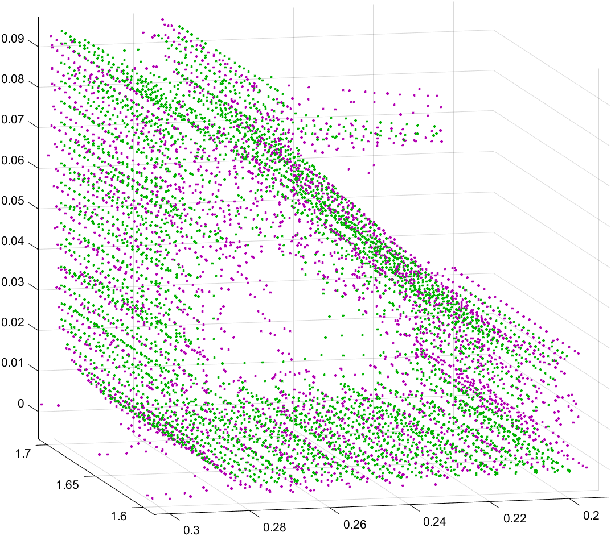

# LOAM Odometry

**点到线的距离**

**点到面的距离**

# 点云配准

## 粗配准

- 4PCS
- RANSCA
- SAC_IA（采样一致性） （特征描述符：FPFH、PFH、SHOT、3DSC、SI、SIFT、...）
- PCA
- ...

## 精配准

- **ICP**
  - **ICP 变种**
    - KD-ICP
    - 点到点、点到面、面到面
    - Trimmed ICP、distance、normal
  
- **NDT**
  - **NDT 与其他算法的融合**
    - **NDT + ICP** [王庆闪,张军,刘元盛张鑫晨.基于NDT与ICP结合的点云配准算法[J]计算机工程与应用.2020,56(07):88-95.]
    - **SAC_IA + NDT** [荆路,武斌李先帅.基于SAC-IA和NDT融合的点云配准方法[J]大地测量与地球动力学.2021,41(04)378-381.]

## SAC_IA 点云配准流程

