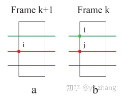
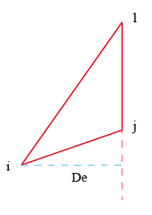
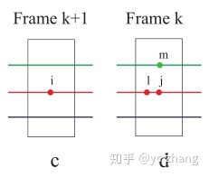
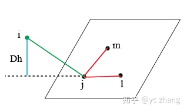
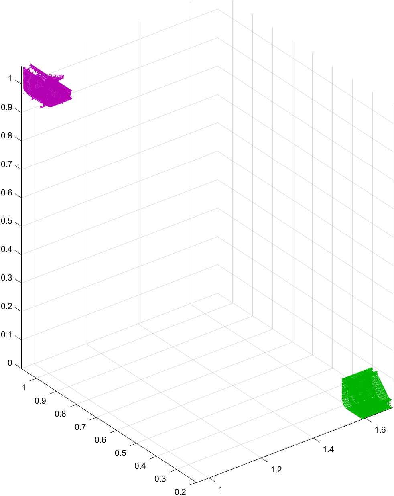
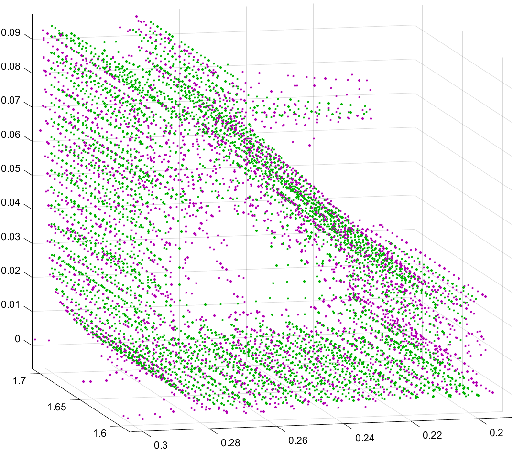
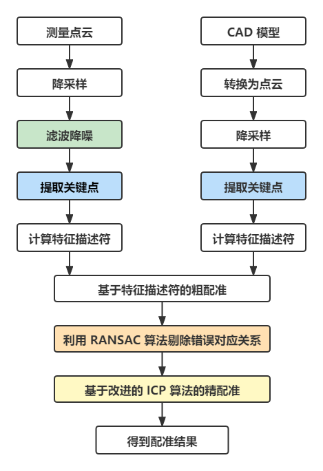

# LOAM Odometry

**点到线的距离**





**点到面的距离**





**loam 中存在的问题**

- **匹配**

  平面点匹配的过程中，在每个区域内，曲率较低的 4 个点作为 source 与所有点云减去曲率较大的 20 个角点降采样后的点云作为 target 进行匹配，target 点云包含一些曲率较大的点，这些曲率较大的点因为被标记为近邻点而没有被纳入角点特征，这些点可能不在少数，因为当某个点曲率较大时，周围点可能曲率都偏大，但它们却不能被加入至角点特征，平面点作匹配时，仍然与这些点做匹配，若成功匹配，则匹配错误，不论如何都会降低效率。

  **改进：**

  1. 当作为曲率较大的角点特征的临近点时，并且该点曲率较大，则重置 label 属性，让其不加入target 点云
  2. 当作为曲率较大的角点特征的临近点时，不论该店曲率如何，都重置 label 属性，让其不加入target 点云，原因是曲率较大的角点特征周围的点曲率可能偏大，或者即使不偏大，但距离角点特征较近，也可能不会作为平面点特征的匹配点。

- **查找**

  Odometry 模块中，在查询近邻点以创建直线和面的过程中，LOAM 中代码使用 kdtree 进行查找，首先查找最近邻点，之后在按照最近邻点所在的 SCANID，以该 SCANID 为基准上下查找近邻点，代码如下：

  ```cpp
  kdtreeCornerLast->nearestKSearch(pointSel, 1, pointSearchInd, pointSearchSqDis);        // 查询近邻点       
  ```

  这样查找可能比较繁琐，一开始使用 kdtree，后面又逐一遍历计算欧式距离，比较麻烦，且代码易读性低，不如查询所有的点都采样 kdtree 查询，即查询 K 个点，然后以第一个点为最近点 a，得到 a 的 SCANID，以该点为基准，遍历查询到的其余 K - 1 个数，若满足条件则终止遍历。或使用基于半径的查找，以阈值为半径，查询半径内的所有点，按距离远近遍历所有查询点，满足条件则终止遍历。

  代码改进：

  ```cpp
  kdtreeCornerLast->nearestKSearch(pointSel, k, pointSearchInd, pointSearchSqDis); 
  kdtreeCornerLast->radiusSearch(pointSel, sqrt(DISTANCE_SQ_THRESHOLD), pointSearchInd, pointSearchSqDis); 
  ```

# 点云配准





## 粗配准

- 4PCS
- RANSCA
- SAC_IA（采样一致性） （特征描述符：FPFH、PFH、SHOT、3DSC、SI、SIFT、...）
- PCA
- ...

## 精配准

- **ICP**
  - **ICP 变种**
    - KD-ICP
    - 点到点、点到面、面到面
    - Trimmed ICP、distance、normal
  
- **NDT**
  - **NDT 与其他算法的融合**
    - **NDT + ICP** [王庆闪,张军,刘元盛张鑫晨.基于NDT与ICP结合的点云配准算法[J]计算机工程与应用.2020,56(07):88-95.]
    - **SAC_IA + NDT** [荆路,武斌李先帅.基于SAC-IA和NDT融合的点云配准方法[J]大地测量与地球动力学.2021,41(04)378-381.]

## SAC_IA 点云配准流程

