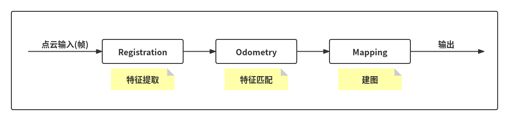
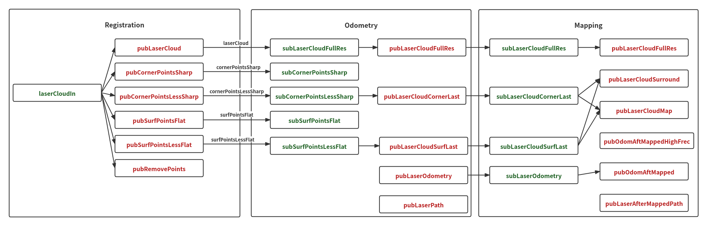

# LOAM 梳理

本篇文章对 LOAM 框架进行宏观的解析，暂不涉及内部具体的实现原理。

## 整个流程

整个 LOAM 框架分为三个主要部分，分别为 **Registration**（**特征提取**）、**Odometry**（**特征匹配**）和 **Mapping**（**建图**），分别存储于相应的 cpp 文件中。首先将输入点云进行特征提取，利用提取的特征进行特征匹配，最后将点云置于地图中，具体流程见下图。

## 主要思路

### Registration（特征提取）

特征提取流程主要如下：

1. 输入点云预处理（去除 NAN 点及距离过近的点）

2. 调整角度，将输入点云调整至 $(-\pi,\pi)$ 区间内

3. 把每个点存储到对应的扫描线上，并利用强度信息记录下来

4. 计算每个点的曲率，记录索引（点对应的索引，后续对曲率排序是对索引排序）、近邻（该点是否为近邻点）、标签（该点属于什么类型的点）

5. 特征提取

   遍历每条扫描线，每条扫描线上分 6 个区域，每个区域内按曲率大小进行排序：

    1. 从大到小遍历提取角点

       曲率最大的 2 个特征点（**cornerPointsSharp**，不包含近邻点，标签为 2）、曲率较大的前 20 个特征点（**subCornerPointsLessSharp**，不包含近邻点，标签为 1），并标记近邻点

    2. 从小到大遍历提取表面点

       曲率最小的 4 个特征点（**subSurfPointsFlat**，不包含近邻点，标签为 -1），并标记近邻点、除去曲率较大的前 20 个特征点，剩余的点再降采样后的点（**subSurfPointsLessFlat**）

6. 发布信息

### Odometry（特征匹配）

特征匹配流程大体如下：

1. 接收信息
2. 特征点匹配
   1. Ceres 创建问题
   2. 角点匹配：点到直线的距离
   3. 平面点匹配：点到面的距离
   4. Ceres 求解
   5. 更新位姿信息：t_w_curr、q_w_curr
3. 发布 odom 信息
4. 交换点云，设置 kdtree
5. 间隔几帧发布信息：corner、surf

注意：

​	在特征点匹配时：

- 角点的匹配是 cornerPointsSharp（source，当前帧的特征点，即每个区域 2 个角点特征点） 对应匹配 laserCloudCornerLast（target，对应上一帧的 cornerPointsLessSharp，即每个区域 20个角点特征点）
- 平面点的匹配是 surfPointsFlat（source，当前帧的特征点，即每个区域 4 个平面特征点）对应匹配 laserCloudSurfLast（target，对应上一帧的 surfPointsLessFlat，即每个区域所有点云减去 20 个角点特征点再降采样之后的点）

### Mapping（建图）

建图流程简要概括一下：

1. 首先将整个 map 划分成 21 × 21 × 11 个栅格，每个栅格大小为 50 × 50 × 50 cm
2. 获取前一部分发布的信息，包括 corner、surf 及 odom
3. 将 odom 转换到世界坐标系下，并寻找对应的栅格
4. 对应的栅格尽量在整个 map 的中心，若偏向边缘则对其调整
5. 计算对应栅格及其附近栅格的索引，并将其存储在数组中
6. 将提取出的栅格内的角点特征点和平面特征点分别提取到相应的点云中去，分别作为 corner 的 target 和 surf 的target
7. 获取当前帧传入的 corner 和 surf，对其将采样，作为 corner 的 source 和 surf 的source
8. 分别对 corner 和 surf 进行特征匹配，优化当前帧点云在 map 坐标系下的位姿
9. 根据当前帧点云在 odom 坐标系下的位姿和优化的当前帧点云在 map 坐标系下的位姿更新 odom 坐标系到 map 坐标系的转换关系
10. 将当前帧的 corner 特征点和 surf 特征点加入到栅格的点云中，并对加入特征点之后的栅格进行降采样
11. 发布信息：laserCloudSurround、laserCloudMap
12. 将所有点（laserCloudFullRes）转换到 map 坐标系下
13. 发布信息

## 消息传递

理解不同部分之间的消息传递有助于理解整个 LOAM 框架。下图是 LOAM 源码的一些订阅、发布节点，绿色表示输入，红色表示输出。

### Registration（特征提取）

- **输入：**
  - **laserCloudIn**：输入点云

- **输出：**
  - **pubLaserCloud**：全部点云
  - **pubCornerPointsSharp**：每个区域角点特征（2 个）× 6 个区域 × 线数
  - **pubCornerPointsLessSharp**：每个区域角点特征（20 个）× 6 个区域 × 线数
  - **pubSurfPointsFlat**：每个区域平面特征（4 个）× 6 个区域 × 线数
  - **pubSurfPointsLessFlat**：每个区域角点特征（（全部点云 - 角点特征（20 个））/ 降采样）× 6 个区域 × 线数
  - **pubRemovePoints**

### Odometry（特征匹配）

- **输入：**
  - **subLaserCloudFullRes**：全部点云
  - **subCornerPointsSharp**：每个区域角点特征（2 个）× 6 个区域 × 线数
  - **subCornerPointsLessSharp**：每个区域角点特征（20 个）× 6 个区域 × 线数
  - **subSurfPointsFlat**：每个区域平面特征（4 个）× 6 个区域 × 线数
  - **subSurfPointsLessFlat**：每个区域角点特征（（全部点云 - 角点特征（20 个））/ 降采样）× 6 个区域 × 线数

- **输出：**
  - **pubLaserCloudFullRes**：全部点云
  - **pubLaserCloudCornerLast**：每个区域角点特征（20 个）× 6 个区域 × 线数
  - **pubLaserCloudSurfLast**：每个区域角点特征（（全部点云 - 角点特征（20 个））/ 降采样）× 6 个区域 × 线数
  - **pubLaserOdometry**：odom 坐标系
  - **pubLaserPath**

### Mapping（建图）

- **输入：**
  - **subLaserCloudFullRes**：全部点云
  - **subLaserCloudCornerLast**：每个区域角点特征（20 个）× 6 个区域 × 线数
  - **subLaserCloudSurfLast**：每个区域角点特征（（全部点云 - 角点特征（20 个））/ 降采样）× 6 个区域 × 线数
  - **subLaserOdometry**：odom 坐标系

- **输出：**
  - **pubLaserCloudFullRes**：转换到 map 坐标系下的全部点云
  - **pubLaserCloudSurround**
  - **pubLaserCloudMap**
  - **pubOdomAftMappedHighFrec**
  - **pubOdomAftMapped**：map 坐标系
  - **pubLaserAfterMappedPath**

## 位姿传递

通过 lidar 采集的点云，每一帧在不同的坐标系中，最终目的是要将所有点云转换到统一坐标系下。理解点云在每一部分是如何进行位姿变换的至关重要。

在 Odometry 部分中，计算两帧点云之间的位姿关系，更新当前帧在 odom 下的位姿，并将位姿信息传递至 Mapping 部分。

Mapping 得到的位置信息是当前帧在 odom 坐标系下的位姿，通过 odom 坐标系到 map 坐标系的转换关系初步将当前帧信息转换至 map 坐标系下，这个转换关系是不正确的，只是一个初始转换，再经过特征匹配，计算当前帧转在 map 坐标系下正确位置，通过当前帧在 odom 坐标系下和 map 坐标系下的位置，计算出 odom 坐标系到 map 坐标系的正确转换关系，并更新该转换关系。

位姿中的四元数是不断地在累乘的，保证当前帧经过位姿转换可以移动至正确的位置。

**上面有些内容肯定有理解错误或者说法错误的地方！**