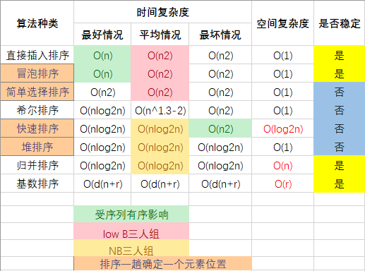

# 十大排序算法

> 原创 bigsai 

## 绪论

对于排序的分类，主要不同的维度比如复杂度来分、内外部、比较非比较等维度来分类。我们正常讲的十大排序算法是内部排序，我们更多将他们分为两大类：基于**「比较和非比较」**这个维度去分排序种类。

- **「非比较类的有桶排序、基数排序、计数排序」**。也有很多人将排序归纳为 8 大排序，那就是因为基数排序、计数排序是建立在桶排序之上或者是一种特殊的桶排序，但是基数排序和计数排序有它特有的特征，所以在这里就将他们归纳为 10 种经典排序算法。
- 比较类排序也有更细致的分法，有基于交换的、基于插入的、基于选择的、基于归并的，更细致的可以看下面的脑图。


## 交换类

### 冒泡排序

冒泡排序，又称起泡排序，它是一种基于交换的排序典型，也是快排思想的基础，冒泡排序是一种稳定排序算法，时间复杂度为 O(n^2). 基本思想是：**「循环遍历多次每次从前往后把大元素往后调，每次确定一个最大(最小)元素，多次后达到排序序列。」**(或者从后向前把小元素往前调)。

具体思想为(把大元素往后调)：

- 从第一个元素开始往后遍历，每到一个位置判断是否比后面的元素大，如果比后面元素大，那么就交换两者大小，然后继续向后，这样的话进行一轮之后就可以保证**「最大的那个数被交换交换到最末的位置可以确定」**。
- 第二次同样从开始起向后判断着前进，如果当前位置比后面一个位置更大的那么就和他后面的那个数交换。但是有点注意的是，这次并不需要判断到最后，只需要判断到倒数第二个位置就行(因为第一次我们已经确定最大的在倒数第一，这次的目的是确定倒数第二)
- 同理，后面的遍历长度每次减一，直到第一个元素使得整个元素有序。

例如`2 5 3 1 4`排序过程如下：


实现代码为：

```cpp
void bubbleSort(vector<int>& nums)
{
    bool swapped;										// 优化
    for (int i = 0; i < nums.size(); ++i)
    {
        swapped = false;
        for (int j = 0; j < nums.size() - i - 1; ++j)
        {
            if (nums[j] > nums[j + 1]) 					// 修改：nums[j] < nums[j - 1]
            {
                swap(num[j], nums[j + 1]);
                swapped = true;
            }
        }
        if (!swapped)
            break;
    }
}
```

**测试代码**：[bubbleSort](./排序测试/bubbleSort.cpp)

### 快速排序

快速排序是对冒泡排序的一种改进，采用递归分治的方法进行求解。而快排相比冒泡是一种不稳定排序,时间复杂度最坏是 O(n^2), 平均时间复杂度为 O(nlogn), 最好情况的时间复杂度为 O(nlogn)。

对于快排来说，**「基本思想」**是这样的

- 快排需要将序列变成两个部分，就是**「序列左边全部小于一个数」**，**「序列右面全部大于一个数」**，然后利用递归的思想再将左序列当成一个完整的序列再进行排序，同样把序列的右侧也当成一个完整的序列进行排序。
- 其中这个数在这个序列中是可以随机取的，可以取最左边，可以取最右边，当然也可以取随机数。但是**「通常」**不优化情况我们取最左边的那个数。


实现代码为：

```cpp
void quickSort(vector<int> &nums, int l, int r) // 左闭右开的写法
{
    if (l + 1 >= r)
        return;

    int first = l, last = r - 1, key = nums[first];

    while (first < last)
    {
        while (first < last && nums[last] >= key) // 修改：nums[last] <= key
            --last;

        nums[first] = nums[last];

        while (first < last && nums[first] <= key) // 修改：nums[first] >= key
            ++first;

        nums[last] = nums[first];
    }

    nums[first] = key;

    quickSort(nums, l, first);
    quickSort(nums, first + 1, r);
}
```

**测试代码**：[quickSort](./排序测试/quickSort.cpp)

## 插入类排序

### 直接插入排序

直接插入排序在所有排序算法中的是最简单排序方式之一。和我们上学时候 从前往后、按高矮顺序排序，那么一堆高低无序的人群中，从第一个开始，如果前面有比自己高的，就直接插入到合适的位置。**「一直到队伍的最后一个完成插入」**整个队列才能满足有序。

直接插入排序遍历比较时间复杂度是每次 O(n), 交换的时间复杂度每次也是 O(n), 那么 n 次总共的时间复杂度就是 O(n\^2)。有人会问折半(二分)插入能否优化成O(nlogn), 答案是不能的。因为二分只能减少查找复杂度每次为 O(logn), 而插入的时间复杂度每次为 O(n) 级别，这样总的时间复杂度级别还是 O(n^2).

插入排序的具体步骤：

- 选取当前位置(当前位置前面已经有序) 目标就是将当前位置数据插入到前面合适位置。
- 向前枚举或者二分查找，找到待插入的位置。
- 移动数组，赋值交换，达到插入效果。


实现代码为：

```cpp
void insertSort(vector<int>& nums)
{
    for (int i = 1; i < nums.size(); ++i)
    {
        for (int j = i; j > 0 && nums[j] < nums[j - 1]; --j)	// 修改：nums[j] > nums[j - 1]
        {
            swap(nums[j], nums[j - 1]);
        }
    }
}
```

**测试代码**：[insertSort](./排序测试/insertSort.cpp)

### 希尔排序

直接插入排序因为是 O(n^2), 在数据量很大或者数据移动位次太多会导致效率太低。很多排序都会想办法拆分序列，然后组合，希尔排序就是以一种特殊的方式进行预处理，考虑到了**「数据量和有序性」**两个方面纬度来设计算法。使得序列前后之间小的尽量在前面，大的尽量在后面，进行若干次的分组别计算，最后一组即是一趟完整的直接插入排序。

对于一个`长串`，希尔首先将序列分割(非线性分割)而是**「按照某个数模」**(`取余`这个类似报数1、2、3、4。1、2、3、4)这样形式上在一组的分割先**「各组分别进行直接插入排序」**,这样**「很小的数在后面」**可以通过**「较少的次数移动到相对靠前」**的位置。然后慢慢合并变长，再稍稍移动。

因为每次这样插入都会使得序列变得更加有序，稍微有序序列执行直接插入排序成本并不高。所以这样能够在合并到最终的时候基本小的在前，大的在后，代价越来越小。这样希尔排序相比插入排序还是能节省不少时间的。


实现代码为：

```cpp
void shellSort(vector<int>& nums)
{
    for (int gap = nums.size(); gap > 0; gap /= 2)
    {
        for (int i = gap; i < nums.size(); ++i)
        {													// 修改：num[j] < num[j + gap]
            for (int j = i - gap; j >= 0 && nums[j] > nums[j + gap]; j -= gap)
            {
                swap(nums[j], nums[j + gap]);
            }
        }
    }
}
```

**测试代码**：[shellSort](./排序测试/shellSort.cpp)

## 选择类排序

### 简单选择排序

简单选择排序（Selection sort）是一种简单直观的排序算法。它的工作原理：首先在未排序序列中找到最小（大）元素，存放到排序序列的起始位置，然后，再从剩余未排序元素中继续寻找最小（大）元素，然后放到**「已排序序列的末尾」**。以此类推，直到所有元素均排序完毕。


实现代码为：

```cpp
void selectSort(vector<int>& nums)
{
    int index;									// 记录每次遍历最小值的索引
    for (int i = 0; i < nums.size(); ++i)
    {
        index = i;
        for (int j = i + 1; j < nums.size(); ++j)
        {
            if (nums[j] < nums[index])			// 修改：nums[j] > nums[index]
            {
                index = j;
            }
        }
        swap(nums[i], nums[index]);
    }
}
```

**测试代码**：[selectSort](./排序测试/selectSort.cpp)

### 堆排序

对于堆排序，首先是建立在堆的基础上，堆是一棵完全二叉树，还要先认识下大根堆和小根堆，完全二叉树中所有节点均大于(或小于)它的孩子节点，所以这里就分为两种情况

- 如果所有节点**「大于」**孩子节点值，那么这个堆叫做**「大根堆」**，堆的最大值在根节点。
- 如果所有节点**「小于」**孩子节点值，那么这个堆叫做**「小根堆」**，堆的最小值在根节点。


堆排序首先就是**「建堆」**，然后再是调整。对于二叉树(数组表示)，我们从下往上进行调整，从**「第一个非叶子节点」**开始向前调整，对于调整的规则如下：

建堆是一个 O(n) 的时间复杂度过程，建堆完成后就需要进行删除头排序。给定数组建堆 (creatHeap)

① 从第一个非叶子节点开始判断交换下移 (shiftDown)，使得当前节点和子孩子能够保持堆的性质

② 但是普通节点替换可能没问题，对如果交换打破子孩子堆结构性质，那么就要重新下移 (shiftDown)被交换的节点一直到停止。


堆构造完成，取第一个堆顶元素为最小(最大)，剩下左右孩子依然满足堆的性值，但是缺个堆顶元素，如果给孩子调上来，可能会调动太多并且可能破坏堆结构。

① 所以索性把最后一个元素放到第一位。这样只需要判断交换下移(shiftDown）,不过需要注意此时整个堆的大小已经发生了变化，我们在逻辑上不会使用被抛弃的位置，所以在设计函数的时候需要附带一个堆大小的参数。

② 重复以上操作，一直堆中所有元素都被取得停止。


而堆算法复杂度的分析上，之前建堆时间复杂度是 O(n)。而每次删除堆顶然后需要向下交换，每个个数最坏为 logn 个。这样复杂度就为 O(nlogn). 总的时间复杂度为 O(n) + O(nlogn) = O(nlogn).

实现代码为：

```cpp
void heapAdjust(vector<int> &nums, int low, int high)
{
    int pivotKey = nums[low - 1];
    for (int i = 2 * low; i <= high; i *= 2)
    {
        if (i < high && nums[i - 1] < nums[i])
        {
            i++; 		// i 指向较大值
        }

        if (pivotKey >= nums[i - 1])
        {
            break;
        }

        nums[low - 1] = nums[i - 1];
        low = i;
    }
    nums[low - 1] = pivotKey;
}

void heapSort(vector<int> &nums)
{
    for (int i = nums.size() / 2; i > 0; i--)
    {
        heapAdjust(nums, i, nums.size());
    }

    for (int i = nums.size(); i > 1; i--)
    {
               swap(nums[0], nums[i - 1]);
        heapAdjust(nums, 1, i - 1);
    }
}
```

**测试代码**：[heapSort](./排序测试/heapSort.cpp)

## 归并类排序

在归并类排序一般只讲归并排序，但是归并排序也分二路归并、多路归并，这里就讲较多的二路归并排序，且用递归方式实现。

### 归并排序

归并和快排都是**「基于分治算法」**的，分治算法其实应用挺多的，很多分治会用到递归，但事实上**「分治和递归是两把事」**。分治就是分而治之，可以采用递归实现，也可以自己遍历实现非递归方式。而归并排序就是先将问题分解成代价较小的子问题，子问题再采取代价较小的合并方式完成一个排序。

至于归并的思想是这样的：

- 第一次：整串先进行划分成一个一个单独，第一次是将序列中(`1 2 3 4 5 6---`)两两归并成有序，归并完(`xx xx xx xx----`)这样局部有序的序列。
- 第二次就是两两归并成若干四个(`1 2 3 4 5 6 7 8 ----`)**「每个小局部是有序的」**。
- 就这样一直到最后这个串串只剩一个，然而这个耗费的总次数logn。每次操作的时间复杂的又是`O(n)`。所以总共的时间复杂度为`O(nlogn)`.


合并为一个O(n)的过程：


实现代码为：

```cpp
void mergeSort(vector<int>& nums, int l, int r, vector<int>& temp)
{
	if (l + 1 >= r)
        return;
    
    int m = l + (r - l) / 2;
    
    mergeSort(nums, l, m, temp);
    mergeSort(nums, m, r, temp);
    
    int p = l, q = m, i = l;
    while (p < m || q < r)
    {
        if (q >= r || (p < m && nums[p] <= nums[q]))	// 修改：nums[p] >= nums[q]
            temp[i++] = nums[p++];
        else
            temp[i++] = nums[q++];
    }
    
    for (i = l; i < r; ++i)
        nums[i] = temp[i];
}
```

**测试代码**：[mergeSort](./排序测试/mergeSort.cpp)

## 桶类排序

### 桶排序

桶排序是一种用空间换取时间的排序，桶排序重要的是它的思想，而不是具体实现，时间复杂度最好可能是线性 O(n)，桶排序不是基于比较的排序而是一种分配式的。桶排序从字面的意思上看：

- 桶：若干个桶，说明此类排序将数据放入若干个桶中。
- 桶：每个桶有容量，桶是有一定容积的容器，所以每个桶中可能有多个元素。
- 桶：从整体来看，整个排序更希望桶能够更匀称，即既不溢出(太多)又不太少。

桶排序的思想为：**「将待排序的序列分到若干个桶中，每个桶内的元素再进行个别排序。」** 当然桶排序选择的方案跟具体的数据有关系，桶排序是一个比较广泛的概念，并且计数排序是一种特殊的桶排序，基数排序也是建立在桶排序的基础上。在数据分布均匀且每个桶元素趋近一个时间复杂度能达到 O(n), ==但是如果数据范围较大且相对集中就不太适合使用桶排序。==


实现一个简单桶排序：

```cpp
void bucketSort(vector<int> &nums)
{
    vector<vector<int>> buckets(5);		// 以数值都在 0~50 为例
    
    for (int i = 0; i < nums.size(); ++i)
    {
        int bucket = nums[i] / 10;
        buckets[bucket].push_back(nums[i]);
    }

    int index = 0;
    for (int i = 0; i < buckets.size(); ++i)
    {
        sort(buckets[i].begin(), buckets[i].end());
        for (int j = 0; j < buckets[i].size(); ++j)
        {
            nums[index++] = buckets[i][j];
        }
    }
}
```

**测试代码**：[bucketSort](./排序测试/bucketSort.cpp)

### 计数排序

计数排序是一种特殊的桶排序，每个桶的大小为1，每个桶不在用 List 表示，而通常用一个值用来计数。

在**「设计具体算法的时候」**，先找到最小值 min，再找最大值 max。然后创建这个区间大小的数组，从 min 的位置开始计数，这样就可以最大程度的压缩空间，提高空间的使用效率。


```cpp
void countSort(vector<int> &nums)
{
    int minVal = *min_element(nums.begin(), nums.end());
    int maxVal = *max_element(nums.begin(), nums.end());

    vector<int> vecCount(maxVal - minVal + 1, 0);
    for (int i = 0; i < nums.size(); ++i)
    {
        vecCount[nums[i] - minVal]++;
    }

    int index;
    for (int i = 0; i < vecCount.size(); ++i)
    {
        while (vecCount[i]--)
        {
            nums[index++] = i + minVal;
        }
    }
}
```

**测试代码**：[countSort](./排序测试/countSort.cpp)

### 基数排序

基数排序是一种很容易理解但是比较难实现(优化)的算法。基数排序也称为卡片排序，基数排序的原理就是多次利用计数排序(计数排序是一种特殊的桶排序)，但是和前面的普通桶排序和计数排序有所区别的是，**「基数排序并不是将一个整体分配到一个桶中」**，而是将自身拆分成一个个组成的元素，每个元素分别顺序分配放入桶中、顺序收集，当从前往后或者从后往前每个位置都进行过这样顺序的分配、收集后，就获得了一个有序的数列。


如果是数字类型排序，那么这个桶只需要装0-9大小的数字，但是如果是字符类型，那么就需要注意ASCII的范围。

所以遇到这种情况我们基数排序思想很简单，就拿 934，241，3366，4399这几个数字进行基数排序的一趟过程来看，第一次会根据各位进行分配、收集：


分配和收集都是有序的，第二次会根据十位进行分配、收集，此次是在第一次个位分配、收集基础上进行的，所以所有数字单看个位十位是有序的。


而第三次就是对百位进行分配收集，此次完成之后百位及其以下是有序的。


而最后一次的时候进行处理的时候，千位有的数字需要补零，这次完毕后后千位及以后都有序，即整个序列排序完成。


简单实现代码为：

```cpp
void radixSort(vector<int> &nums)
{
    int maxVal = *max_element(nums.begin(), nums.end());
    int count = 0;
    while (maxVal)
    {
        count++;
        maxVal /= 10;
    }

    vector<int> bucket(10, 0);
    vector<int> temp(nums.size());

    int radix = 1;
    for (int i = 0; i < count; ++i)
    {
        for (auto &buck : bucket)
        {
            buck = 0;
        }

        for (int j = 0; j < nums.size(); ++j)
        {
            int index = (nums[j] / radix) % 10;
            bucket[index]++;
        }

        for (int k = 1; k < bucket.size(); ++k)
        {
            bucket[k] += bucket[k - 1];
        }

        for (int m = nums.size() - 1; m >= 0; --m)
        {
            int index = (nums[m] / radix) % 10;
            temp[bucket[index] - 1] = nums[m];
            bucket[index]--;
        }

        nums = temp;
        radix *= 10;
    }
}
```

**测试代码**：[radixSort](./排序测试/radixSort.cpp)

## 总结

本次十大排序就这么潇洒的过了一遍，我想大家都应该有所领悟了吧！对于算法总结，避免不必要的劳动力，我分享这个表格给大家：

| 排序算法 | 平均时间复杂度 | 最好     | 最坏      | 空间复杂度 | 稳定性 |
| :------- | :------------- | :------- | :-------- | :--------- | :----- |
| 冒泡排序 | O(n^2)         | O(n)     | O(n^2)    | O(1)       | 稳定   |
| 快速排序 | O(nlogn)       | O(nlogn) | O(n^2)    | O(logn)    | 不稳定 |
| 插入排序 | O(n^2)         | O(n)     | O(n^2)    | O(1)       | 稳定   |
| 希尔排序 | O(n^1.3)       | O(n)     | O(nlog2n) | O(1)       | 不稳定 |
| 选择排序 | O(n^2)         | O(n^2)   | O(n^2)    | O(1)       | 不稳定 |
| 堆排序   | O(nlogn)       | O(nlogn) | O(nlogn)  | O(1)       | 不稳定 |
| 归并排序 | O(nlogn)       | O(nlogn) | O(nlogn)  | O(n)       | 稳定   |
| 桶排序   | O(n+k)         | O(n+k)   | O(n+k)    | O(n+k)     | 稳定   |
| 计数排序 | O(n+k)         | O(n+k)   | O(n+k)    | O(k)       | 稳定   |
| 基数排序 | O(n*k)         | O(n*k)   | O(n*k)    | O(n+k)     | 稳定   |


