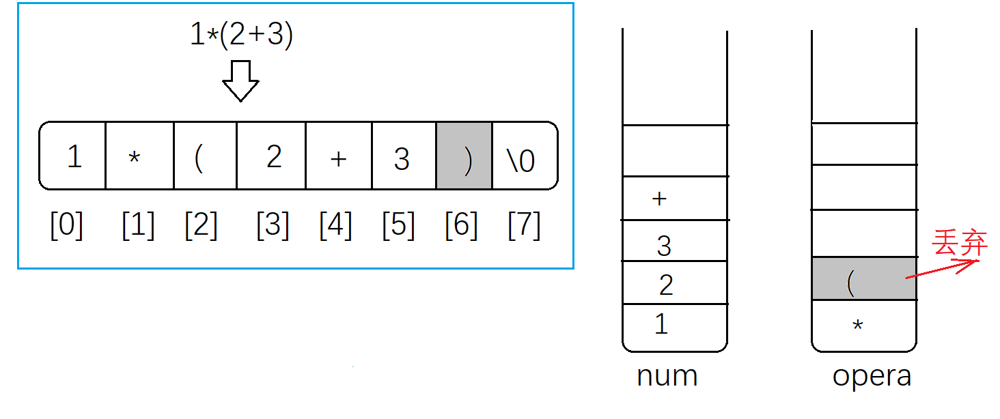
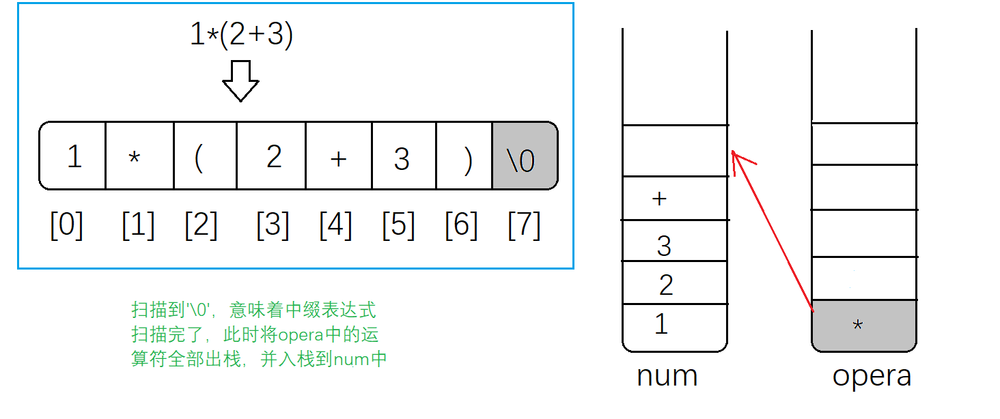
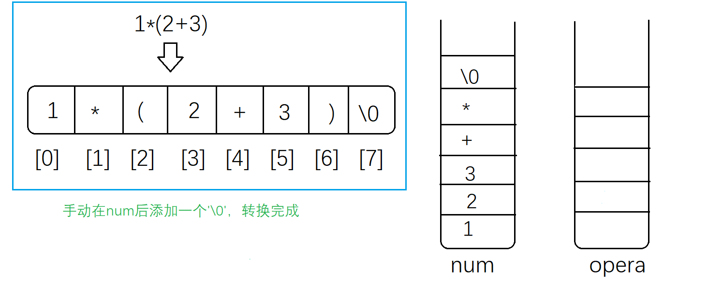

# 面试中遇到的算法题

## 归并排序，在底部当数组小于 K 值时，使用插入排序提升效率

**题解：**

```cpp
#include <iostream>
#include <vector>
using namespace std;

void insertSort(vector<int> &nums, int left, int right)
{
    int i, j;
    for (i = left + 1; i < right; ++i)
    {
        int temp = nums[i];
        for (j = i - 1; j >= left; --j)
        {
            if (temp < nums[j]) // 修改：temp > nums[j - 1]
            {
                nums[j + 1] = nums[j];
            }
            else
                break;
        }
        nums[j + 1] = temp;
    }
}

void mergeSort(vector<int> &nums, int l, int r, int k, vector<int> &temp)
{
    if (l + k >= r)
    {
        insertSort(nums, l, r);
        return;
    }

    int m = l + (r - l) / 2;

    mergeSort(nums, l, m, k, temp);
    mergeSort(nums, m, r, k, temp);

    int p = l, q = m, i = l;
    while (p < m || q < r)
    {
        if (q >= r || (p < m && nums[p] <= nums[q])) // 修改：nums[p] >= nums[q]
            temp[i++] = nums[p++];
        else
            temp[i++] = nums[q++];
    }

    for (i = l; i < r; ++i)
        nums[i] = temp[i];
}

void printNums(const vector<int> &nums)
{
    for (int i = 0; i < nums.size(); ++i)
    {
        std::cout << nums[i] << "  ";
    }
    std::cout << std::endl;
}

int main()
{
    vector<int> nums{4, 5, 3, 2, 6, 7, 3, 5, 2, 6, 9, 0, 8, 2, 1, 6, 8, 9};
    printNums(nums);
    int k = 3;
    vector<int> temp(nums.size(), 0);
    mergeSort(nums, 0, nums.size(), k, temp);
    printNums(nums);
    return 0;
}
```


## 寻找一个数组中的第 K 个元素

**答题思路：**

利用快排方法，快排每次将一个数放置正确的位置 index，比较 index 与 K 的大小，若 index 大于 K，则第 K 个数在 index 的左侧，只需对 index 左侧进行排序，反之对右侧进行排序，循环，直到 index == K。

**题解：**

```cpp
#include <iostream>
#include <vector>
using namespace std;

int findKthNum(vector<int> &nums, int K);
void quickSort(vector<int> &nums, int l, int r, int index);

int main()
{
    //vector<int> nums{4, 0, 1, 2, 2, 3};
    vector<int> nums{4, 0, 1, 2, 5, 4, 6, 2, 3, 7, 9};
    cout << findKthNum(nums, 11);		// 输出 9
    return 0;
}

int findKthNum(vector<int> &nums, int K)
{
    if (K > nums.size() || K < 0)
        return -1;
    quickSort(nums, 0, nums.size(), K - 1);		// 第 K 大的数，索引为 K — 1
    return nums[K - 1];
}

void quickSort(vector<int> &nums, int l, int r, int index)
{
    if (l + 1 >= r)
        return;
    int first = l, last = r - 1, key = nums[first];
    while (first < last)
    {
        if (first < last && nums[last] >= key)
            last--;
        if (first < last)
            nums[first] = nums[last];
        if (first < last && nums[first] <= key)
            first++;
        if (first < last)
            nums[last] = nums[first];
    }
    nums[first] = key;
    if (first == index)
        return;
    else if (first < index)
        quickSort(nums, first + 1, r, index);
    else
        quickSort(nums, l, first, index);
}
```


## 对 map 的value 进行排序

**题解：**

```cpp
#include <unordered_map>
#include <string>
#include <iostream>
#include <vector>
#include <algorithm>

using namespace std;

bool cmp(const pair<string, int> &a, const pair<string, int> &b)	// 关键步骤 3
{
    if (a.second == b.second)
        return a.first < b.first;
    return a.second > b.second;
}
int main()
{
    vector<string> vs{"ccv", "bbc", "abc", "cnn", "abc", "bbc", "abc", "cnn"};
    unordered_map<string, int> mapDict;
    // 插入
    for (int i = 0; i < vs.size(); i++)
    {
       
        mapDict[vs[i]]++;
    }
    // 打印
    for (auto m : mapDict)
    {
        cout << m.first << " " << m.second << endl;
    }

    // 将 map 中的内容转存到 vector 中
    vector<pair<string, int>> vec(mapDict.begin(), mapDict.end());	// 关键步骤 1
    
    // 对线性的 vector 进行排序
    sort(vec.begin(), vec.end(), cmp); // cmp 不能少				  // 关键步骤 2
    
	// 打印
    for (int i = 0; i < vec.size(); ++i)
    {
        cout << vec[i].first << " " << vec[i].second << endl;
    }
    
    return 0;
}

/*
input:
	cnn 2
	abc 3
	ccv 1
	bbc 2
output:
	abc 3
	bbc 2
	cnn 2
	ccv 1
*/
```


## 华为机试-蛇形字符串

题目描述：
输入一个字符串（不含空格）， 请寻找输入中包含所有蛇形字符串。
蛇形字符串定义：

1.蛇形字符串由连续字符对组成，其特点如下：
1.1 字符对定义：字符对由同一字母的大写和小写组成（前大后小）。如：Aa，Dd；
1.2 蛇形字符串中包含的字符对，必须是连续字母，并按照字母顺序排序。如：AaBbCc或OoPpQqRrSs；
2.从输入中寻找字符组成蛇形字符串（字符顺序不限），符合规则：
2.1 每次寻找必须是最长的蛇形字符串；
2.2 使用过的字符不能重复使用；
例： 输入SxxsrR^AaSs
正确处理过程：

Step1：SxxsrR^AaSs -> RrSs （找到两对连续字符对：Ss、Rr，可以组成蛇形字符串。另，Ss后应该是Tt，但当前字符串SxxsrR^AaSs中不包含，所以当前蛇形字符串到Ss结束。本轮查找结果是RrSs。）
Step2：xs^AaSs -> Aa
Step3：xx^Ss -> Ss
output：RrSs
              Aa
              Ss

输入描述：
一个字符串（不含空格，字符串长度<=5000）

输出描述：
所有包含的蛇形字符串，按蛇形字符串长短输出；同一个首字母的情况，按首字母升序排列（即A在Z前）；如果没有找到，输出Not Found。

示例1：

```cpp
输入：SwSE$3454356DD$$E#eswsxxsssAAWDxxdderfvcRFER65645hbg^^%%^UnbnvccTRChnyvcxcvVCFR
输出：
CcDdEeFf
CcDdEe
RrSs
VvWw
Ss
```

**答题思路：**

统计大写字母小写字母分别出现次数
统计一个字母大小写同时出现的次数，取最小次数保存，另一个丢弃（这里保存大写/小写均可，但如果保存大写就都大写）
寻找最大的连续字符数，输出。

**题解：**

```cpp
#include <iostream>
#include <string>
#include <vector>
#include <algorithm>
 
using namespace std;
 
int main()
{
    string str;
    while(cin >> str)
    {
        int strs[26] = {0};
        int strl[26] = {0};
        for(int i = 0; i < str.size(); i++)         //统计字符
        {
            if(str[i] >= 'a' && str[i] <= 'z')
                strs[str[i] - 'a']++;
            else if(str[i] >= 'A' && str[i] <= 'Z')
                strl[str[i] - 'A']++;
        }
        
        vector<int> myvector(26);
        for(int i = 0; i < 26; i++)                // 字符匹配
        {
            if(strs[i] && strl[i])
                strs[i] > strl[i] ? myvector[i] = strl[i] : myvector[i] = strs[i];
        }
        
        int flag = 0;      // 标志最大字符串的起始位置
        int con = 0;       // 连续字符个数
        int max = 0;       // 标志最大连续字符是多少位  后面的数据 > max 才赋值
        if(count(myvector.begin(), myvector.end(), 0) == 26)
            cout << "Not Found" << endl;
        else
        {
            while(count(myvector.begin(), myvector.end(), 0) != 26)     // 输出字符，直到 vector 全为零
            {
                for(int i = 0; i < 26; i++)
                {
                    if(myvector[i] != 0)           // 统计连续字符数
                        con++;
                    else
                    {
                        if(con > max)
                        {
                            max = con;
                            flag = i - max;        // 最大连续字符起始位置
                        }
                        con = 0;
                    }
                }
                
                //output
                for(int i = flag; i < flag + max; i++)
                {
                    char char1 = i + 'A';
                    char char2 = i + 'a';
                    cout << char1 << char2;
                    myvector[i]--;
                }
                cout << endl;
                flag = 0;
                max = 0;
            }
        }
    }
    return 0;
}
 
/*===============================================
 键盘输入：
 SwSE$3454356DD$$E#eswsxxsssAAWDxxdderfvcRFER65645hbg^^%%^UnbnvccTRChnyvcxcvVCFR
 函数输出：
 CcDdEeFf
 CcDdEe
 RrSs
 VvWw
 Ss
===============================================*/
```

## 奇安信－－中缀表达式求值

给定中缀表达式，求中缀表达式的值。

输入：(字符串形式，都是对整数进行操作)

```cpp
1*(2+3)
3*3
1+9/3
```

输出：

```cpp
5
9
4   
```

**题解：**先把中缀表达式转换为后缀表达式，利用后缀表达式进行求解。

后缀表达式求值：

leetcode:

[150. 逆波兰表达式求值](https://leetcode-cn.com/problems/evaluate-reverse-polish-notation/)

[剑指 Offer II 036.后缀表达式](https://leetcode-cn.com/problems/8Zf90G/)

```cpp
void IRN2RPN(string str, vector<char> &path) // 中缀表达式转成后缀表达式
{
    stack<char> temp;
    for (int i = 0; i < str.size(); ++i)
    {
        if (str[i] <= '9' && str[i] >= '0')
        {
            path.push_back(str[i]);
        }
        else
        {
            if (str[i] != ')')
            {
                temp.push(str[i]);
            }
            else
            {
                while (temp.top() != '(')
                {
                    path.push_back(temp.top());
                    temp.pop();
                }
                temp.pop();
            }
        }
    }
    while (!temp.empty())
    {
        path.push_back(temp.top());
        temp.pop();
    }
    return;
}

int evalRPN(const vector<char> &path)		// 后缀表达式求值
{
    stack<int> temp;
    int a, b, c;
    for (int i = 0; i < path.size(); ++i)
    {
        if (path[i] <= '9' && path[i] >= '0')
        {
            temp.push(path[i] - '0');
        }
        else
        {
            a = temp.top();
            temp.pop();
            b = temp.top();
            temp.pop();

            if (path[i] == '+')
            {
                c = b + a;
            }
            else if (path[i] == '-')
            {
                c = b - a;
            }
            else if (path[i] == '*')
            {
                c = b * a;
            }
            else
            {
                c = b / a;
            }
            temp.push(c);
        }
    }
    return temp.top();
}

int main()
{
    //string str = "1*(2+3)";
    string str = "1*(2+3/3)+6";
    vector<char> path;
    IRN2RPN(str, path);
    int ans = evalRPN(path);
    cout << ans << endl;
    return 0;
}
```

**以上代码只能完成数字 0 - 9 的计算，主要掌握中缀表达式向后缀表达式的转换。**







