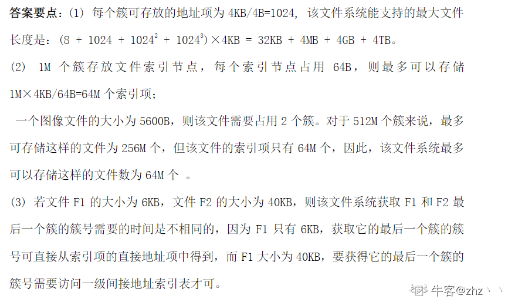

问答题：

某文件系统采用索引结点存放文件的属性和地址信息，簇大小为 4KB。每个 文件索引结点占 64B，有 11 个地址项，其中直接地址项 8 个，一级、二级和三级间接地址项各 1 个，每个地址项长度为 4B。请回答下列问题。 

  （1）该文件系统能支持的最大文件长度是多少？（给出计算表达式即可。） 

  （2）文件系统用 1M（1M = 2 20）个簇存放文件索引结点，用 512M 个簇存放文件数据。若 一个图像文件的大小为 5600B，则该文件系统最多能存放多少个图像文件？ 

  （3）若文件 F1 的大小为 6KB，文件 F2 的大小为 40KB，则该文件系统获取 F1 和 F2 最后 一个簇的簇号需要的时间是否相同？为什么？

