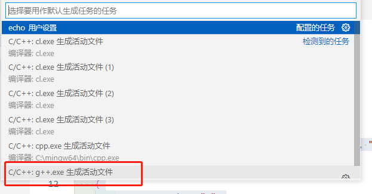
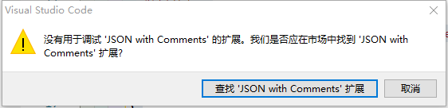
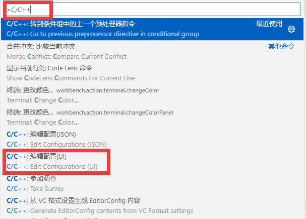
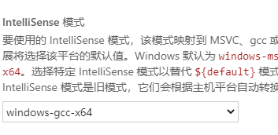
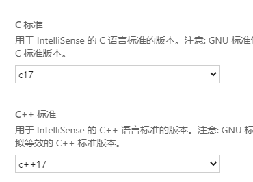

# vscode配置C++环境

## 准备

首先，需要安装 `mingw`，并配置了环境变量。

在 vscode 中安装了 `C/C++` 插件。

## 目的

配置 C++ 环境，生成 `.vscode` 文件夹，在该文件下内含三个文件：

- `tasks.json` （用于生成可执行文件）
- `launch.json` （调试器设置）
- `c_cpp_properties.json` （编译器路径和 IntelliSense 设置）

## 开启配置

创建一个空文件夹，并在 vscode 中打开。新建一个 `cpp` 文件：


在 `cpp` 文件中写入如下代码进行测试：

```cpp
#include <iostream>
#include <vector>
#include <string>

using namespace std;

int main()
{
    vector<string> msg{"Hello", "C++", "World", "from", "VS Code", "and the C++ extension!"};

    for (const string &word : msg)
    {
        cout << word << " ";
    }
    cout << endl;
}
```

### 生成 `tasks.json` 文件

文件保存后，点击上方的 `终端`，选择最后一个选项：`配置默认生成任务`，选择 `C/C++：g++.exe 生成活动文件`。



点击之后，就会生成 `tasks.json` 文件，内容如下

```json
{
  "version": "2.0.0",
  "tasks": [
    {
      "type": "cppbuild",
      "label": "C/C++: g++.exe 生成活动文件",
      "command": "C:\\mingw64\\bin\\g++.exe",
      "args": [
        "-fdiagnostics-color=always",
        "-g",
        "${file}",
        "-o",
        "${fileDirname}\\${fileBasenameNoExtension}.exe"
      ],
      "options": {
        "cwd": "${fileDirname}"
      },
      "problemMatcher": ["$gcc"],
      "group": {
        "kind": "build",
        "isDefault": true
      },
      "detail": "编译器: C:\\mingw64\\bin\\g++.exe"
    }
  ]
}
```

其中 `command` 为 `mingw64` 的安装路径。

### 生成 `launch.json`文件

点击 `F5`，或点击 `运行`，选择 `启动调试`，之后再选择 构建和调试活动文件，会生成`launch.json`文件。

若不能调试，有如下错误：



则，点击取消，**直接在 `.vscode` 中新建`launch.json`文件**，内容如下：

```json
{
    "version": "0.2.0",
    "configurations": [
    {
        "name": "g++.exe - Build and debug active file",
        "type": "cppdbg",
        "request": "launch",
        "program": "${fileDirname}\\${fileBasenameNoExtension}.exe",
        "args": [],
        "stopAtEntry": false,
        "cwd": "${fileDirname}",
        "environment": [],
        "externalConsole": false,
        "MIMode": "gdb",
        "miDebuggerPath": "C:\\mingw64\\bin\\gdb.exe",
        "setupCommands": [
        {
            "description": "Enable pretty-printing for gdb",
            "text": "-enable-pretty-printing",
            "ignoreFailures": true
        }
        ],
        "preLaunchTask": "C/C++: g++.exe 生成活动文件"
    }
    ]
}
```

**注意：`preLaunchTask` 的内容要与 `tasks.json` 文件中 `label` 内容一致，**`miDebuggerPath` 依然为 `mingw64` 的安装路径。

这样就可以进行调试了。

### 生成 `c_cpp_properties.json` 文件

点击 `Ctrl` + `shift` + `p`，在命令行输入 `C/C++`，选择 `C/C++:编辑配置(UI)`。



接下来做几个选择：






最终生成 `c_cpp_properties.json` 文件，文件内容大致如下：

```json
{
    "configurations": [
        {
            "name": "Win32",
            "includePath": [
                "${default}"
            ],
            "defines": [
                "_DEBUG",
                "UNICODE",
                "_UNICODE"
            ],
            "windowsSdkVersion": "10.0.17763.0",
            "intelliSenseMode": "windows-gcc-x64",
            "cStandard": "c17",
            "cppStandard": "c++17",
            "compilerPath": "C:/mingw64/bin/g++.exe"
        }
    ],
    "version": 4
}
```

也可以直接将此内容复制到 `c_cpp_properties.json` 文件中。

**`includePath` 可以包含其他的文件路径。**

至此，vscode 配置 C++ 环境就结束了。