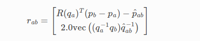

# Ceres

## Why？

- **代码质量** - Ceres Solver 已经在 Google 的生产环境中使用了四年多。它是积极开发和支持的干净、经过广泛测试和有据可查的代码。
- **建模 API** - 很少有人从试图解决的问题的准确和完整公式开始。 Ceres 的建模 API 的设计使用户可以轻松地构建和修改目标函数，一次一个术语。这样做而不用担心求解器将如何处理底层问题的稀疏性/结构的变化。
  - **导数** 提供导数可能是使用优化库中最乏味和最容易出错的部分。 Ceres 附带自动和数字微分。所以你永远不必手动计算导数（除非你真的想要）。不仅如此，Ceres 还允许您以任何您想要的组合混合自动、数值和分析导数。
  - **稳健的损失函数** 大多数非线性最小二乘问题都涉及数据。如果有数据，就会有异常值。 Ceres 允许用户使用 LossFunction 来塑造他们的残差，以减少异常值的影响。
  - **局部参数化** 在许多情况下，一些参数位于欧几里得空间以外的流形上，例如旋转矩阵。在这种情况下，用户可以通过指定 LocalParameterization 对象来指定局部切线空间的几何形状。

- **求解器选择** 根据大小、稀疏结构、时间和内存预算以及求解质量要求，不同的优化算法将满足不同的需求。为此，Ceres Solver 自带了多种优化算法： 
  - **Trust Region Solvers** - Ceres 支持 Levenberg-Marquardt、Powell 的 Dogleg 和 Subspace dogleg 方法。所有这些方法的关键计算成本是线性系统的解。为此，Ceres 提供了多种线性求解器 - 用于密集问题的密集 QR 和密集 Cholesky 分解（使用 Eigen 或 LAPACK），用于大型稀疏问题的稀疏 Cholesky 分解（SuiteSparse、CXSparse 或 Eigen），基于自定义 Schur 补码的密集、稀疏，以及用于束调整问题的迭代线性求解器。
  - **线搜索求解器** - 当问题规模如此之大以至于无法存储和分解雅可比行列式或需要廉价的低精度解决方案时，Ceres 提供了许多基于线搜索的算法。这包括非线性共轭梯度、BFGS 和 LBFGS 的许多变体。

- **速度** - Ceres Solver 已经过广泛优化，包括 C++ 模板、手写线性代数例程和基于 OpenMP 或现代 C++ 线程的 Jacobian 评估和线性求解器的多线程。

- **解决方案质量** Ceres 是 Mondragon 和 Borchers 用于对非线性最小二乘求解器进行基准测试的 NIST 问题集上性能最好的求解器。

- **协方差估计** - 通过评估全部或部分协方差矩阵来评估解决方案的敏感性/不确定性。 Ceres 是少数允许您进行大规模分析的求解器之一。

- **社区** 自作为开源软件发布以来，Ceres 开发了一个活跃的开发者社区，提供新功能、错误修复和支持。

- **便携性** - 在 Linux、Windows、Mac OS X、Android 和 iOS 上运行。

- **BSD** 许可 BSD 许可提供了发布您的应用程序的灵活性

## 教程 

### 非线性最小二乘

#### 介绍

Ceres 可以解决以下形式的边界约束鲁棒化非线性最小二乘问题:

$$
min_x\space\frac{1}{2}\sum_i(||f_i(x_{i1},...,x_{ik})||^2)
\\s.t. \space l_j \leq x_j \leq u_j 
$$

这种形式的问题出现在科学和工程领域的广泛领域——从拟合统计曲线到从计算机视觉中的照片构建 3D 模型。

在本章中，我们将学习如何使用 Ceres Solver 求解上述式子。 本章中描述的所有示例的完整工作代码以及更多可以在示例目录中找到。

表达方式 $\rho_i(||f_i(x_{i1}, ... , x_{ik})||^2)$  被称为 **残差块 `ResidualBlock`**，其中 $f_i(\cdot)$  是一个依赖于参数块 $[x_{i1}, ... , x_{ik}]$ 的 **代价函数** `CostFunction`。在大多数优化问题中，一小群标量一起出现。 例如，平移向量的三个分量和定义相机姿态的四元数的四个分量。 我们将这样一组小标量称为 **参数块** `ParameterBlock`。 当然 `ParameterBlock` 可以只是一个参数。 $l_j$ 和  $u_j$  是参数块 $x_j$ 的界限。

作为一种特殊情况，当  $\rho_i(x) = x$  ，即恒等函数， $l_j = -\infty$ 和 $u_j = \infty$   我们得到了更熟悉的非线性最小二乘问题。
$$
\frac{1}{2}\sum_i||f_i(x_{i1}, ... , x_{ik})||^2
$$

#### Hello World!

首先，考虑寻找函数最小值的问题:
$$
\frac{1}{2}(10-x)^2
$$
这是一个微不足道的问题，其最小值位于 $x=10$ 处，但它是一个很好的起点来说明用 Ceres 解决问题的基础知识。

第一步是编写一个函数来评估这个函数 $f(x) = 10 - x$ ：

```cpp
struct CostFunctor {
    template <typename T>
    bool operator()(const T* const x, T* residual) const {
        residual[0] = 10.0 - x[0];
        return true;
    }
};
```

这里要注意的重要一点是，`operator() `是一个模板化方法，它假定它的所有输入和输出都是某种类型 `T`。这里使用模板化允许 Ceres 调用 `CostFunctor::operator<T>()`，当只需要残差值时，用 `T = double` ; 当需要雅可比行列时，使用特殊类型 `T = Jet`。 在导数中，我们将更详细地讨论向 Ceres 提供导数的各种方式。

一旦我们有了计算残差函数的方法，现在是时候使用它构造一个非线性最小二乘问题并让 Ceres 解决它了。

```cpp
int main(int argc, char** argv) {
    google::InitGoogleLogging(argv[0]);

    // 要求解的变量及其初始值
    double initial_x = 5.0;
    double x = initial_x;

    // 构建问题。
    Problem problem;

    // 设置唯一的成本函数（也称为残差）。 这使用自微分来获得导数（雅可比）。
    CostFunction* cost_function =
        new AutoDiffCostFunction<CostFunctor, 1, 1>(new CostFunctor);
    problem.AddResidualBlock(cost_function, nullptr, &x);

    // 运行求解器
    Solver::Options options;
    options.linear_solver_type = ceres::DENSE_QR;
    options.minimizer_progress_to_stdout = true;
    Solver::Summary summary;
    Solve(options, &problem, &summary);

    std::cout << summary.BriefReport() << "\n";
    std::cout << "x : " << initial_x
        << " -> " << x << "\n";
    return 0;
}
```

`AutoDiffCostFunction` 将 `CostFunctor` 作为输入，自动区分它并给它一个 CostFunction 接口。

编译运行examples/helloworld.cc 得到：

```cpp
iter      cost      cost_change  |gradient|   |step|    tr_ratio  tr_radius  ls_iter  iter_time  total_time
   0  4.512500e+01    0.00e+00    9.50e+00   0.00e+00   0.00e+00  1.00e+04       0    5.33e-04    3.46e-03
   1  4.511598e-07    4.51e+01    9.50e-04   9.50e+00   1.00e+00  3.00e+04       1    5.00e-04    4.05e-03
   2  5.012552e-16    4.51e-07    3.17e-08   9.50e-04   1.00e+00  9.00e+04       1    1.60e-05    4.09e-03
Ceres Solver Report: Iterations: 2, Initial cost: 4.512500e+01, Final cost: 5.012552e-16, Termination: CONVERGENCE
x : 5.0 -> 10
```

从 $x = 5$ 开始，两次迭代中的求解器达到 $10^2$。细心的读者会注意到这是一个线性问题，一个线性求解应该足以得到最优值。 求解器的默认配置是针对非线性问题的，为了简单起见，我们在这个例子中没有改变它。 确实有可能在一次迭代中使用 Ceres 获得该问题的解决方案。 另请注意，求解器在第一次迭代中确实非常接近最佳函数值 0。 当我们讨论 Ceres 的收敛和参数设置时，我们将更详细地讨论这些问题。

实际上求解器运行了三次迭代，通过查看线性求解器在第三次迭代中返回的值，它观察到对参数块的更新太小并宣布收敛。 Ceres 仅在迭代结束时打印显示，并在检测到收敛时立即终止，这就是为什么您在这里只看到两次迭代而不是三次迭代的原因。

#### 导数

像大多数优化包一样，Ceres Solver 依赖于能够在任意参数值下评估目标函数中每个项的值和导数。 正确有效地这样做对于获得良好的结果至关重要。 Ceres Solver 提供了许多这样做的方法。 你已经看到了其中之一的实际应用——examples/helloworld.cc 中的自动微分.

我们现在考虑另外两种可能性。 解析和数值导数。

##### 数值导数

在某些情况下，不可能定义模板化成本函数，例如，当残差的评估涉及对您无法控制的库函数的调用时。 在这种情况下，可以使用数值微分。 用户定义一个计算残差值并使用它构造 `NumericDiffCostFunction` 的函子。 例如， $f(x) = 10 - x$ 对于相应的函数将是

```cpp
struct NumericDiffCostFunctor {
    bool operator()(const double* const x, double* residual) const {
        residual[0] = 10.0 - x[0];
        return true;
    }
};
```

将其添加到 `Problem` 中：

```cpp
CostFunction* cost_function =
  new NumericDiffCostFunction<NumericDiffCostFunctor, ceres::CENTRAL, 1, 1>(
      new NumericDiffCostFunctor);
problem.AddResidualBlock(cost_function, nullptr, &x);
```

注意我们使用自动微分时的相似之处

```cpp
CostFunction* cost_function =
    new AutoDiffCostFunction<CostFunctor, 1, 1>(new CostFunctor);
problem.AddResidualBlock(cost_function, nullptr, &x);
```

该构造看起来与用于自动微分的构造几乎相同，除了一个额外的模板参数，该参数指示用于计算数值导数的有限差分方案的种类。有关更多详细信息，请参阅 `NumericDiffCostFunction` 的文档。

**一般来说，我们建议使用自动微分而不是数值微分。 使用 C++ 模板可以提高自动微分效率，而数值微分成本高，容易出现数值错误，并导致收敛速度较慢。**

##### 解析导数

在这种情况下，可以提供您自己的残差和雅可比计算代码。 为此，如果您在编译时知道参数和残差的大小，请定义 `CostFunction` 或 `SizedCostFunction` 的子类。 例如，这里是实现 $f(x) = 10 - x$ 的  `SimpleCostFunction` 。

```cpp
class QuadraticCostFunction : public ceres::SizedCostFunction<1, 1> {
    public:
    virtual ~QuadraticCostFunction() {}
    virtual bool Evaluate(double const* const* parameters,
                          double* residuals,
                          double** jacobians) const {
        const double x = parameters[0][0];
        residuals[0] = 10 - x;

        // Compute the Jacobian if asked for.
        if (jacobians != nullptr && jacobians[0] != nullptr) {
            jacobians[0][0] = -1;
        }
        return true;
    }
};
```

`SimpleCostFunction::Evaluate` 提供了一个参数输入数组、一个用于残差的输出数组残差和一个用于雅可比矩阵的输出数组 `jacobians`。 `jacobians` 数组是可选的，`Evaluate` 应该检查它何时为非空，如果是，则用残差函数的导数的值填充它。 在这种情况下，由于残差函数是线性的，雅可比是常数 。

从上面的代码片段可以看出，实现 CostFunction 对象有点繁琐。 我们建议除非您有充分的理由自己管理雅可比计算，否则您可以使用 AutoDiffCostFunction 或 NumericDiffCostFunction 来构造残差块。

##### 更多关于导数

计算导数是迄今为止使用 Ceres 最复杂的部分，根据情况，用户可能需要更复杂的方法来计算导数。 本节仅涉及如何向 Ceres 提供导数的表面。 一旦您对使用 NumericDiffCostFunction 和 AutoDiffCostFunction 感到满意，我们建议您查看 DynamicAutoDiffCostFunction、CostFunctionToFunctor、NumericDiffFunctor 和 ConditionedCostFunction，了解构建和计算成本函数的更高级方法。

#### 鲍威尔方程

现在考虑一个稍微复杂一点的例子——鲍威尔方程的最小化。 让 $x = [x_1, x_2, x_3, x_4]$  和

$$
f_1(x) = x_1 + 10 x_2
\\f_2(x) = \sqrt{5}(x_3 - x_4)
\\f_3(x) = (x_2-2x_3)^2
\\f_4(x) = \sqrt{10}(x_1-x_4)^2
\\F(x) = [f_1(x), f_2(x), f_3(x), f_4(x)]
$$
$F(x)$ 是四个参数的函数，有四个残差，我们希望找到这样的 $x$ 使 $\frac{1}{2}||F(x)||^2$  被最小化。

同样，第一步是定义对目标函子中的项进行评估的函子。 这是评估 $f_4(x_1, x_4)$ 的代码：

```cpp
struct F4 {
    template <typename T>
    bool operator()(const T* const x1, const T* const x4, T* residual) const {
        residual[0] = sqrt(10.0) * (x1[0] - x4[0]) * (x1[0] - x4[0]);
        return true;
    }
};
```

同样，我们可以定义类 F1、F2 和 F3 分别来评估  $f_1(x_1, x_2)$ ,  $f_2(x_3, x_4)$ ,   和 $f_3(x_2, x_3)$   。 使用这些，问题可以构造如下：

```cpp
double x1 =  3.0; double x2 = -1.0; double x3 =  0.0; double x4 = 1.0;

Problem problem;

// 使用 autodiff 包装器将残差项添加到问题中以自动获取导数。
problem.AddResidualBlock(
  new AutoDiffCostFunction<F1, 1, 1, 1>(new F1), nullptr, &x1, &x2);
problem.AddResidualBlock(
  new AutoDiffCostFunction<F2, 1, 1, 1>(new F2), nullptr, &x3, &x4);
problem.AddResidualBlock(
  new AutoDiffCostFunction<F3, 1, 1, 1>(new F3), nullptr, &x2, &x3);
problem.AddResidualBlock(
  new AutoDiffCostFunction<F4, 1, 1, 1>(new F4), nullptr, &x1, &x4);
```

请注意，每个 `ResidualBlock` 仅依赖于对应残差对象所依赖的两个参数，而不依赖于所有四个参数。 编译和运行examples/powell.cc 得到：

```cpp
Initial x1 = 3, x2 = -1, x3 = 0, x4 = 1
iter      cost      cost_change  |gradient|   |step|    tr_ratio  tr_radius  ls_iter  iter_time  total_time
   0  1.075000e+02    0.00e+00    1.55e+02   0.00e+00   0.00e+00  1.00e+04       0    4.95e-04    2.30e-03
   1  5.036190e+00    1.02e+02    2.00e+01   2.16e+00   9.53e-01  3.00e+04       1    4.39e-05    2.40e-03
   2  3.148168e-01    4.72e+00    2.50e+00   6.23e-01   9.37e-01  9.00e+04       1    9.06e-06    2.43e-03
   3  1.967760e-02    2.95e-01    3.13e-01   3.08e-01   9.37e-01  2.70e+05       1    8.11e-06    2.45e-03
   4  1.229900e-03    1.84e-02    3.91e-02   1.54e-01   9.37e-01  8.10e+05       1    6.91e-06    2.48e-03
   5  7.687123e-05    1.15e-03    4.89e-03   7.69e-02   9.37e-01  2.43e+06       1    7.87e-06    2.50e-03
   6  4.804625e-06    7.21e-05    6.11e-04   3.85e-02   9.37e-01  7.29e+06       1    5.96e-06    2.52e-03
   7  3.003028e-07    4.50e-06    7.64e-05   1.92e-02   9.37e-01  2.19e+07       1    5.96e-06    2.55e-03
   8  1.877006e-08    2.82e-07    9.54e-06   9.62e-03   9.37e-01  6.56e+07       1    5.96e-06    2.57e-03
   9  1.173223e-09    1.76e-08    1.19e-06   4.81e-03   9.37e-01  1.97e+08       1    7.87e-06    2.60e-03
  10  7.333425e-11    1.10e-09    1.49e-07   2.40e-03   9.37e-01  5.90e+08       1    6.20e-06    2.63e-03
  11  4.584044e-12    6.88e-11    1.86e-08   1.20e-03   9.37e-01  1.77e+09       1    6.91e-06    2.65e-03
  12  2.865573e-13    4.30e-12    2.33e-09   6.02e-04   9.37e-01  5.31e+09       1    5.96e-06    2.67e-03
  13  1.791438e-14    2.69e-13    2.91e-10   3.01e-04   9.37e-01  1.59e+10       1    7.15e-06    2.69e-03

Ceres Solver v1.12.0 Solve Report
----------------------------------
                                     Original                  Reduced
Parameter blocks                            4                        4
Parameters                                  4                        4
Residual blocks                             4                        4
Residual                                    4                        4

Minimizer                        TRUST_REGION

Dense linear algebra library            EIGEN
Trust region strategy     LEVENBERG_MARQUARDT

                                        Given                     Used
Linear solver                        DENSE_QR                 DENSE_QR
Threads                                     1                        1
Linear solver threads                       1                        1

Cost:
Initial                          1.075000e+02
Final                            1.791438e-14
Change                           1.075000e+02

Minimizer iterations                       14
Successful steps                           14
Unsuccessful steps                          0

Time (in seconds):
Preprocessor                            0.002

  Residual evaluation                   0.000
  Jacobian evaluation                   0.000
  Linear solver                         0.000
Minimizer                               0.001

Postprocessor                           0.000
Total                                   0.005

Termination:                      CONVERGENCE (Gradient tolerance reached. Gradient max norm: 3.642190e-11 <= 1.000000e-10)

Final x1 = 0.000292189, x2 = -2.92189e-05, x3 = 4.79511e-05, x4 = 4.79511e-05
```

不难看出，这个问题的最优解是 $x_1 = 0$,  $x_2 = 0$,  $x_3 = 0$,  $x_4 = 0$,  目标函数值为 0。在 10 次迭代中，Ceres 找到目标函数值为 $4 \times 10^{-12}$.

#### 曲线拟合

到目前为止，我们看到的示例都是没有数据的简单优化问题。 最小二乘和非线性最小二乘分析的最初目的是拟合数据曲线。 我们现在只考虑这样一个问题的例子是合适的。它包含通过采样曲线 $y = e^{0.3x + 0.1}$ 生成的数据, 并添加具有标准偏差 $\sigma = 0.2$的高斯噪声。 让我们将一些数据拟合到曲线上:
$$
y = e^{mx + c}
$$
我们首先定义一个模板化对象来评估残差。 每次观察都会有一个残差。

```cpp
struct ExponentialResidual {
    ExponentialResidual(double x, double y)
        : x_(x), y_(y) {}

    template <typename T>
    bool operator()(const T* const m, const T* const c, T* residual) const {
        residual[0] = y_ - exp(m[0] * x_ + c[0]);
        return true;
    }

    private:
    // Observations for a sample.
    const double x_;
    const double y_;
};
```

假设观测值位于一个 $2n$ 大小的数组中，称为 `data`, 那么问题构造就是为每个观测值创建一个 CostFunction 的简单问题。

```cpp
double m = 0.0;
double c = 0.0;

Problem problem;
for (int i = 0; i < kNumObservations; ++i) {
    CostFunction* cost_function =
        new AutoDiffCostFunction<ExponentialResidual, 1, 1, 1>(
        new ExponentialResidual(data[2 * i], data[2 * i + 1]));
    problem.AddResidualBlock(cost_function, nullptr, &m, &c);
}
```

编译和运行 examples/curve_fitting.cc 得到：

```cpp
iter      cost      cost_change  |gradient|   |step|    tr_ratio  tr_radius  ls_iter  iter_time  total_time
   0  1.211734e+02    0.00e+00    3.61e+02   0.00e+00   0.00e+00  1.00e+04       0    5.34e-04    2.56e-03
   1  1.211734e+02   -2.21e+03    0.00e+00   7.52e-01  -1.87e+01  5.00e+03       1    4.29e-05    3.25e-03
   2  1.211734e+02   -2.21e+03    0.00e+00   7.51e-01  -1.86e+01  1.25e+03       1    1.10e-05    3.28e-03
   3  1.211734e+02   -2.19e+03    0.00e+00   7.48e-01  -1.85e+01  1.56e+02       1    1.41e-05    3.31e-03
   4  1.211734e+02   -2.02e+03    0.00e+00   7.22e-01  -1.70e+01  9.77e+00       1    1.00e-05    3.34e-03
   5  1.211734e+02   -7.34e+02    0.00e+00   5.78e-01  -6.32e+00  3.05e-01       1    1.00e-05    3.36e-03
   6  3.306595e+01    8.81e+01    4.10e+02   3.18e-01   1.37e+00  9.16e-01       1    2.79e-05    3.41e-03
   7  6.426770e+00    2.66e+01    1.81e+02   1.29e-01   1.10e+00  2.75e+00       1    2.10e-05    3.45e-03
   8  3.344546e+00    3.08e+00    5.51e+01   3.05e-02   1.03e+00  8.24e+00       1    2.10e-05    3.48e-03
   9  1.987485e+00    1.36e+00    2.33e+01   8.87e-02   9.94e-01  2.47e+01       1    2.10e-05    3.52e-03
  10  1.211585e+00    7.76e-01    8.22e+00   1.05e-01   9.89e-01  7.42e+01       1    2.10e-05    3.56e-03
  11  1.063265e+00    1.48e-01    1.44e+00   6.06e-02   9.97e-01  2.22e+02       1    2.60e-05    3.61e-03
  12  1.056795e+00    6.47e-03    1.18e-01   1.47e-02   1.00e+00  6.67e+02       1    2.10e-05    3.64e-03
  13  1.056751e+00    4.39e-05    3.79e-03   1.28e-03   1.00e+00  2.00e+03       1    2.10e-05    3.68e-03
Ceres Solver Report: Iterations: 13, Initial cost: 1.211734e+02, Final cost: 1.056751e+00, Termination: CONVERGENCE
Initial m: 0 c: 0
Final   m: 0.291861 c: 0.131439
```

从参数值 $m=0$, $c=0$ 开始，初始目标函数值为 121.173 Ceres 找到解决方案 $m=0.291861$ , $c=0.131439$，目标函数值为 $1.05675$。 这些值与原始模型的参数 $m=0.3$ , $c=0.1$ 有点不同，但这是意料之中的。 从嘈杂的数据中重建曲线时，我们希望看到这样的偏差。 实际上，如果您要评估 $m=0.3$ , $c=0.1$ 的目标函数，则目标函数值为 $1.082425$ 时的拟合更差。 下图说明了拟合。


#### 稳健的曲线拟合

现在假设我们得到的数据有一些异常值，即我们有一些不服从噪声模型的点。 如果我们使用上面的代码来拟合这些数据，我们会得到如下所示的拟合。 注意拟合曲线如何偏离基本事实。


为了处理异常值，一种标准技术是使用 `LossFunction`。 损失函数减少了具有高残差的残差块的影响，通常是对应于异常值的块。 为了将损失函数与残差块相关联，我们更改

```cpp
problem.AddResidualBlock(cost_function, nullptr , &m, &c);
```

改为：

```cpp
problem.AddResidualBlock(cost_function, new CauchyLoss(0.5) , &m, &c);
```

`CauchyLoss` 是 Ceres Solver 附带的损失函数之一。 参数 0.5 指定损失函数的规模。 结果，我们得到了下面的拟合。 请注意拟合曲线如何移回到更接近地面真实曲线的位置。


#### 捆绑调整

编写 Ceres 的主要原因之一是我们需要解决大规模的捆绑调整问题 [Hartley Zisserman]、[Triggs]。

给定一组测量的图像特征位置和对应关系，束调整的目标是找到最小化重投影误差的 3D 点位置和相机参数。 该优化问题通常被表述为非线性最小二乘问题，其中误差是观察到的特征位置与相机图像平面上相应 3D 点的投影之间的差异的平方 $L_2$ 范数。 Ceres 为解决捆绑调整问题提供了广泛的支持。

BAL 问题中的每个残差都取决于一个三维点和一个九参数相机。 定义相机的九个参数是：三个用于作为罗德里格斯轴角矢量的旋转，三个用于平移，一个用于焦距，两个用于径向畸变。 此相机型号的详细信息可以在 Bundler 主页和 BAL 主页中找到。

```cpp
struct SnavelyReprojectionError {
    SnavelyReprojectionError(double observed_x, double observed_y)
        : observed_x(observed_x), observed_y(observed_y) {}

    template <typename T>
    bool operator()(const T* const camera,
                    const T* const point,
                    T* residuals) const {
        // camera[0,1,2] are the angle-axis rotation.
        T p[3];
        ceres::AngleAxisRotatePoint(camera, point, p);
        // camera[3,4,5] are the translation.
        p[0] += camera[3]; p[1] += camera[4]; p[2] += camera[5];

        // Compute the center of distortion. The sign change comes from
        // the camera model that Noah Snavely's Bundler assumes, whereby
        // the camera coordinate system has a negative z axis.
        T xp = - p[0] / p[2];
        T yp = - p[1] / p[2];

        // Apply second and fourth order radial distortion.
        const T& l1 = camera[7];
        const T& l2 = camera[8];
        T r2 = xp*xp + yp*yp;
        T distortion = 1.0 + r2  * (l1 + l2  * r2);

        // Compute final projected point position.
        const T& focal = camera[6];
        T predicted_x = focal * distortion * xp;
        T predicted_y = focal * distortion * yp;

        // The error is the difference between the predicted and observed position.
        residuals[0] = predicted_x - T(observed_x);
        residuals[1] = predicted_y - T(observed_y);
        return true;
    }

    // Factory to hide the construction of the CostFunction object from
    // the client code.
    static ceres::CostFunction* Create(const double observed_x,
                                       const double observed_y) {
        return (new ceres::AutoDiffCostFunction<SnavelyReprojectionError, 2, 9, 3>(
            new SnavelyReprojectionError(observed_x, observed_y)));
    }

    double observed_x;
    double observed_y;
}
```

请注意，与之前的示例不同，这是一个非平凡的函数，计算其解析雅可比行列有点麻烦。 自动微分使生活变得更加简单。 函数 AngleAxisRotatePoint() 和其他用于操作旋转的函数可以在 include/ceres/rotation.h 中找到。

给定这个函数，捆绑调整问题可以构造如下： 

```cpp
ceres::Problem problem;
for (int i = 0; i < bal_problem.num_observations(); ++i) {
    ceres::CostFunction* cost_function =
        SnavelyReprojectionError::Create(
        bal_problem.observations()[2 * i + 0],
        bal_problem.observations()[2 * i + 1]);
    problem.AddResidualBlock(cost_function,
                             nullptr /* squared loss */,
                             bal_problem.mutable_camera_for_observation(i),
                             bal_problem.mutable_point_for_observation(i));
}
```

请注意，捆绑调整的问题构造与曲线拟合示例非常相似——每次观察都将一项添加到目标函数中。

由于这是一个大的稀疏问题（无论如何对于 DENSE_QR 来说都很大），解决此问题的一种方法是将 Solver::Options::linear_solver_type 设置为 SPARSE_NORMAL_CHOLESKY 并调用 Solve()。 虽然这是一件合理的事情，但捆绑调整问题具有特殊的稀疏结构，可以利用它来更有效地解决它们。 Ceres 为这项任务提供了三个专门的求解器（统称为基于 Schur 的求解器）。 示例代码使用其中最简单的 DENSE_SCHUR。 

```cpp
ceres::Solver::Options options;
options.linear_solver_type = ceres::DENSE_SCHUR;
options.minimizer_progress_to_stdout = true;
ceres::Solver::Summary summary;
ceres::Solve(options, &problem, &summary);
std::cout << summary.FullReport() << "\n";
```

有关更复杂的捆绑调整示例，该示例演示了 Ceres 更高级功能的使用，包括其各种线性求解器、稳健的损失函数和局部参数化，请参见示例/bundle_adjuster.cc。

#### 其他例子

除了本章中的示例，示例目录还包含许多其他示例：

1. bundle_adjuster.cc 展示了如何使用 Ceres 的各种特性来解决捆绑调整问题。

2. circle_fit.cc 展示了如何将数据拟合到一个圆中。

3. ellipse_approximation.cc 用近似线段轮廓拟合随机分布在椭圆上的点。这是通过联合优化线段轮廓的控制点以及数据点的原像位置来完成的。此示例的目的是展示 Solver::Options::dynamic_sparsity 的示例用例，以及它如何使数值密集但动态稀疏的问题受益。

4. denoising.cc 使用 Fields of Experts 模型实现图像去噪。

5. nist.cc 实现并尝试解决 NIST 非线性回归问题。

6. more_garbow_hillstrom.cc 论文中测试问题的一个子集

   测试无约束优化软件 Jorge J. More、Burton S. Garbow 和 Kenneth E. Hillstrom ACM Transactions on Mathematical Software，7(1)，第 17-41 页，1981

   它增加了边界并用于测试边界约束优化算法

   A Trust Region Approach to Linear Constrained Optimization David M. Gay Numerical Analysis（Griffiths, D.F., ed.），第 72-105 页数学讲义 1066，Springer Verlag，1984 年

7. libmv_bundle_adjuster.cc 是 Blender/libmv 使用的捆绑调整算法。

8. libmv_homography.cc 该文件演示了解决两组点之间的单应性，并通过回调检查图像空间错误来使用自定义退出标准。

9. robot_pose_mle.cc 此示例演示如何使用 CostFunction 的 DynamicAutoDiffCostFunction 变体。 DynamicAutoDiffCostFunction 用于在编译时不知道参数块的数量或大小的情况。

   这个例子模拟了一个机器人穿过一维走廊，带有噪声里程计读数和走廊尽头的噪声范围读数。 通过融合嘈杂的里程计和传感器读数，此示例演示了如何计算机器人在每个时间步的姿态的最大似然估计 (MLE)。

10. slam/pose_graph_2d/pose_graph_2d.cc 同时定位和映射 (SLAM) 问题包括构建未知环境的地图，同时针对该地图进行定位。这个问题的主要困难在于没有任何额外的外部辅助信息，如 GPS。 SLAM 被认为是机器人技术的基本挑战之一。 SLAM 上有很多资源。位姿图优化问题是 SLAM 问题的一个例子。下面解释如何在具有相对位姿约束的二维中制定基于位姿图的 SLAM 问题。

    考虑一个在二维平面中移动的机器人。机器人可以使用一组传感器，例如车轮里程计或激光测距扫描仪。从这些原始测量中，我们想要估计机器人的轨迹并构建环境地图。为了降低问题的计算复杂度，位姿图方法将原始测量值抽象出来。具体来说，它创建了一个表示机器人姿势的节点图，以及表示两个节点之间的相对变换（增量位置和方向）的边。边缘是从原始传感器测量值得出的虚拟测量值，例如通过集成原始车轮里程计或对齐从机器人获取的激光范围扫描。结果图表的可视化如下所示。

    

    该图将机器人的位姿描绘为三角形，测量值由连接线表示，环路闭合测量值显示为虚线。 闭环是非顺序机器人状态之间的测量，它们随着时间的推移减少错误的累积。 下面将描述位姿图问题的数学公式。

11. slam/pose_graph_3d/pose_graph_3d.cc 下面解释了如何在具有相对位姿约束的 3 维中制定基于位姿图的 SLAM 问题。 该示例还说明了如何将 Eigen 的几何模块与 Ceres 的自动微分功能一起使用。

    时间戳 t 处的机器人具有状态 $x_t = [p^T, q^T]^T$  其中 p 是表示位置的 3D 向量，q 是表示为特征四元数的方向。 在两个时间戳 a 和 b 处机器人状态之间的相对变换的测量结果如下：$z_{ab} = [\hat{p}^T_{ab}, \hat{q}^T_{ab}]^T$.

    在 Ceres 成本函数中实现的残差计算测量和预测测量之间的误差是：

    

    其中函数 $vec()$ 返回四元数的向量部分，即 $[q_x, q_y, q_z]$, $R(q)$ 是四元数的旋转矩阵。

    为了完成成本函数，我们需要通过测量的不确定性对残差进行加权。 因此，我们将残差预乘以协方差矩阵的逆平方根以进行测量，即 $\sum^{\frac{1}{2}}_{ab}r_{ab}$ 其中 $\sum_{ab}$ 是协方差。

    鉴于我们使用四元数来表示方向，我们需要使用局部参数化（EigenQuaternionParameterization）来仅应用与定义四元数的 4 向量正交的更新。 Eigen 的四元数对四元数的元素使用与常用的不同的内部存储器布局。 具体来说，Eigen 将元素作为 $[x,y,z,w]$ 存储在内存中，其中实部在最后，而通常首先存储。 请注意，当通过构造函数创建特征四元数时，元素按 w, x, y, z 顺序接受。 由于 Ceres 对作为原始双指针的参数块进行操作，因此这种差异很重要，并且需要不同的参数化。

    这个包包括一个可执行的pose_graph_3d，它将读取一个问题定义文件。 该可执行文件可以处理任何使用 g2o 格式的 3D 问题定义，其中四元数用于方向表示。 为不同格式（例如 TORO 或其他格式）实现新阅读器相对简单。 pose_graph_3d 将打印 Ceres 求解器的完整摘要，然后以以下格式将机器人的原始和优化姿势（分别为poses_original.txt 和poses_optimized.txt）输出到磁盘：

    ```cpp
    pose_id x y z q_x q_y q_z q_w
    pose_id x y z q_x q_y q_z q_w
    pose_id x y z q_x q_y q_z q_w
    ...
    ```

    其中 pose_id 是文件定义中对应的整数 ID。 请注意，文件将按 pose_id 升序排序。

    可执行的 pose_graph_3d 期望第一个参数是问题定义的路径。 可执行文件可以通过

    ```cpp
    /path/to/bin/pose_graph_3d /path/to/dataset/dataset.g2o
    ```

    提供了一个脚本来可视化生成的输出文件。 还有一个选项可以使用 --axes_equal 启用轴

    ```cpp
    /path/to/repo/examples/slam/pose_graph_3d/plot_results.py --optimized_poses ./poses_optimized.txt --initial_poses ./poses_original.txt
    ```

    例如，解决了一个标准合成基准数据集，其中机器人在具有 2500 个节点和总共 4949 条边的球体表面上行驶。 使用提供的脚本可视化结果会产生：

    

    

### 一般无约束最小化

Ceres Solver 除了能够解决非线性最小二乘问题外，还可以仅使用其目标函数值和梯度来解决一般无约束问题。 在本章中，我们将看到如何做到这一点。

#### 罗森布鲁克函数

考虑最小化著名的 Rosenbrock 函数。

最简单的最小化方法是定义一个模板化的仿函数来评估这个函数的目标值，然后使用 Ceres Solver 的自动微分来计算它的导数。

我们首先定义一个模板仿函数，然后使用 AutoDiffFirstOrderFunction 构造 FirstOrderFunction 接口的一个实例。 这是负责计算目标函数值和梯度（如果需要）的对象。 这类似于在 Ceres 中定义非线性最小二乘问题时的 CostFunction。

```cpp
// f(x,y) = (1-x)^2 + 100(y - x^2)^2;
struct Rosenbrock {
    template <typename T>
    bool operator()(const T* parameters, T* cost) const {
        const T x = parameters[0];
        const T y = parameters[1];
        cost[0] = (1.0 - x) * (1.0 - x) + 100.0 * (y - x * x) * (y - x * x);
        return true;
    }

    static ceres::FirstOrderFunction* Create() {
        constexpr int kNumParameters = 2;
        return new ceres::AutoDiffFirstOrderFunction<Rosenbrock, kNumParameters>(
            new Rosenbrock);
    }
};
```

然后将其最小化是一个简单的问题，即构造一个 `GradientProblem` 对象并在其上调用 `Solve()`。

```cpp
double parameters[2] = {-1.2, 1.0};

ceres::GradientProblem problem(Rosenbrock::Create());

ceres::GradientProblemSolver::Options options;
options.minimizer_progress_to_stdout = true;
ceres::GradientProblemSolver::Summary summary;
ceres::Solve(options, problem, parameters, &summary);

std::cout << summary.FullReport() << "\n";
```

执行此代码结果，使用有限内存 BFGS 算法解决问题。

```cpp
   0: f: 2.420000e+01 d: 0.00e+00 g: 2.16e+02 h: 0.00e+00 s: 0.00e+00 e:  0 it: 2.29e-05 tt: 2.29e-05
   1: f: 4.280493e+00 d: 1.99e+01 g: 1.52e+01 h: 2.01e-01 s: 8.62e-04 e:  2 it: 8.39e-05 tt: 1.62e-04
   2: f: 3.571154e+00 d: 7.09e-01 g: 1.35e+01 h: 3.78e-01 s: 1.34e-01 e:  3 it: 2.22e-05 tt: 1.91e-04
   3: f: 3.440869e+00 d: 1.30e-01 g: 1.73e+01 h: 1.36e-01 s: 1.00e+00 e:  1 it: 5.01e-06 tt: 2.01e-04
   4: f: 3.213597e+00 d: 2.27e-01 g: 1.55e+01 h: 1.06e-01 s: 4.59e-01 e:  1 it: 3.81e-06 tt: 2.10e-04
   5: f: 2.839723e+00 d: 3.74e-01 g: 1.05e+01 h: 1.34e-01 s: 5.24e-01 e:  1 it: 4.05e-06 tt: 2.19e-04
   6: f: 2.448490e+00 d: 3.91e-01 g: 1.29e+01 h: 3.04e-01 s: 1.00e+00 e:  1 it: 5.01e-06 tt: 2.28e-04
   7: f: 1.943019e+00 d: 5.05e-01 g: 4.00e+00 h: 8.81e-02 s: 7.43e-01 e:  1 it: 4.05e-06 tt: 2.36e-04
   8: f: 1.731469e+00 d: 2.12e-01 g: 7.36e+00 h: 1.71e-01 s: 4.60e-01 e:  2 it: 1.22e-05 tt: 2.52e-04
   9: f: 1.503267e+00 d: 2.28e-01 g: 6.47e+00 h: 8.66e-02 s: 1.00e+00 e:  1 it: 5.96e-06 tt: 2.66e-04
  10: f: 1.228331e+00 d: 2.75e-01 g: 2.00e+00 h: 7.70e-02 s: 7.90e-01 e:  1 it: 4.05e-06 tt: 2.75e-04
  11: f: 1.016523e+00 d: 2.12e-01 g: 5.15e+00 h: 1.39e-01 s: 3.76e-01 e:  2 it: 9.06e-06 tt: 2.88e-04
  12: f: 9.145773e-01 d: 1.02e-01 g: 6.74e+00 h: 7.98e-02 s: 1.00e+00 e:  1 it: 5.01e-06 tt: 2.97e-04
  13: f: 7.508302e-01 d: 1.64e-01 g: 3.88e+00 h: 5.76e-02 s: 4.93e-01 e:  1 it: 5.01e-06 tt: 3.05e-04
  14: f: 5.832378e-01 d: 1.68e-01 g: 5.56e+00 h: 1.42e-01 s: 1.00e+00 e:  1 it: 4.77e-06 tt: 3.13e-04
  15: f: 3.969581e-01 d: 1.86e-01 g: 1.64e+00 h: 1.17e-01 s: 1.00e+00 e:  1 it: 4.05e-06 tt: 3.20e-04
  16: f: 3.171557e-01 d: 7.98e-02 g: 3.84e+00 h: 1.18e-01 s: 3.97e-01 e:  2 it: 8.82e-06 tt: 3.33e-04
  17: f: 2.641257e-01 d: 5.30e-02 g: 3.27e+00 h: 6.14e-02 s: 1.00e+00 e:  1 it: 4.05e-06 tt: 3.42e-04
  18: f: 1.909730e-01 d: 7.32e-02 g: 5.29e-01 h: 8.55e-02 s: 6.82e-01 e:  1 it: 1.00e-05 tt: 4.64e-04
  19: f: 1.472012e-01 d: 4.38e-02 g: 3.11e+00 h: 1.20e-01 s: 3.47e-01 e:  2 it: 1.29e-05 tt: 4.87e-04
  20: f: 1.093558e-01 d: 3.78e-02 g: 2.97e+00 h: 8.43e-02 s: 1.00e+00 e:  1 it: 5.01e-06 tt: 4.97e-04
  21: f: 6.710346e-02 d: 4.23e-02 g: 1.42e+00 h: 9.64e-02 s: 8.85e-01 e:  1 it: 4.05e-06 tt: 5.06e-04
  22: f: 3.993377e-02 d: 2.72e-02 g: 2.30e+00 h: 1.29e-01 s: 4.63e-01 e:  2 it: 1.00e-05 tt: 5.25e-04
  23: f: 2.911794e-02 d: 1.08e-02 g: 2.55e+00 h: 6.55e-02 s: 1.00e+00 e:  1 it: 5.01e-06 tt: 5.34e-04
  24: f: 1.457683e-02 d: 1.45e-02 g: 2.77e-01 h: 6.37e-02 s: 6.14e-01 e:  1 it: 4.05e-06 tt: 5.42e-04
  25: f: 8.577515e-03 d: 6.00e-03 g: 2.86e+00 h: 1.40e-01 s: 1.00e+00 e:  1 it: 3.81e-06 tt: 5.49e-04
  26: f: 3.486574e-03 d: 5.09e-03 g: 1.76e-01 h: 1.23e-02 s: 1.00e+00 e:  1 it: 4.05e-06 tt: 5.57e-04
  27: f: 1.257570e-03 d: 2.23e-03 g: 1.39e-01 h: 5.08e-02 s: 1.00e+00 e:  1 it: 3.81e-06 tt: 5.65e-04
  28: f: 2.783568e-04 d: 9.79e-04 g: 6.20e-01 h: 6.47e-02 s: 1.00e+00 e:  1 it: 4.05e-06 tt: 5.73e-04
  29: f: 2.533399e-05 d: 2.53e-04 g: 1.68e-02 h: 1.98e-03 s: 1.00e+00 e:  1 it: 4.05e-06 tt: 5.81e-04
  30: f: 7.591572e-07 d: 2.46e-05 g: 5.40e-03 h: 9.27e-03 s: 1.00e+00 e:  1 it: 5.96e-06 tt: 6.30e-04
  31: f: 1.902460e-09 d: 7.57e-07 g: 1.62e-03 h: 1.89e-03 s: 1.00e+00 e:  1 it: 4.05e-06 tt: 6.39e-04
  32: f: 1.003030e-12 d: 1.90e-09 g: 3.50e-05 h: 3.52e-05 s: 1.00e+00 e:  1 it: 3.81e-06 tt: 6.47e-04
  33: f: 4.835994e-17 d: 1.00e-12 g: 1.05e-07 h: 1.13e-06 s: 1.00e+00 e:  1 it: 4.05e-06 tt: 6.59e-04
  34: f: 1.885250e-22 d: 4.84e-17 g: 2.69e-10 h: 1.45e-08 s: 1.00e+00 e:  1 it: 4.05e-06 tt: 6.67e-04

Solver Summary (v 2.0.0-eigen-(3.3.9)-lapack-suitesparse-(5.8.1)-cxsparse-(3.2.0)-acceleratesparse-eigensparse-no_openmp-no_custom_blas)

Parameters                                  2
Line search direction              LBFGS (20)
Line search type                  CUBIC WOLFE


Cost:
Initial                          2.420000e+01
Final                            1.955192e-27
Change                           2.420000e+01

Minimizer iterations                       36

Time (in seconds):

  Cost evaluation                    0.000000 (0)
  Gradient & cost evaluation         0.000008 (44)
  Polynomial minimization            0.000067
Total                                0.000721

Termination:                      CONVERGENCE (Parameter tolerance reached. Relative step_norm: 1.890726e-11 <= 1.000000e-08.)

Initial x: -1.2 y: 1
Final   x: 1 y: 1
```

如果由于某种原因无法使用自动微分（比如因为您需要调用外部库），那么您可以使用数值微分。 在这种情况下，仿函数定义如下。 

```cpp
// f(x,y) = (1-x)^2 + 100(y - x^2)^2;
struct Rosenbrock {
    bool operator()(const double* parameters, double* cost) const {
        const double x = parameters[0];
        const double y = parameters[1];
        cost[0] = (1.0 - x) * (1.0 - x) + 100.0 * (y - x * x) * (y - x * x);
        return true;
    }

    static ceres::FirstOrderFunction* Create() {
        constexpr int kNumParameters = 2;
        return new ceres::NumericDiffFirstOrderFunction<Rosenbrock,
        ceres::CENTRAL,
        kNumParameters>(
            new Rosenbrock);
    }
};
```

最后，如果您更愿意手动计算导数（比如因为参数向量的大小太大而无法自动区分）。 然后你应该定义一个 FirstOrderFunction 的实例，它是非线性最小二乘问题的 CostFunction 的类比。 

```cpp
// f(x,y) = (1-x)^2 + 100(y - x^2)^2;
class Rosenbrock final  : public ceres::FirstOrderFunction {
    public:
    ~Rosenbrock() override {}

    bool Evaluate(const double* parameters,
                  double* cost,
                  double* gradient) const override {
        const double x = parameters[0];
        const double y = parameters[1];

        cost[0] = (1.0 - x) * (1.0 - x) + 100.0 * (y - x * x) * (y - x * x);
        if (gradient) {
            gradient[0] = -2.0 * (1.0 - x) - 200.0 * (y - x * x) * 2.0 * x;
            gradient[1] = 200.0 * (y - x * x);
        }
        return true;
    }

    int NumParameters() const override { return 2; }
};
```

## 导数

Ceres Solver 与所有基于梯度的优化算法一样，依赖于能够在其域中的任意点评估目标函数及其导数。 实际上，定义目标函数及其雅可比行列式是用户在使用 Ceres Solver 解决优化问题时需要执行的主要任务。 雅可比矩阵的正确和高效计算是良好性能的关键。

Ceres Solver 在用户如何向求解器提供导数方面提供了相当大的灵活性。 它可以使用：

1. 分析导数：用户自己计算导数，或者使用 Maple 或 Mathematica 等工具，并在 CostFunction 中实现它们。
2. 数值导数：Ceres 使用有限差分数值计算导数。
3. 自动导数：Ceres 使用 C++ 模板和运算符重载自动计算解析导数。

应该使用这三种方法中的哪一种（单独使用或组合使用）取决于情况和用户愿意做出的权衡。 不幸的是，数值优化教科书很少详细讨论这些问题，用户只能自己动手。

本文的目的是填补这一空白，并在 Ceres Solver 的上下文中描述这三种方法中的每一种，并提供足够的详细信息，以便用户做出明智的选择。

对于你们当中没有耐心的人，这里有一些高级建议：

1. 使用自动导数。 
2. 在某些情况下，可能值得使用分析导数。 
3. 避免数字导数。 将其用作最后的手段，主要用于与外部库交互。 

其余的，请继续阅读。

- [Spivak Notation](http://ceres-solver.org/spivak_notation.html)
- [Analytic Derivatives](http://ceres-solver.org/analytical_derivatives.html)
- [Numeric derivatives](http://ceres-solver.org/numerical_derivatives.html)
- [Automatic Derivatives](http://ceres-solver.org/automatic_derivatives.html)
- [Interfacing with Automatic Differentiation](http://ceres-solver.org/interfacing_with_autodiff.html)
- [Using Inverse & Implicit Function Theorems](http://ceres-solver.org/inverse_and_implicit_function_theorems.html)

### Automatic Derivatives 自动导数

我们现在将考虑自动微分。 这是一种可以快速计算精确导数的技术，同时需要用户付出与使用数值微分相同的努力。

以下代码片段为 Rat43 实现了一个自动区分的 CostFunction。

```cpp
struct Rat43CostFunctor {
    Rat43CostFunctor(const double x, const double y) : x_(x), y_(y) {}

    template <typename T>
    bool operator()(const T* parameters, T* residuals) const {
        const T b1 = parameters[0];
        const T b2 = parameters[1];
        const T b3 = parameters[2];
        const T b4 = parameters[3];
        residuals[0] = b1 * pow(1.0 + exp(b2 -  b3 * x_), -1.0 / b4) - y_;
        return true;
    }

    private:
    const double x_;
    const double y_;
};


CostFunction* cost_function =
    new AutoDiffCostFunction<Rat43CostFunctor, 1, 4>(
    new Rat43CostFunctor(x, y));
```

请注意，与数值微分相比，定义用于自动微分的函数时的唯一区别是 operator() 的签名。

在数值微分的情况下，它是

```cpp
bool operator()(const double* parameters, double* residuals) const;
```

对于自动区分，它是模板化函数

```cpp
template <typename T> bool operator()(const T* parameters, T* residuals) const;
```

那么这个小小的改变能给我们带来什么呢？ 下表比较了使用各种方法评估 Rat43 的残差和雅可比所需的时间。

| CostFunction            | Time (ns) |
| ----------------------- | --------- |
| Rat43Analytic           | 255       |
| Rat43AnalyticOptimized  | 92        |
| Rat43NumericDiffForward | 262       |
| Rat43NumericDiffCentral | 517       |
| Rat43NumericDiffRidders | 3760      |
| Rat43AutomaticDiff      | 129       |

我们可以使用自动微分 (Rat43AutomaticDiff) 获得精确的导数，其工作量与编写数值微分代码所需的工作量大致相同，但仅比手动优化的分析导数慢 40 %。 

那么它是怎样工作的？ 为此，我们将不得不了解二元数和 **Jets**。

#### 二元数 & Jets

在 Ceres Solver 中使用自动微分不需要阅读本节和下一节有关实施 Jets 的内容。 但是，在调试和推理自动微分的性能时，了解 Jets 如何工作的基础知识很有用。

对偶数是类似于复数的实数的扩展：而复数通过引入一个虚数单位 $i$ 来增加实数，使得 $i^2 = -1$, 对偶数引入了一个无穷小的单位，使得 $\epsilon ^2 = 0$ . 对偶数 $a+v \epsilon$ 有两个分量，实分量 $a$ 和无穷小分量 $v$。

令人惊讶的是，这种简单的变化导致了一种计算精确导数的便捷方法，而无需操作复杂的符号表达式。

例如，考虑函数:
$$
f(x) = x^2
$$
然后：
$$
f(10 + \epsilon) = (10 +\epsilon ) ^ 2\\=100 + 20\epsilon+\epsilon^2\\=100+20\epsilon
$$
观察到 $\epsilon$ 的系数为 20。 实际上，这可以推广到非多项式的函数。 考虑一个任意可微函数 $f(x)$。 然后我们可以通过考虑 $f$ 在 $x$ 附近的泰勒展开来评估 $f(x+\epsilon)$，这给了我们无限级数:
$$
f(x+\epsilon) = f(x) + Df(x)\epsilon + D^2f(x)\frac{\epsilon^2}{2} + D^3f(x)\frac{\epsilon^3}{6}+ ...
\\f(x+\epsilon) = f(x) + Df(x)\epsilon
$$
在这里，我们假定 $\epsilon ^ 2 = 0$.

Jet 是一个 n 维对偶数，其中我们用 n 个无穷小单位 $\epsilon_i, i  = 1, ..., n$ 增加实数, 具有 $\forall i,j : \epsilon_i\epsilon_j = 0$ 的性质. 那么一个 Jet 由一个实部 $a$ 和一个 n 维无穷小部分 $v$ 组成，即
$$
x = a + \sum_jv_j\epsilon_j
$$
求和符号变得乏味，所以我们也只写:
$$
x = a + v
$$
其中 $\epsilon$ 是隐含的。 然后，使用上面使用的相同的泰勒级数展开，我们可以看到：
$$
f(a+v) = f(a) + Df(a) v
$$
类似地对于多元函数:
$$
f(x_1, ..., x_n) = f(a_1, ..., a_n) + \sum_iD_if(a_1, ..., a_n) v_i
$$
所以如果每个$ v_i = e_i$ 是第 $i_{th}$ 个标准基向量，那么，上面的表达式将简化为
$$
f(x_1, ..., x_n) = f(a_1, ..., a_n) + \sum_iD_if(a_1, ..., a_n) \epsilon_i
$$
我们可以通过检查 $\epsilon$ 的系数来提取雅可比的坐标。

#### 实现 Jet

为了使上述方法在实践中发挥作用，我们需要能够评估任意函数 $f$ 不仅对实数而且对对偶数，但通常不会通过评估函数的泰勒展开来评估函数， 

这就是 C++ 模板和运算符重载发挥作用的地方。 下面的代码片段有一个简单的 Jet 实现和一些对其进行操作的操作符/函数。

```cpp
template<int N> struct Jet {
    double a;
    Eigen::Matrix<double, 1, N> v;
};

template<int N> Jet<N> operator+(const Jet<N>& f, const Jet<N>& g) {
    return Jet<N>(f.a + g.a, f.v + g.v);
}

template<int N> Jet<N> operator-(const Jet<N>& f, const Jet<N>& g) {
    return Jet<N>(f.a - g.a, f.v - g.v);
}

template<int N> Jet<N> operator*(const Jet<N>& f, const Jet<N>& g) {
    return Jet<N>(f.a * g.a, f.a * g.v + f.v * g.a);
}

template<int N> Jet<N> operator/(const Jet<N>& f, const Jet<N>& g) {
    return Jet<N>(f.a / g.a, f.v / g.a - f.a * g.v / (g.a * g.a));
}

template <int N> Jet<N> exp(const Jet<N>& f) {
    return Jet<T, N>(exp(f.a), exp(f.a) * f.v);
}

// 这是一个用于说明目的的简单实现，pow 的实际实现需要仔细处理一些极端情况。
template <int N>  Jet<N> pow(const Jet<N>& f, const Jet<N>& g) {
    return Jet<N>(pow(f.a, g.a),
                  g.a * pow(f.a, g.a - 1.0) * f.v +
                  pow(f.a, g.a) * log(f.a); * g.v);
}
```

有了这些重载函数，我们现在可以使用 Jets 数组而不是双精度数调用 Rat43CostFunctor。 将其与适当初始化的 Jets 放在一起，我们可以按如下方式计算雅可比行列式：

```cpp
class Rat43Automatic : public ceres::SizedCostFunction<1,4> {
    public:
    Rat43Automatic(const Rat43CostFunctor* functor) : functor_(functor) {}
    virtual ~Rat43Automatic() {}
    virtual bool Evaluate(double const* const* parameters,
                          double* residuals,
                          double** jacobians) const {
        // Just evaluate the residuals if Jacobians are not required.
        if (!jacobians) return (*functor_)(parameters[0], residuals);

        // Initialize the Jets
        ceres::Jet<4> jets[4];
        for (int i = 0; i < 4; ++i) {
            jets[i].a = parameters[0][i];
            jets[i].v.setZero();
            jets[i].v[i] = 1.0;
        }

        ceres::Jet<4> result;
        (*functor_)(jets, &result);

        // Copy the values out of the Jet.
        residuals[0] = result.a;
        for (int i = 0; i < 4; ++i) {
            jacobians[0][i] = result.v[i];
        }
        return true;
    }

    private:
    std::unique_ptr<const Rat43CostFunctor> functor_;
};
```

事实上，这本质上就是 AutoDiffCostFunction 的工作原理。

#### 陷阱

自动微分将用户从计算和推理雅可比符号表达式的负担中解放出来，但这种自由是有代价的。 例如考虑以下简单的仿函数：

```cpp
struct Functor {
    template <typename T> bool operator()(const T* x, T* residual) const {
        residual[0] = 1.0 - sqrt(x[0] * x[0] + x[1] * x[1]);
        return true;
    }
};
```

查看残差计算的代码，没有预见到任何问题。 但是，如果我们看一下雅可比行列式的解析表达式：
$$
y = 1-\sqrt{x_0^2+x_1^2}
\\ D_1y = -\frac{x_0}{\sqrt{x_0^2+x_1^2}}, D_2y = -\frac{x_1}{\sqrt{x_0^2+x_1^2}}
$$
我们发现它在 $x_0=0,x_1=0$ 处是一个不确定的形式.

这个问题没有单一的解决方案。 在某些情况下，需要明确地推断可能发生不确定性的点，并使用 L'Hopital 规则使用替代表达式（例如，参见 rotation.h 中的一些转换例程。在其他情况下，为消除这些点可能需要将表达式正则化。