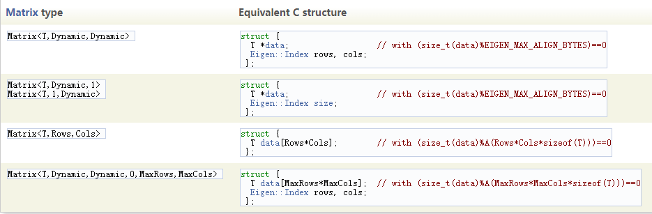
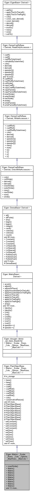

# Eigen::Matrix

[密集矩阵和数组操作](https://eigen.tuxfamily.org/dox/group__DenseMatrixManipulation__chapter.html)»[参考](https://eigen.tuxfamily.org/dox/group__DenseMatrixManipulation__Reference.html)»[核心模块](https://eigen.tuxfamily.org/dox/group__Core__Module.html)

## 详细说明

```cpp
template<typename _Scalar, int _Rows, int _Cols, int _Options, int _MaxRows, int _MaxCols>
class Eigen::Matrix< _Scalar, _Rows, _Cols, _Options, _MaxRows, _MaxCols >
```

矩阵类，也用于向量和行向量。

Matrix 类是[Eigen ](https://eigen.tuxfamily.org/dox/namespaceEigen.html)中所有*密集*（[注意](https://eigen.tuxfamily.org/dox/classEigen_1_1Matrix.html#dense)）矩阵和向量的表示方式。向量是一列矩阵，行向量是一行矩阵。

Matrix类包括*两个*固定大小和动态大小的对象（[note](https://eigen.tuxfamily.org/dox/classEigen_1_1Matrix.html#fixedsize)）。

前三个模板参数是必需的：

- 模板参数
    - **_Scalar** 标量数字类型，例如 float、double、int 或 std::complex<float>。也支持用户定义的标量类型（请参阅[此处](https://eigen.tuxfamily.org/dox/TopicCustomizing_CustomScalar.html#user_defined_scalars)）。
    - **_Rows** 行数，或动态
    - **_Cols** 列数，或动态

其余的模板参数是可选的——在大多数情况下，您不必担心它们。

- 模板参数
    - **_Options** 任一的组合**[RowMajor](https://eigen.tuxfamily.org/dox/group__enums.html#ggaacded1a18ae58b0f554751f6cdf9eb13a77c993a8d9f6efe5c1159fb2ab07dd4f)**或**[ColMajor](https://eigen.tuxfamily.org/dox/group__enums.html#ggaacded1a18ae58b0f554751f6cdf9eb13a0103672ae41005ab03b4176c765afd62)**，和任一的**[自动校准](https://eigen.tuxfamily.org/dox/group__enums.html#ggaacded1a18ae58b0f554751f6cdf9eb13ad0e7f67d40bcde3d41c12849b16ce6ea)**或**[DontAlign](https://eigen.tuxfamily.org/dox/group__enums.html#ggaacded1a18ae58b0f554751f6cdf9eb13a56908522e51443a0aa0567f879c2e78a)**。前者控制[存储顺序](https://eigen.tuxfamily.org/dox/group__TopicStorageOrders.html)，默认为 column-major。后者控制对齐，这是矢量化所必需的。它默认对齐矩阵，除了不是数据包大小倍数的固定大小。
    - **_MaxRows**最大行数。默认为*_Rows*（[注意](https://eigen.tuxfamily.org/dox/classEigen_1_1Matrix.html#maxrows)）。
    - **_MaxCols** 最大列数。默认为*_Cols*（[注意](https://eigen.tuxfamily.org/dox/classEigen_1_1Matrix.html#maxrows)）。

[Eigen](https://eigen.tuxfamily.org/dox/namespaceEigen.html)提供了许多涵盖通常情况的 typedef。这里有些例子：

- `Matrix2d`是一个 2x2 的双精度方阵 ( `Matrix<double, 2, 2>`)
- `Vector4f`是 4 个浮点数 ( `Matrix<float, 4, 1>`)的向量
- `RowVector3i`是 3 个整数的行向量 ( `Matrix<int, 1, 3>`)

- `MatrixXf`是一个动态大小的浮点数矩阵 ( `Matrix<float, Dynamic, Dynamic>`)
- `VectorXf`是浮点数 ( `Matrix<float, Dynamic, 1>`)的动态大小向量

- `Matrix2Xf`是浮点数 ( `Matrix<float, 2, Dynamic>`)的部分固定大小（动态大小）矩阵
- `MatrixX3d`是 double ( `Matrix<double, Dynamic, 3>`)的部分动态大小（固定大小）矩阵

有关预定义*Matrix*和*Vector*类型定义的完整列表，请参阅[此页面](https://eigen.tuxfamily.org/dox/group__matrixtypedefs.html)。

您可以使用普通下标访问向量和矩阵的元素：

```cpp
Eigen::VectorXd v(10);
v[0] = 0.1;
v[1] = 0.2;
v(0) = 0.3;
v(1) = 0.4;
 
Eigen::MatrixXi m(10, 10);
m(0, 1) = 1;
m(0, 2) = 2;
m(0, 3) = 3;
```

通过定义预处理器符号，可以在[扩展 MatrixBase（和其他类）](https://eigen.tuxfamily.org/dox/TopicCustomizing_Plugins.html)页面上描述的插件机制的帮助下[扩展此类](https://eigen.tuxfamily.org/dox/TopicCustomizing_Plugins.html)`EIGEN_MATRIX_PLUGIN`。

***一些注意事项：***

- **[密集](https://eigen.tuxfamily.org/dox/structEigen_1_1Dense.html)与稀疏：**

    Matrix 类处理密集而不是稀疏的矩阵和向量。对于稀疏矩阵和向量，请参阅[稀疏](https://eigen.tuxfamily.org/dox/structEigen_1_1Sparse.html)模块。[密集](https://eigen.tuxfamily.org/dox/structEigen_1_1Dense.html)矩阵和向量是普通的系数数组。所有系数都存储在一个普通的连续数组中。这与将系数存储为非零系数列表的[稀疏](https://eigen.tuxfamily.org/dox/structEigen_1_1Sparse.html)矩阵和向量不同。

- **固定大小与动态大小：**

    固定大小意味着行数和列数是编译时已知的。在这种情况下，[Eigen](https://eigen.tuxfamily.org/dox/namespaceEigen.html)将系数数组分配为固定大小的数组，作为类成员。这对于非常小的矩阵很有意义，通常高达 4x4，有时高达 16x16。即使在编译时碰巧知道它们的大小，也应将较大的矩阵声明为动态大小。动态大小意味着在编译时不一定知道行数或列数。在这种情况下，它们是运行时变量，系数数组在堆上动态分配。请注意，*密集*矩阵，无论是固定大小还是动态大小，*都不会*在 std::map 的意义上动态扩展。如果您想要这种行为，请参阅[稀疏](https://eigen.tuxfamily.org/dox/structEigen_1_1Sparse.html)模块。

- **_MaxRows 和 _MaxCols：**

    在大多数情况下，人们只是将这些参数保留为默认值。这些参数表示矩阵可能具有的行和列的最大大小。在编译时不知道行和列的确切数量的情况下，它们很有用，但在编译时已知它们不能超过某个值。当在固定大小的矩阵中获取动态大小的块时会发生这种情况：在这种情况下，_MaxRows 和 _MaxCols 是原始矩阵的维度，而 _Rows 和 _Cols 是动态的。

***ABI 和存储布局***

下表总结了一些可能的[Matrix](https://eigen.tuxfamily.org/dox/classEigen_1_1Matrix.html)实例的 ABI，这些实例在[Eigen](https://eigen.tuxfamily.org/dox/namespaceEigen.html) 3 的整个生命周期中都是固定的。



请注意，在该表中，Rows、Cols、MaxRows 和 MaxCols 都是正整数。A(S) 定义为小于 EIGEN_MAX_STATIC_ALIGN_BYTES 的最大可能的 2 的幂。

[MatrixBase](https://eigen.tuxfamily.org/dox/classEigen_1_1MatrixBase.html)用于矩阵的大多数 API 方法、[类层次结构](https://eigen.tuxfamily.org/dox/TopicClassHierarchy.html)、[存储顺序](https://eigen.tuxfamily.org/dox/group__TopicStorageOrders.html)



## 成员函数

### 构造函数

1. 默认构造函数

```cpp
template<typename _Scalar , int _Rows, int _Cols, int _Options, int _MaxRows, int _MaxCols>
Eigen::Matrix< _Scalar, _Rows, _Cols, _Options, _MaxRows, _MaxCols >::Matrix()
    
/*
对于固定大小的矩阵，不执行任何操作。
对于动态大小矩阵，创建大小为0的空矩阵。不分配任何数组。这样的矩阵称为空矩阵。此构造函数是创建空矩阵的唯一方法：不支持将矩阵大小调整为0。
*/    
```

2. 

```cpp
template<typename _Scalar , int _Rows, int _Cols, int _Options, int _MaxRows, int _MaxCols>
template<typename... ArgTypes>
Eigen::Matrix< _Scalar, _Rows, _Cols, _Options, _MaxRows, _MaxCols >::Matrix(	
    const Scalar& a0,
    const Scalar& a1,
    const Scalar& a2,
    const Scalar& a3,
    const ArgTypes&... args 
)	
    
/*
Matrix<int, 1, 6> a(1, 2, 3, 4, 5, 6);
Matrix<int, 3, 1> b {1, 2, 3};
cout << a << "\n\n" << b << endl;

1 2 3 4 5 6

1
2
3
*/    
```

3. 

```cpp
template<typename _Scalar , int _Rows, int _Cols, int _Options, int _MaxRows, int _MaxCols>
Eigen::Matrix< _Scalar, _Rows, _Cols, _Options, _MaxRows, _MaxCols >::Matrix(	
    const std::initializer_list< std::initializer_list< Scalar >>& list)	

/*
构造一个矩阵并从作为按行分组的初始化列表给出的系数初始化它。[c++11]
在一般情况下，构造函数接受一个行列表，每一行表示为一个系数列表：

MatrixXd m {
  {1, 2, 3},
  {4, 5, 6}
};
cout << m << endl;

1 2 3
4 5 6

每个内部初始化列表必须包含完全相同数量的元素，否则会触发断言。
在编译时列向量的情况下，允许从单行进行隐式转置。因此VectorXd{{1,2,3,4,5}}是合法的，RowVectorXd{{1},{2},{3},{4},{5}}可以避免更冗长的语法：

VectorXi v {{1, 2}};
cout << v << endl;

1
2

对于固定大小的矩阵，初始值设定项列表大小必须与矩阵大小完全匹配，并且仅允许对编译时向量进行隐式转置。
*/    
```

4. 

```cpp
template<typename _Scalar , int _Rows, int _Cols, int _Options, int _MaxRows, int _MaxCols>
Eigen::Matrix< _Scalar, _Rows, _Cols, _Options, _MaxRows, _MaxCols >::Matrix(Index dim)	

/*
构造具有给定维度的向量或行向量。这仅适用于向量（行向量或列向量），即在编译时已知具有一行或一列的矩阵。
这对于动态大小的向量很有用。对于固定大小的向量，传递这些参数是多余的，因此应该使用默认构造函数Matrix()代替。

对于固定大小的1x1矩阵，此构造函数被禁用。例如，调用 Matrix<double,1,1>(1) 将调用初始化构造函数：Matrix(const Scalar&)。为固定大小的1x1矩阵因此，建议使用默认构造矩阵（）代替，采用非标准的一个特别是当EIGEN_INITIALIZE_MATRICES_BY_{ZERO，NAN}宏（见预处理器指令）。
*/
```

5. 

```cpp
template<typename _Scalar , int _Rows, int _Cols, int _Options, int _MaxRows, int _MaxCols>
Eigen::Matrix< _Scalar, _Rows, _Cols, _Options, _MaxRows, _MaxCols >::Matrix(const Scalar& x)	
    
// 用给定的系数构造一个初始化的 1x1 矩阵。
```

6. 

```cpp
template<typename _Scalar , int _Rows, int _Cols, int _Options, int _MaxRows, int _MaxCols>
Eigen::Matrix< _Scalar, _Rows, _Cols, _Options, _MaxRows, _MaxCols >::Matrix(Index rows, Index cols)	
    
/*
构造未初始化的矩阵行行的cols列。

这对于动态大小的矩阵很有用。对于固定大小的矩阵，传递这些参数是多余的，因此应该使用默认构造函数Matrix()代替。

对于固定大小1x2和2x1向量，此构造函数被禁用。例如，调用 Matrix2f(2,1) 将调用初始化构造函数：Matrix(const Scalar& x, const Scalar& y)。为固定大小1x2或2x1载体因此，建议使用默认构造矩阵（）代替，采用非标准的一个特别是当EIGEN_INITIALIZE_MATRICES_BY_{ZERO，NAN}宏（见预处理器指令）。
*/
```

7. 

```cpp
template<typename _Scalar , int _Rows, int _Cols, int _Options, int _MaxRows, int _MaxCols>
Eigen::Matrix< _Scalar, _Rows, _Cols, _Options, _MaxRows, _MaxCols >::Matrix(
    const Scalar& x,
    const Scalar& y)	
    
// 构造一个具有给定系数的初始化 2D 向量。        
```

8. 

```cpp
template<typename _Scalar , int _Rows, int _Cols, int _Options, int _MaxRows, int _MaxCols>
Eigen::Matrix< _Scalar, _Rows, _Cols, _Options, _MaxRows, _MaxCols >::Matrix(	
    const Scalar& x,
    const Scalar& y,
    const Scalar& z )	
    
// 构造一个具有给定系数的初始化 3D 向量。        
```

9. 

```cpp
template<typename _Scalar , int _Rows, int _Cols, int _Options, int _MaxRows, int _MaxCols>
Eigen::Matrix< _Scalar, _Rows, _Cols, _Options, _MaxRows, _MaxCols >::Matrix(	
    const Scalar & 	x,
    const Scalar & 	y,
    const Scalar & 	z,
    const Scalar & 	w )
    
// 构造一个具有给定系数的初始化 4D 向量。    
```

10. 

```cpp
template<typename _Scalar , int _Rows, int _Cols, int _Options, int _MaxRows, int _MaxCols>
template<typename OtherDerived >
Eigen::Matrix< _Scalar, _Rows, _Cols, _Options, _MaxRows, _MaxCols >::Matrix(
    const EigenBase< OtherDerived > & other)
    
// 泛型表达式的复制构造函数。    
```

11. 

```cpp
template<typename _Scalar , int _Rows, int _Cols, int _Storage, int _MaxRows, int _MaxCols>
template<typename OtherDerived >
Eigen::Matrix< _Scalar, _Rows, _Cols, _Storage, _MaxRows, _MaxCols >::Matrix(	
    const RotationBase< OtherDerived, ColsAtCompileTime > & r)	

// 从旋转 r 构造一个 Dim x Dim 旋转矩阵。    
```

### operator=()

```cpp
// 将通用表达式other复制到 *this 中。
// 该表达式必须提供一个（模板化的）evalTo(Derived& dst) const 函数来完成实际工作。在实践中，这允许任何用户编写自己的特殊矩阵而无需修改MatrixBase
template<typename _Scalar , int _Rows, int _Cols, int _Options, int _MaxRows, int _MaxCols>
template<typename OtherDerived >
Matrix& Eigen::Matrix< _Scalar, _Rows, _Cols, _Options, _MaxRows, _MaxCols >::operator=(	
    const EigenBase< OtherDerived > & other	)	

// 相互分配矩阵。
// 这是模板化 operator= 的一个特例。其目的是防止默认 operator= 隐藏模板化 operator=。
template<typename _Scalar , int _Rows, int _Cols, int _Options, int _MaxRows, int _MaxCols>
Matrix& Eigen::Matrix< _Scalar, _Rows, _Cols, _Options, _MaxRows, _MaxCols >::operator=(	
    const Matrix< _Scalar, _Rows, _Cols, _Options, _MaxRows, _MaxCols >& other)	

// 根据旋转r设置 Dim x Dim 旋转矩阵。    
template<typename _Scalar , int _Rows, int _Cols, int _Options, int _MaxRows, int _MaxCols>
template<typename OtherDerived >
Matrix<_Scalar, _Rows, _Cols, _Storage, _MaxRows, _MaxCols>& Eigen::Matrix< _Scalar, _Rows, _Cols, _Options, _MaxRows, _MaxCols >::operator=(	
    const RotationBase< OtherDerived, ColsAtCompileTime >& r)	
```

