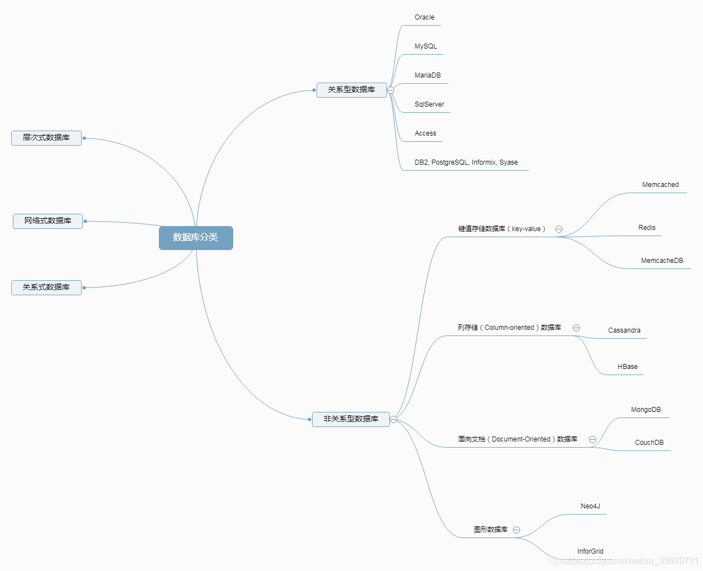
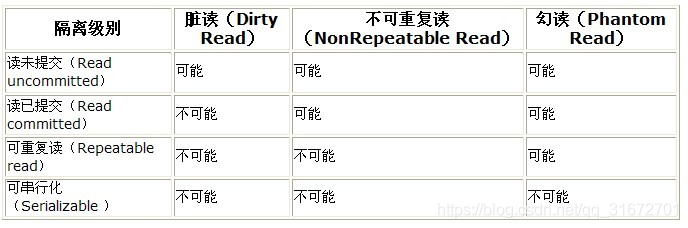

# 2021 秋招面经总结 —— 数据库Mysql 篇（上）

> 作者：leetcode-Crystal

## （0）数据库的分类

## （1） 关系型和非关系型数据库的区别（各自优点）

**关系型数据库**是==简单的表结构==，优点：易于维护，使用方便，直接用 sql 语句进行查询，支持复杂的多表的连接查询；缺点：读写性能差，尤其是面对海量数据的高效率读写；固定的表结构，灵活性差；高并发读写需求，面临硬盘 I/O 的瓶颈

**非关系型数据库**：（包括四种：键值存储数据库 Redis，列存储数据库 HBase，文档数据库 MongoDB CoachDB，图形数据库IinforGrid）优点：格式灵活，支持以上四种格式；速度快；扩展性好；容易部署。缺点：**不支持事务，不支持 sql，不利于对复杂的查询**

## （2） 数据库的索引类型

- 唯一索引：每一个索引对应唯一的数据记录

- 主键索引：以主键作为索引

- 聚集索引：索引的顺序和数据存储的物理顺序是相同的

## （3） 聚集索引和非聚集索引的区别（叶节点存储内容）

- 聚集索引：表数据按照索引的顺序存储，索引的顺序和表中记录的物理顺序一致。**叶子节点存储了真实的数据行，不再有另外单独的数据页**。（类似于新华字典中按照拼音目录（字母+声调））一张表中最多只能创建一个聚集索引，因为真实数据的物理顺序只能有一种。

- 非聚集索引：索引的逻辑顺序和数据存储的物理顺序无关（类似于新华字典中的偏旁目录），**叶子节点包含索引字段值及指向数据页数据行的逻辑指针**，其行数量与数据表行数据量一致。

## （4） 唯一性索引和主键索引的区别

- 主键索引只能创建一个，唯一索引可以创建多个

- 主键索引列不能是空值，唯一索引列可以为空值

- 主键索引严格来讲就是表的主键，是一种约束；唯一索引是一种索引，它是一种数据结构，二者有本质的差别

- 主键索引可以作为其他表的外键，而唯一索引不可以

- 主键一定会创建一个唯一索引，但有唯一索引的列不一定是主键

## （5） 索引的优缺点，什么时候使用索引，什么时候不能使用索引（重点）

**索引的优缺点：**

- 优点：
  - 加快表的查询速度；
  - 加快表之间的连接；
  - 唯一索引保证表中每一行数据的唯一性；
  - 在进行分组和排序查询时，减少查询中分组和排序的时间，借助索引可以提高查询的速度
- 缺点：
  - 需要占额外的存储空间；
  - 索引的维护和创建需要花费一定的时间；
  - 当表发生改变时，同时也要更新索引

**什么时候需要创建索引：**

- 主键自动建立唯一索引

- 频繁作为查询条件的字段应该建立索引

- 查询中排序字段的创建会大大提高索引速度

- 查询中统计或者分组的字段

**什么时候不能使用索引：**

- 频繁进行更新的字段，因为更新字段时不单单需要更新记录，还会更新索引，保存索引文件

- where 条件中用不到的字段

- 记录太少的表

- 经常进行增删改的表

- 数据重复且分布平均的字段

## （6） 索引的底层实现（B+树，为何不采用红黑树，B树）

- 红黑树也可以作为索引的底层实现，但是一般不用红黑树，因为索引是以索引文件的形式存储在磁盘中，访问磁盘需要进行 I/O 操作，因此 I/O 操作的次数是衡量索引底层实现好坏的标准。

- B 树原理：树的高度为 h,节点的度为 d, B 树用了磁盘局部性原理，将一个节点的大小设置为一个页，这样每个节点只需要一次 I/O 就可以完全读入，B 树的深度决定了 I/O 的次数，最多进行 h-1 次 I/O 操作（根节点常驻内存）。然而红黑树的高度比 B 树的高度要深的多，并且逻辑上相邻的节点在物理上可能很远，无法利用磁盘的局部性原理。因此红黑树的性能比 B 树要差很多

- B+ 树：B+ 树更适合外存索引。B+ 树去掉了内节点去掉了 data 域，因此有更大的出度，有更好的性能。并且按关键字进行查找，不经过分支节点，按叶子节点的指针就能够访问所有的节点。

## （7） B 树和 B+ 树具体实现

B 树和 B+ 树都属于多路平衡查找树，是为了解决查找效率低的问题而实现的，B+ 树是 B 树的延伸

度数：在树中，每个节点的子节点（子树）的个数就称为该节点的度（degree）。

阶数：（Order）阶定义为一个节点的子节点数目的最大值。（自带最大值属性）

**B 树：**B 树的阶数为 m

每个节点最多有 m 棵子树（最多有 m - 1 个关键字）；所有非叶子节点除根节点外最少有 m / 2 (取上界)棵子树（最少有 m / 2 - 1 个关键字）。根节点至少有一个关键字

一个节点中的关键字按非降序排列

每个节点的关键字对应其子树的范围

所有的叶子节点有相同的深度（h <= log( n + 1 ) / 2）

**B+ 树：**B+ 树的阶数为 m

除根节点外的内部节点，每个节点最多有 m 个关键字，最少有 m / 2 个关键字，每个关键字对应一个子树；根节点要么没有子树，要么至少两棵子树

所有叶子节点包含了全部关键字，以及这些关键字指向文件的指针，所有叶子节点按关键字大小排序，相邻叶子节点顺序连接，相当于构成一个顺序链表，所有叶子节点在同一层；

分支节点中的关键字对应子树中关键字的最大值

**二者的区别：**

- B+ 树每个节点的关键字的个数和其子树的个数相等，而 B 树关键字的个数比子树的个数少 1

- B+ 树种所有的关键字及指针都存储到叶子节点中，内部节点相当于索引，B 树指向文件的关键字在内部节点中。

- B+ 树在搜索过程中，如果内部节点与当前关键字匹配，则继续搜索，直到搜索到根节点。

## （8） 索引最左前缀问题

**联合索引**：以一定顺序引用多个列，这种索引叫联合索引，一个联合索引是一个有序元组

索引的最左前缀匹配是指在建立联合索引时，==索引的任何前缀都会用于查询==，例如：联合索引（col1, col2, col3）这个联合索引的所有前缀就是（col1）, (col1,col2), (col1,col2,col3), 包含这些列的查询都会启用索引查询；但是所有不在最左前缀里的列，即使包含在联合索引中也不会启用索引。

最左前缀匹配原则，一直向右匹配，直到遇到范围查询（>, <, between, like）就停止匹配。比如 a = 1 and b = 2 and c > 3 and d = 4 如果建立(a, b, c, d)顺序的索引，d 是用不到索引的，如果建立(a, b, d, c)的索引则都可以用到，a, b, d 的顺序可以任意调整。

## （9） Mysql 的优化（结构优化、查询优化），MySQL 慢查询优化

索引策略属于结构优化的范畴

**索引优化：**

索引优化这里不得不提到联合索引，联合索引是以一定的顺序引用多个列，在查询的过程中会使用最左前缀匹配的索引。

1. 当全列匹配时，不用考虑 where 的查询条件中列的顺序，查询优化器会自动调整其顺序,以使用适合的索引；
2. 最左前缀匹配：当匹配索引左面的一列或者几列时，会用到索引，但只会用到一部分；
3. 查询条件中用到了索引中列的精确匹配中的一部分，中间某个条件未提供，如果中间这个条件对应的值少，可以考虑用 IN 来填补这个坑，从而形成最左前缀（隔离列的优化方式）；否则，可以建立辅助索引
4. 查询条件中没有指定索引的第一列，没办法用到索引。
5. 查询条件中包含匹配某列的前缀字符串，当该条件（也就是含有通配符的条件 %）不出现在开头时，可以用该条件所在的列及其之前的列作为索引，查询条件不同，用到的索引的前缀的个数也不同
6. 查询条件中包含范围时，包含范围的列可以作为索引，但最多只能用于一个范围列，注意 BETWEEN 并不代表范围，相当于关键字 IN
7. 查询条件中含有函数或者表达式的列，该列不会作为索引

索引的底层实现的优化：

mysql 的默认的数据库引擎是 innodb, innodb 使用默认自增的主键作为索引，这样每次插入索引时是从右边扩展的，避免了 B+ 树节点的频繁的分裂和合并，如果采用随机主键，会使得数据随机插入，效率低。

**为什么使用 select \* from table 会使得查询效率低？**

select * 语句取出表中所有的字段，会解析更多的对象，字段，权限，属性等，无论该字段的数据对调用的程序是否有用，这会造成服务器资源的浪费，导致优化和效率问题，对服务器的性能产生一定的影响

**总结：**

**索引方面**：为了避免全表扫描，首先考虑在 where 及 order by 涉及的列上建立索引；如果该索引是复合索引，必须使用该索引中的第一个字段作为条件时，才能用到该索引，并尽可能的让索引顺序和字段顺序一致

**Sql 语句编写方面**：在 where 子句中，避免对字段进行 null 值判断，避免使用 !=, <, > 操作符，避免使用 or 来建立连接条件，慎用 in 和 not in ,慎用 like '%abc%'，避免对字段进行表达式操作和函数操作，会导致引擎放弃索引而进行全表扫面；用 exists 代替 in 是一个提高查询效率的方法；任何地方不要使用 select * from t，用具体的字段代替“星号”，不要返回用不到的字段

**设计表时**，尽量使用数字型字段，若只含数值信息的字段尽量不要设计为字符型，这样会降低查询和连接的效率，增加存储开销，因为引擎处理查询和连接时会逐个比较字符串中的每一个字符，对于数字型而言只比较一次就够了；尽量使用 varchar 代替 char，因为变长字段存储空间小，可以节省内存空间，在查询时，一个较小的字段搜索效率高；避免频繁创建表、删除表，减少系统的表资源消耗。

**写在最后**

上篇重点总结了索引涉及到的知识点，这也是面试过程中的高频问题，一定要掌握的扎扎实实。

# 2021 秋招面经总结 —— 数据库Mysql 篇（中）

坚持看到中篇，已经掌握了三分之一的知识点，本篇重点总结数据库**引擎、事务、隔离性、隔离级别、连接池、表空间**等知识点。

## （10） 数据库引擎介绍，innodb和myisam的特点与区别

myISAM 和 innodb 底层实现都是 B+ 树，innodb 是 mysql 默认的存储引擎

**区别：**

1. innodb 支持事务并且提供了外键约束，MYISAM 不支持事务并且没有外键约束

2. innodb 是聚簇索引，使用 B+ 树的索引结构，数据文件和（主键）索引文件绑在一起，因此要求表必须有主键，通过主键索引的查询效率很高，但是通过辅助索引需要查询两次，先检索辅助索引查询到主键，第二次根据主键查询到数据；主键索引的叶子节点存储的就是数据文件，辅助索引的叶子节点存储的是主键的值。因此主键不应该过大，主键太大，其他索引也都会很大；
3. myisam 是非聚簇索引，使用 B+ 树的索引结构，数据文件和索引文件分离，索引保存的是指向数据文件的指针，主键索引和辅助索引保存的都是数据文件的指针

**总结：**

myISAM 是非聚簇索引；data 域存放的是数据的地址，数据文件和索引文件在内存中是分开的，索引文件保存数据文件的地址；主索引 key 唯一，辅索引 key 可以重复

inndb 是聚簇索引；data 域存放的是完整的数据记录，只有数据文件；主索引 key 是表的主键，要求表必须有主键，根据主键创建索引，而 myisam 没有此要求

## （11） 数据库中事务的ACID（四大特性都要能够举例说明，理解透彻，比如原子性和一致性的关联）

事务：要做的事情，对数据库进行读写操作。事务是并发控制的基本单位，一个程序包含多个事务

**A** (Atomicity) **C** (Consistency) **I** (Isolation) **D** (Durability)==>原子性，一致性，隔离性，持久性

**原子性**：事务作为一个整体被执行，对数据的操作要么全都执行要么全不执行

**一致性：**事务应确保从一个一致状态转变到另一个一致状态，一致状态的含义是数据库中的数据应满足完整性约束

**隔离性：**多个事务并发执行时，一个事务的执行不影响其他事务的执行

**持久性：**一个事务一旦提交，他对数据库的修改应该永久保存在数据库中

举例：

A向B转钱，分为六个过程：

1. 读取A账户的钱；

2. A账户的钱递减；

3. 写回A账户；

4. 读取B账户的钱；

5. B账户的钱递增；

6. 写回B账户。

**原子性**：以上转钱的中间过程要么全做，要么全部不做，中间如果某个步骤出错，则回滚（单库事务回滚使用ROLLBACK）到初始的状态，通过undo log来实现（在操作任何数据之前，首先将数据备份到undo log中，谭厚进行数据修改，如果出现了错误，执行了ROLLBACK语句，系统可以利用undo log中的备份将数据恢复到事务开始之前的状态）

**一致性：**A账户和B账户，转账之前和转账之后钱的总数是不变的，通过undo log来实现

**隔离性：**在进行并发操作时，A向B转账，C也向B转账，转账完成之后，B账户的钱是两次转账的总和；在A向B转账的过程中，只要事务还没有提交，两个账户里面的钱不会发生变化

**持久性：**转账成功，两个账号的钱会写入数据库中做持久化保存，通过redo log(重做日志)来实现（redo log记录的是新数据的备份，在事务提交之前只要将redo log持久化即可，不需要将数据持久化，当系统崩溃时，系统可以根据redo log的内容，将数据恢复到最新的状态）

**原子性和一致性的关联：**

原子性的破坏可能导致数据库的不一致，数据的不一致并不都和原子性有关。

例如：A账户向B账户转100元，但是B账户只增加了50元，此过程符合事务的原子性，但是数据的一致性被破坏了。

## （12） 数据库隔离性设置不同会出现的问题（丢失更新、脏读、不可重复读、幻读）

**丢失更新**：事务 T1 对数据进行操作，然后事务 T2 对相同的数据进行操作并提交，事务 T1 对数据进行了回滚操作，导致事务 T2 对数据的操作丢失；事务 T1 对数据进行操作，事务 T2 也对数据进行操作并提交，事务 T1 提交事务，将事务 T2 对数据的操作覆盖掉了。（两个事务 T1、T2 读入同一数据并修改，T2 提交的结果破坏了 T1 提交的结果，导致 T1 的修改丢失。）

**脏读：**读到了数据库中未提交的数据。（读未提交）。事务 T1 读到了事务 T2 未提交的数据，并对该数据进行操作然后提交，但是事务 T2 对撤销了该事务，导致事务 T1 操作的是错误的数据。

**不可重复读：**一个事务 T1 在读取表中的数据后，另一个事务 T2 对表中的数据进行了修改，多次读取的结果不一样

**幻读：**一个事务 T1 读取按一定条件读取数据库中的某些数据后，另一个事务 T2 插入或者删除了一些记录，当 T1 再次读取该数据库时，出现了前后不一致的情况。（事务 T1 对表的全部数据进行了修改，事务 T2 在表里插入了一些数据，导致事务 T1 再次操作该表时，发现还有未修改的数据，好像出现了幻觉一样）

**不可重复读和幻读的区别：**

**不可重复读：**由于数据修改引起的，

**幻读**：由于数据插入和删除引起的，在可重复读中，sql 第一次读取数据后，就将这些数据加锁，其他事物无法修改这些数据，但是可以 insert 数据，所以事务 A 先前读取了数据，或者修改了全部数据，事务 B 还是可以 insert 数据，这是事务A就会发现多了一条数据，这就是幻读

## （13） 数据库的隔离级别（事务的锁），mysql 和 Oracle 的隔离级别分别是什么

通过对数据库加锁实现并发控制，锁分为：**排它锁**（X锁，写锁）和**共享锁**（S锁，读锁）

**隔离级别：**四种隔离级别（读未提交、读已提交、可重复读、串行化）

- **读未提交：**隔离级别最低，会引发脏读、不可重复读和幻读
- **读已提交**：读到的都是已提交的数据，会引发不可重复读和幻读
- **可重复读：**避免了脏读、不可重复读，会引发幻读
- **串行化：**所有事务按照次序依次执行，脏读、不可重复读、幻读都不会出现

进行读操作时，需要申请并获得 S 锁（共享锁，其他事务可以继续加锁，但不能加排它锁）；进行写操作时，需要申请并获得 X 锁（排它锁，其他事务不能再获得任何锁）

《一级封锁协议》（写操作时，加 X 锁，只有当 X 锁释放后，才能允许其他事物对该事务操作），可防止丢失修改；

《二级封锁协议》（在一级封锁协议的基础上，在读数据时加 S 锁，读完后释放），可防止不丢失修改，不读脏数据；

《三级封锁协议》（在一级封锁协议的基础上，读数据时加 S 锁，直到事务结束时释放）可防止不丢失修改，不读脏数据，不可重复读。

**mysql 的默认隔离级别是：可重复读。**myISAM 和 InnoDB 都支持表级锁，但 Innodb 默认是行级锁。

oracle 支持读已提交和串行化两种隔离级别，默认情况是读已提交

## （14） 数据库连接池的作用

为什么会出现连接池： 在操作数据库的时候，可能会出现频繁的建立连接、关闭连接的情况。这样会大大降低系统的性能。

连接池： 资源池是为了解决资源频繁分配和释放所造成的问题而出现的，应用在数据库管理领域就是建立一个数据库的连接池，当需要建立连接时，调用 getConnection 方法获得连接；当使用完毕时，通过 releaseConnection 方法直接返回，并不是释放连接，只是由连接池收回，以便下一次使用。 

**作用：**

- **资源复用：**数据库的连接得到了重用，避免了频繁的创建连接、释放连接引起的性能开销。在减少系统消耗的基础上，也增进了系统运行环境的平稳性。

- **更快的响应速度：**数据库连接池在初始化的过程中，往往已经建立了若干数据库连接置于池中备用。此时连接的初始化工作已经完成。对于业务请求而言，直接利用现有的可用连接，避免了数据库连接初始化和释放过程的时间，从而缩短了系统整体响应的时间。

- **统一的连接管理，避免了数据库连接泄漏：**在较完备的数据库连接池实现中，可以根据预先的连接占用超时设定，强制收回被占用的连接。从而避免了常规数据库连接操作中可能出现的资源泄露。

## （15） Mysql的表空间方式，各自特点。

Mysql 存储引擎是 innodb, innodb 的数据的存储方式有两种：共享表空间、独占表空间。（表空间是指数据库表的存储方式）

**共享表空间：**每一个数据库的所有的表数据、索引文件全部放在一个文件中，每一个表都有 .frm 描述文件，默认这个共享表空间的文件路径在 data 目录下。

**独占表空间：**每一个表都会以独立的文件方式来进行存储，每一个表都有 .frm 表描述文件，还有一个 .ibd，每个表的数据和索引单独存放在以表命名的 ibd 文件中

**共享表空间：**

- 优点：表空间可以自动分成多个文件存放到各个磁盘上，一个表的数据可以分布在不同的文件上，表数据的大小限制不再是文件系统单个文件大小的限制而是 InnoDB 自身的限制

- 缺点：所有数据和索引存放到一个文件中，文件非常大，虽然可以将大文件分成多个小文件，但是整个数据库的表及索引在表空间中混合存储，这样对数据库做了大量的删除操作后，表空间会有大量的空隙

**独占表空间：**

- 优点：每个表都有自己独立的表空间，数据存储清晰，灾难恢复相对容易，不容易影响其他的表；可以实现单表在不同的数据库中移动；空间更容易回收；使用独占表空间的性能会高一点，无论怎么删除，表空间的碎片不会太影响性能

- 缺点：使用独占来存放 Innodb 表，每个表数据以单独的文件来存放，这时单表数据量的限制变成了文件系统大小的限制。

# 2021 秋招面经总结 —— 数据库Mysql 篇（下）

这是面经系列数据库篇的最后一部分，涉及到分布式事务、范式、数据库中的锁、视图等知识点。

## （16）分布式事务

**分布式事务：事务的参与者、支持事务的服务器、资源服务器以及事务管理器分别位于不同的分布式系统的不同节点上，分布式事务是为了保证数据库的数据一致性。** 

强一致性： 任何一次都能读到某个数据的最近一次写的数据。系统中的所有进程，看到的操作顺序，都和全局时钟下的顺序一致。简言之，在任何时刻，所有节点的数据是一致的。

弱一致性： 数据更新后，能容忍后续的访问只能访问到部分或者全部访问不到。

最终一致性： 不能保证在任意时刻节点上的同一份数据都是相同的，但是随着时间的迁移，不同节点上的同一份数据总是在向趋同的方向变化。简单说，在一段时间后，节点间的数据会最终到达一致状态

CAP(Consistency, Availability, Partition torlence)原则：

一致性（Consistency）：在分布式系统中的所有数据备份，在同一时刻是否具有同样的值。（所有节点访问到同一份最新数据的副本）

可用性（Availability）：在集群中一部分节点故障后，集群整体是否还能响应客户端的读写请求。

分区容错性（Partition torlence）：以实际效果而言，分区相当于对通信的时限要求。系统如果不能在时限内达成数据一致性，就有意味着发生了分区的情况，就必须在C和A之间做出选择

CAP原则：要么是AP，要么是CP，要么是CA，但是不存在CAP。

BASE（Base Available Soft State Eventual Consistency）理论：

BASE理论指的是基本可用Basically Available，软状态Soft State，最终一致性Eventual Consistency，核心思想：即便无法做到强一致性，但应该采用适合的方式保证最终一致性.

BA(Base Available)：基本可用，分布式系统在出现故障时，允许损失部分可用性，即保证核心可用

S(Soft State)：软状态，允许系统存在中间状态，而中间状态不会影响系统的可用性

E(Eventual Consistency)：最终一致性，系统中所有的副本经过一定的时间后，最终能够达到一致的状态

柔性事务： 不同于ACID的刚性事务，在分布式场景下，基于BASE理论，就出现了柔性事务的概念。要想通过柔性事务来达到最终的一致性，就需要依赖于一些特性，这些特性在具体的方案中不一定都要满足，因为不同的方案要求不一样，但是都不满足的话，是不可能做柔性事务的。

幂等操作： 幂等操作的特点：其任意多次执行所产生的影响均与一次执行的影响相同。幂等函数或者幂等方程，是指可以用相同的参数重复执行，并能获得相同结果的函数。这些函数不会影响系统的状态，也不用担心重复执行会对系统造成改变。例如：支付流程中第三方支付系统告知系统中某个订单支付成功，接收该支付回掉接口在网络正常的情况下无论操作多少次都应该返回成功。

分布式事务使用场景：

转账操作：用户A使用银行app转账给用户B，银行系统首先扣掉用户A的钱，然后增加用户B账户的钱。此时会出现两种异常：1.用户A的账户扣款成功，用户B的账户余额增加失败；2.用户A账户扣款失败，用户B增加成功。此时需要用分布式事务来保证转账成功

下单扣库存：下单接口会涉及生成订单id、扣减库存等操作，对于微服务架构系统，订单id与库存服务一般都是独立的服务，此时就需要分布式事务来保证整个下单接口的成功

分布式事务的解决方案：

两阶段提交/XA： 分两步提交，存在一个负责协调各个本地资源管理器的事务管理器，本地资源管理器一般是由数据库实现。

流程：

事务管理器在第一阶段（prepare）的时候询问各个资源管理器是否就绪（ready状态），如果收到每个资源的回复都是yes，则在第二个阶段提交(comit)事务，如果任意一个资源的回复是no，则回滚(rollback)事务。

存在的问题：

1.同步阻塞：当事务参与者存在占用公共资源的情况，其中一个占用了资源，其他事务只能阻塞等待资源释放，处于阻塞状态；

2.单点故障：一旦事务管理器出现故障，整个系统不可用

3.数据不一致：在阶段二，如果事务管理器只发送了部分commit消息，此时网络发生异常，那么只有部分参与者接收commit消息，也就是说只有部分参与者提交了事务，使得系统数据不一致

4.不确定性：当协调本地资源管理器的事务管理器发送了commit后，并且此时只有一个参与者收到了commit，那么当该参与者与事务管理器同时宕机后，重新选举的事务管理器无法确定该条消息是否提交成功

TCC（Try-Confirm-Cancel）:

相比两阶段提交的优点：

1.同步阻塞：引入超时机制，超时后进行补偿，并且不会锁定整个资源，将资源转化为业务逻辑形式，粒度变小；

2.单点故障：解决了事务管理器出现单点故障后，整个系统不可用的问题。由主事务方发起并完成这个事务，事务管理器变成多点，引入集群；

3.数据一致性：有了补偿机制后，事务活动管理器控制一致性。

流程：

1.Try阶段：尝试执行，完成所有的业务检查（一致性），预留必须业务资源（准隔离性）。（对业务进行检查及资源预览，比如订单和存储操作，需要检查库存剩余数量是否够用，并进行预留，预留操作就是新建一个可用库存数量字段，Try阶段操作是对这个可用库存数量进行操作）

2.Confirm阶段：确认执行真正执行业务，不做任何业务检查，只使用Try阶段预留的业务资源，Confirm操作满足幂等性，Confirm操作失败后需要进行重试

3.Cancel阶段：取消执行，释放Try阶段预留的业务资源，Cancel操作满足幂等性，Cancel阶段的异常和Confirm阶段异常处理方案上基本一致

## （17） 数据库的范式

第一范式：属性具有原子性，不可再分解，例如：日期这个属性，如果认为日期可以分解成年月日，含有该属性的表就不是第一范式

第二范式：在第一范式的基础上，非主属性**完全依赖**于候选键（若干主属性组成），不存在部分依赖

第三范式：在满足第二范式的基础上，消除**传递依赖**，就是说每个非主属性都不传递依赖于候选码。例如：（学生，课程，老师，老师职称），（学生，课程）->老师->老师职称，老师和老师职称这里存在传递依赖。

BC 范式：在满足第三范式的基础上主属性不依赖于主属性

## （18） 数据的锁的种类，加锁的方式

按照锁的粒度进行划分：行锁、表锁、页锁

- **行锁**：加锁的粒度最小

- **表锁：**加锁的粒度最大

- **页锁：**粒度介于行锁和表锁之间

按照使用方式进行划分：排它锁、共享锁

- **排它锁（X锁，写锁）**：事务对数据对象加上X锁，既可以对数据进行读操作，又可以对数据进行写操作；但其他事务不能对A加任何锁

- **共享锁（S锁，读锁）：**事务T对数据加上S锁，只能对数据进行读操作，其他事务只能对数据加S锁，不能加X锁，直到事务T释放S锁。

两种思想上的锁：悲观锁和乐观锁

## （19） 视图的作用与使用方法（如何删除等）

视图：从一个表或几个基本表导出的表，与基本表不同，它是一个虚表，数据库中只存放视图的定义而不存放视图对应的数据，这些数据存依然放在基本表中。

视图的使用方法：

建立视图：create view <视图名>[列名1， 列名2，……] as <子查询> [with check option]. with check option表示对视图进行增、删、改操作时，保证增删改的行满足视图中子查询中的条件表达式。

删除视图：drop view <视图名>[cascsde]，视图删除后视图的定义将从数据字典中删除，使用cascade级联删除语句把该视图和由他导出的所有视图一起删除。注意：基本表删除，并不意味着由该基本表定义的视图一起删除，视图依然在数据字典中，删除视图需要显示的使用drop view语句。

查询视图：查询视图的操作和查询表的操作，sql语句的写法是一样的。只不过在对视图进行查询时，会将该查询语句与视图的子查询结合起来，转化为等价的对基本表的查询，这个转化过程称为视图消解。

更新视图：由于视图中存放的不是实际的存储数据，因此对视图的更新转化为对基本表的更新。但是并不是所有的视图都是可更新的

视图能够简化用户的操作：使用户将注意力集中在所关心的数据上

使用户从多角度看待同一数据

对重构数据提供了一定程度的逻辑独立性：数据具有逻辑独立性（当数据重构造时，如增加新的关系或对原有的关系增加新的字段等，用户的应用程序不受影响）和物理独立性（用户的应用程序不依赖于数据库的物理结构）

对机密数据提供安全保护

适当利用视图可以清晰表达查询

## （20） 分库分表，主从复制，读写分离。

技术出现的背景：随着数据库中的数据量越来越大，查询所需的时间就会越来越长；另外MySQL会对更改表的数据加锁，会阻塞其他的操作。

从以上两个方面进行考虑，数据量大的问题采用分库分表解决；对于写操作会阻塞后续的读操作，采用读写分离解决。

分表： 

水平划分：按照行级进行划分，同一模块下多个结构相同的子表

垂直划分：按照列进行划分，将表划分为不同字段结构的表

分库：

水平划分：主要根据数据属性（例如：商品所属地市，种类）拆分物理数据库，从而解决数量过大IO密集问题；

垂直划分：按照业务模块划分出不同的数据库，而不是将所有的表都存放在同一个数据库中。例如：商场订单模块放在主机1中的数据库，商品模块放在主机2中的订单

读写分离：在主服务器上修改，数据会同步到从服务器，从服务器只能提供读数据，不能提供写入，实现备份的同时也实现了数据库性能的优化，以及提升了服务器的安全性。

## （21）order by的底层原理：

rowid 排序： 将待排序的字段放在 sort_buffer 中进行排序，然后根据该字段在查询其对应其他列的字段

全字段排序： 将所要取出的字段放在 sort_buffer 中进行排序，排好序保存结果

## （22） 项目中哪里用到了数据库，怎么用的

结合项目来回答，笔者面试过程中被问道数据库中设计了哪些表，然后针对这些表考察 sql 语句的编写。