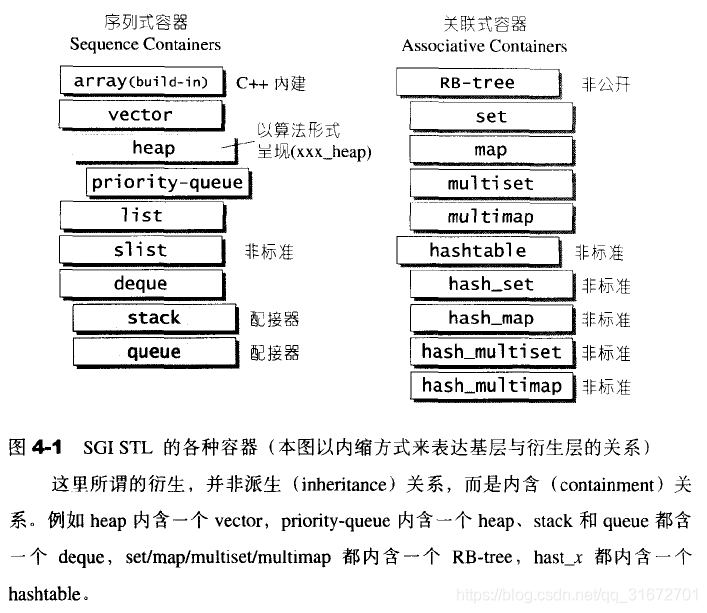
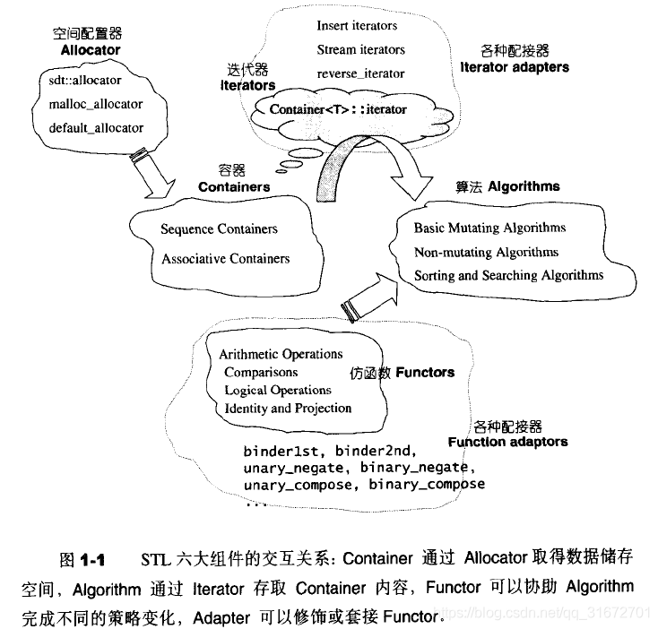
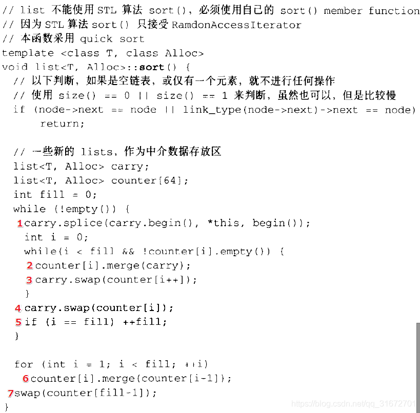
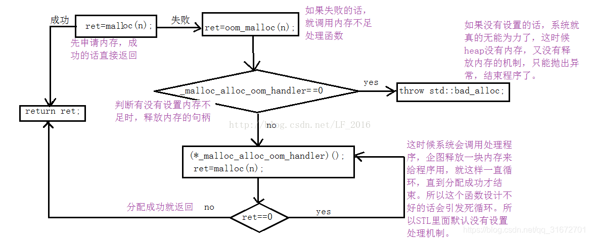
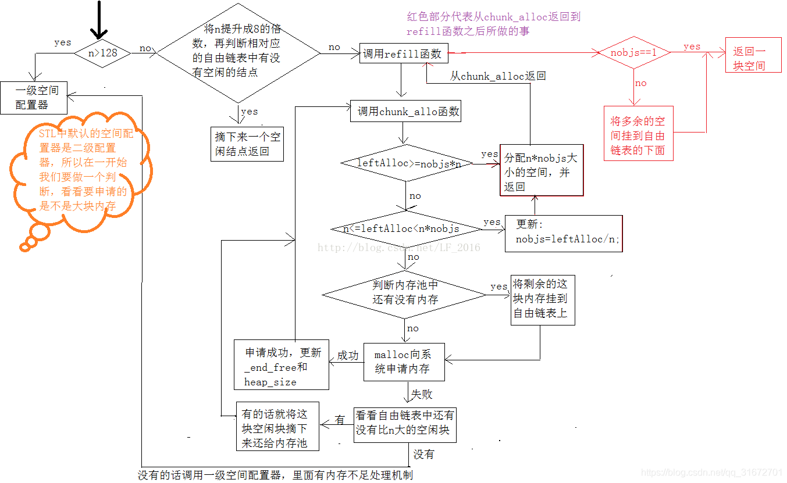

# 2021秋招面经总结——STL篇（上）

> 作者：leetcode-Crystal

笔者秋招投递的岗位主要是软件开发 C++ 方向和后端开发，面试过程中主要的编程语言是 C++，准备面 C++ 方向的小伙伴，一定一定要看下 STL 源码，可能短时间内达不到手写源码的程度，但一些数据结构的底层原理一定要搞明白，面试过程中一些互联网大厂的面试官超级喜欢问。建议看下《STL源码剖析》这本书，但注意没必要面面俱到，可以重点看点各种数据结构设计的底层原理，当然其他部分面试过程中也完全有可能涉及。

## 整体框架：STL六大组件

1、**容器**：各种数据结构，从实现的角度来看，STL 容器是一种 class template

2、**空间配置器**：负责动态空间的配置和管理

3、**迭代器**：在23个设计模式中，有一种是迭代器模式（提供一种方法，使之能够依序访问某个容器所含的各个元素，而无需暴露该容器的内部表述方式），其行为类似于智能指针；STL 的设计中，将数据容器和算法分开，彼此独立设计，通过迭代器（容器和算法的胶粘剂）将他们撮合在一起。

4、**算法**：从实现角度来看，STL 算法是一种 function template

5、**仿函数**：也叫函数对象，行为类似于函数；从实现角度来看，仿函数是重载了 operator() 的 class 或者 class template 。

仿函数分类：以操作数的个数划分：一元仿函数、二元仿函数； 以功能划分：算术运算、关系运算、逻辑运算。

6、**配接器**：用来修饰容器或者迭代器接口

**六大组件的关系：**

## 常用容器的特点及适用情况

- **string**：与 vector 相似的容器，专门用于存储字符。随机访问快，在尾位置插入/删除速度快

- **array**：固定大小数组。支持快速随机访问，不能添加或者删除元素

- **vector**：可变大小的数组。底层数据结构为数组，支持快速随机访问，在尾部之外的位置插入或者删除元素可能很慢

- **list**：双向链表。底层数据结构为双向链表，支持双向顺序访问。在 list 任何位置插入/删除速度很快

- **forward_list**：单向链表。支持单项顺序访问。在 forward_list 任何位置插入/删除速度很快

- **deque**：双端队列。底层数据结构为一个中央控制器和多个缓冲区，支持快速随机访问，在头尾位置插入/删除速度很快

- **stack**：栈。底层用 deque 实现，封闭头部，在尾部进行插入和删除元素

- **queue**：队列。底层用 deque 实现

- **priority_queue**：优先队列。底层用 vector 实现，堆 heap 为处理规则来管理底层容器的实现

- **set**：集合。底层为红黑树，元素有序，不重复

- **multiset**：底层为红黑树，元素有序，可重复

- **map**：底层为红黑树，键有序，不重复

- **multimap**：底层为红黑树，键有序，可重复

- **unordered_set**：底层为哈希表，无序，不重复

- **unordered_multiset**：底层为哈希表，无序，可重复

- **unordered_map**：底层为哈希表，无序，不重复

- **unordered_multiap**：底层为哈希表，无序，可重复

**总结**：(这里仅代表做这几种操作时效率比较高，可能其他容器也支持这几种操作)

- 支持随机访问的容器：string, array, vector, deque

- 支持在任意位置插入/删除的容器：list, forward_list

- 支持在尾部插入元素：vector, string, deque

**说明：**

总体来说：unordered_map 比 map 的查找速度快，unordered_map 的查找速度是常数级别，map 的查找速度是（log(n)）级别。但是，不一定常数就比 log(n) 小，hash 还有 hash 函数耗时。当考虑效率，特别是当元素达到一定数量级时，考虑 unordered_map  但；如果对内存要求特别严格，希望少消耗内存，当 unordered_map 对象比较多时，就不太好控制了，而且它的构造速度会比较慢

## 面经总结1————底层原理问题：

- **vector 底层存储机制**

vector 是一个动态数组，里面是一个指针指向一片连续的空间，当空间不够用时，会自动申请一块更大的空间（一般是增加当前容量的 50% 或者 100% ），然后把原来的数据拷贝过去，接着释放原来的空间；当释放或者删除里面的数据时，其存储空间不释放，仅仅是清空了里面的数据

- **list 底层存储机制**

list 以节点为单位存放数据，节点的地址在内存中不一定连续，每次插入或者删除数据时，就配置或者释放一个元素的空间

- **deque 底层存储机制**

deque 动态的以分段连续的空间组成，随时可以增加一段新的连续的空间并链接起来，不提供空间保留（reserve）功能。

deque 采用一块 map (不是 STL 的 map 容器) 作为主控，其为一小块连续的空间，其中的每个元素都是指针，指向另一段较大的连续空间（缓冲区）

- map底层机制

map 以红黑树作为底层机制，红黑树是平衡二叉树的一种，在要求上比 AVL 树更宽泛。通过 map 的迭代器只能修改其实值，不能修改其键值，所以 map 的迭代器既不能是 const 也不是 mutable

红黑树满足以下几个条件：

	1. 每个节点不是红色就是黑色
 	2. 根节点是黑色
 	3. 红色节点的子节点必须是黑色（不能有连续的红节点）
 	4. 从根节点到NULL的任何路径所含的黑节点数目相同，叶子节点是黑色的 NULL 节点（注：这里不是我们常说的二叉树中的叶节点，是它的子节点（NULL））

 

本篇是STL相关面试题上篇，后续还会总结出下篇。为了便于复习总结，笔者以知识点而非问题的形式呈现出来，敬请关注！！！

 

# 2021秋招面经总结——STL篇（中）

本篇是接续上篇，在上篇中总结了下 STL 的整体框架，重点对数据结构的底层原理问题进行整理，中篇继续总结面试中常问的知识点，建议先看下上篇对 STL 有个整体的认识，再深入到细节进行学习。最好还是看下《STL源码剖析》这本书。

## 面经总结2—迭代器失效问题

**迭代器和指针的区别**

- 迭代器不是指针，是**类模板**，表现的像指针，只是模拟了指针的功能，重载了指针的一些操作符，->, * , ++, --等；

- 迭代器封装了指针，是一个可遍历 STL 容器内全部或者部分元素的对象，本质上封装了原声指针，比指针更高级，相当于智能指针

- **迭代器返回的是引用**，而不是对象的值

**迭代器的种类**

根据移动特性与实施的操作，迭代器被分为五类：

- **Input Iterator**：**只读**迭代器，该迭代器所指的对象，不允许用户改变

- **Output Iterator**：**唯写**

- **Forward Iterator**：允许写入型算法在该迭代器所形成的区间上进行**读写**操作

- **Bidirectional Iterator**：可双向移动

- **Random Acess Iterator**：前三种迭代器支持 operator++，第四种迭代器再加上 operator--，第五种涵盖所有指针算术能力，包括 p + n, p - n, p[n], p1 - p2, p1 < p2

**为什么 vector 的插入操作会导致迭代器失效？**

vector 动态增加空间时，并不是在原空间之后增加新的空间，而是以原来大小的两倍或者原空间加上实际所需的空间的大小另外配置一片较大的空间，释放原来的空间。由于操作改变了空间，所以原来的迭代器失效

**vector 每次 insert 或者 erase 之后，以前保存的迭代器会不会失效？**

- 在进行insert时，如果在 p 位置插入新的元素。当容器有剩余空间，不需要重新分配空间时，p 之前的迭代器都有效，p 之后的迭代器都失效；当容器重新分配了内存空间，那么所有的迭代器都失效

- 进行 erase 时，erase 的位置在 p 处，p 之前的迭代器都有效且 p 指向下一个元素位置（如果 p 在尾元素处，p 指向无效 end 无效），p 之后的迭代器都无效。

**deque 插入和删除元素，以前保存的迭代器是否失效？**

- 在中间插入或者删除元素，将使 deque 所有的迭代器、引用、指针失效

- 在首部或者尾部插入元素可能会使迭代器失效（缓冲区空间已满，需重新分配内存），但不会引起指针或者引用失效

- 在首部或者尾部删除元素，只会使指向被删除的元素迭代器失效

**vector、list、deque、map 在 erase(iter) 后迭代器如何变化**

- vector 和 deque 是序列式容器，其内存分别是连续空间和分段式连续空间，删除迭代器 iter 后，其后面的迭代器都失效了，此时iter 指向被删除元素的下一个位置

- list 删除迭代器 iter 时，其后面的迭代器不会失效，将前面和后面连接起来即可

- map 删除 iter 时，只是当前删除的迭代器失效，其后面的迭代器依然有效

## 面经总结3—容器间的对比

**1. vector 插入删除操作和 list 有什么区别**

- vector 插入删除操作需要进行元素的移动，如果 vector 所存储的对象很大或者构造函数比较复杂，则开销较大，如果是简单的小数据效率优于 list

- list 插入删除操作需要遍历当前数据，但在首部插入效率很高

**2.** **什么情况下用 list 什么情况下用 vector**

- 当数据对象简单，对象数量变化不大，需要**频繁的随机访问**时，用 vector

- 当数据对象复杂，对象的数量频繁变化，**频繁的进行插入和删除**操作时，用 list

**3. deque 和 vector 的区别**

- vector 是单向开口的连续区间，deque 是双向开口的连续区间（可以在头尾两端进行插入和删除操作）

- deque 提供随机访问迭代器，但是迭代器比 vector 复杂很多

- deque 没有提供空间保留功能，也就是没有 capacity 这个概念，而 vector 提供了空间保留功能。即 vector 有 capacity 和 reserve函数，deque 和 list 一样，没有这两个函数。

**4. vector，list，deque 对比**

- vector 数据在内存中连续排列，所以随机存取元素的速度最快。但是在除尾部以外的位置删除或者添加元素的时候速度很慢

- list 数据是链式存储，不能随机存取。其优势在于在任意位置添加和删除元素

- deque 通过链接若干片连续的数据实现的，均衡了以上两容器的特点

**5. unordered_map 和 map 的区别？什么时候用 map, 什么时候用 unordered_map **

- **构造函数**：unordered_map 需要 hash function 以及等于函数，map 需要比较函数

- **存储结构**：unordered_map 以 hashtable 为底层，map 以红黑树为底层

- **查找速度**：总体来说，unordered_map 查找速度比 map 快，而且查找速度基本和数据量的大小无关，属于常数级别；map 的查找速度是 (log(n)) 级别。并不一定常数级别就比（log(n)）小，unordered_map 的 hash function 也会耗时

**二者如何选择：**

- 如果考虑**效率**，特别是元素达到一定的数量级时，用 unordered_map 

- 如果考虑**内存**，或者元素比较少时，用 map

**6. hashtable, unordered_set, unordered_map 的区别**

- hash_set 以 hashtable 为底层，不具有排序功能，能快速查找，其键值就是实值

- hash_map 以 hashtable 为底层，不具有自动排序功能，能快速查找，每一个元素同时拥有键值和实值

**7. map 和 set 的区别**

- 相同点：map 和se t都是 C++ 的关联容器，底层都是红黑树实现的

- 元素： map 的元素是 key-value（键值—实值）对，关键字起到索引的作用，值表示与索引相关联的数据；set 的元素是键值，没有实值

- 迭代器：map 的迭代器既不是 const 也不是 mutable，map 允许修改 value 实值，不允许修改 key 键值；set 的迭代器是 const的，不允许修改键值。其原因在于 map 和 set 是根据关键字来保证其有序性的，如果允许修改键值，那么首先要删除该键，调节平衡，然后再插入修改后的键值，调节平衡，这样一来破坏了 map 和 set 的结构，导致 iterator 失效。

- 下标操作：map 支持下标操作，用关键字作为下标访问关键字对应的值，如果关键字不存在，他会自动将该关键字插入；set 不支持下标操作

## 面经总结4— map 和 set 的相关问题

**1.** **为什么 map 和 set 插入和删除效率比其他容器高？**

==不需要内存的拷贝和移动==

**2.** **为什么 map 和 set 每次 insert 后，以前保存的迭代器不会失效？**

因为插入操作只是节点的指针的交换，节点并没有改变，节点的内存没有改变，指向内存的指针也不会改变

**3.** **当数据元素增多时（从 10000 增加到 20000 ）, map 和 set 的查找速度会怎样？**

二者的底层是基于红黑树来实现的，查找的时间复杂度为 log(n),数据量从 10000 增加到 20000，查找的次数从 log(10000) = 14 增加到 log(20000) = 15，只是增加了 1 次

**4.** **为什么 map 和 set 不能像 vector 一样有个 reserve 函数来预分配数据**

map 和 set 内部存储的已经不是元素本身了，而是包含元素的一个节点。他们内部使用的配置器不是在声明的时候传入的 alloc 而是转换后的 alloc。

 

学习新知识是细水长流的过程，不可能一口吃个胖子，也不可能看完一篇面经就把全部的知识点搞明白了，STL 中篇重点对迭代器失效问题、容器间的对比、map 和 set 相关问题进行了总结，建议时间充裕的同学书和面经搭配着来看。

# 2021秋招面经总结—— STL 篇（下）

本篇是 STL 面经总结的最后一部分，建议看本篇之前先看下 2021 秋招面经总结—— STL篇（上）和 2021 秋招面经总结—— STL 篇（中），特别是上篇，对 STL 涉及到的相关数据结构有个整体的认识。然后再深入细节，在上篇中对一些容器的底层原理进行了总结，在中篇对 STL 的迭代器失效问题、容器间的对比、map 和 set 相关问题进行了整理。本篇中对一些小问题进行了整理。

## 1. list 自带排序函数的原理

说明：STL 中的 sort 方法，接收的输入迭代器是支持随机访问的，双向 list 链表容器的访问方式是双向迭代器，不能够用 STL 的排序算法。

在 list 中自己定义的排序算法，有点像是归并排序，它的排序过程是：

- 首先将前两个元素合并

- 再将后两个元素合并

- 然后将这四个元素合并

- 重复上述过程，得到8个，16个，……，子序列

- 最终将所有的子序列合并得到的就是排序后的序列

时间复杂度：O(nlogn)

**实现方式：**

- 定义了类似搬运作用的链表 carry 以及中转站作用的链表数组 counter

- 链表数组 counter[i] 里面存储的元素最多是 2^(i + 1), 如果存储的数据超过该数字，则把 counter[i] 里面的数据都合并到 counter[i + 1] 链表中

- carry 负责取出原始链表的第一个数据，以及交换数据

- 代码中的 fill,表示当前的 counter[fill] 可处理数据的个数为 2^(fill)，指示当前情况下的最后一个存放链表的位置的下一个位置

源码：

源码说明：

当前链表非空时，进入 while 循环

	1. carry 负责将原链表的起始节点取出（步骤1）；如果内层的 while 循环条件不满足，直接将 carry 链表的内容转移到 counter[0] 处（步骤4），（注：当处理原始链表第一个节点，以及 counter[0] 为空的时候，不会进入内层 while 循环，内层 while 循环主要进行 counter 数组内每个链表合并的过程）
 	2. 内层 while 循环条件（步骤2，3），该内层循环是 counter 数组内链表合并的过程，carry 在这其中相当于个中间变量。首先，将carry 合并到 counter[i] 中，然后将 counter[i] 中的内容放到 carry 中，并且 i + 1,直到 i 指向 fill 或者 counter[i] 为空的时候循环结束
 	3. 将 carry 中的链表转存到 counter[i] 中（步骤4）
 	4. 如果当前 i 指向了 fill,  fill + 1，指示当前情况下的最后一个存放链表的位置的下一个位置
 	5. 最终，将所有的 counter 中的链表从前往后合并（步骤6）
 	6. 将合并后的链表（在 counter[fill - 1] 中）放到 this 里面（步骤7）

## 2.不允许有遍历行为(不提供迭代器)的容器(适配器)有哪些？

- queue：只能获取头部元素，不能获取其他地方的元素

- stack：只能获取顶端的元素

- heap：所有的元素必须遵循遍历规则，不能遍历

## 3.vector 中 erase 方法和 algorithm 中 remove 方法的区别

- vector 中 erase 方法是真正删除了元素，迭代器不能访问了

- remove 只是将元素移动到容器的最后面，迭代器还是可以访问到。因为 remove 只是通过迭代器访问容器，并不知道容器的内部结构，所以无法进行真正的删除。例如序列 [0,1,0,2,0,3,0,4], 如果执行 remove() 希望移除所有的 0，执行结果将是 [1,2,3,4, 0,3,0,4]， 每一个和 0 不相等的元素被拷贝到前四个位置上，第四个位置以后的元素不动

## 4.reserve 和 resize 的区别

- `resize(size_type n, value_type val = value_type())`：改变的是当前容器内元素的数量，也就是改变的 size()。如果 n 小于当前容器的元素数量，则容器中只会取前 n 个元素，多余的会被移除；否则会在当前元素的最后插入 n - size() 个元素，元素的值为其传入的参数，如果未传入，则是默认的

- `reserve(size_type n)`：改变的是容器的容量，也就是 capacity()。如果 n 大于当前的容量，就会分配空间扩增容量；否则，将不会做任何处理

## 5.STL 源码中的 hash 表的实现

hashtable 是采用**开链法**来完成的，（vector + list）

- 底层键值序列采用 vector 实现，vector 的大小取的是质数，且相邻质数的大小约为 2 倍关系，当创建 hashtable 时，会自动选取一个接近所创建大小的质数作为当前 hashtable 的大小；

- 对应键的值序列采用单向 list 实现；

- 当 hashtable 的键 vector 的大小重新分配的时候，原键的值 list 也会重新分配，因为 vector 重建了相当于键增加了，那么原来的值对应的键可能就不同于原来分配的键，这样就需要重新确定值的键。

## 6.STL 中 unordered_map 和 map 的区别

- 底层实现不同：

  unordered_map 底层实现是一个哈希表，元素无序

  map 底层实现是红黑树，其内部所有的元素都是有序的，因此对 map 的所有操作，其实都是对红黑树的操作

- 优缺点：

  unordered_map：查找效率高；但是建立哈希表比较耗费时间

  map：内部元素有序，查找和删除操作都是 log(n) 的时间复杂度；但是维护红黑树的存储结构需要占用一定的内存空间

- 适用情况：

  对于要求内部元素有序的使用 map，对于要求查找效率的用 unordered_map

## 7.STL 中 vector 的实现

vector 是一个动态数组，底层实现是一段连续的线性内存空间。

扩容的本质：当 vector 实际所占用的内存空间和容量相等时，如果再往其中添加元素需要进行扩容。其步骤如下：

- 首先，申请一块更大的存储空间，一般是增加当前容量的 50% 或者 100%，和编译器有关；

- 然后，将旧内存空间的内容，按照原来的顺序放到新的空间中

- 最后，将旧内存空间的内容释放掉，本质上其存储空间不会释放，只是删除了里面的内容。

从 vector 扩容的原理也可以看出：vector 容器释放后，与其相关的指针、引用以及迭代器会失效的原因。

## 8.vector 使用的注意点及其原因，频繁对 vector 调用 push_back() 对性能的影响和原因

主要是在插入元素方面：插入元素需要考虑元素的移动问题和是否需要扩容的问题

频繁的调用 push_back() 也是扩容的问题对性能的影响

## 9.空间配置器

在 C++ 中动态分配内存和释放内存分别用 new 和 delete 这两个关键字。

- new 内含三阶段操作：

  1. 调用 ::operator new 配置内存

  2. 调用 Foo::Foo() 构造对象的内容
  3. 将指针指向分配好的并含有对象的内存上

- delete内含两阶段操作
  1. 调用 Foo::~Foo() 将对象析构
  2. 调用 ::operator delete 释放内存

- STL allocator 将以上两阶段的操作由以下几个函数来完成

  内存配置：alloc:allocate() 负责

  内存释放：allo::deallocate() 负责

  对象构造：::construct() 负责

  对象析构：::destory() 负责

内存分配与释放分别是由 ::operator new() 和 ::operator delete() 来完成，底层是调用 malloc() 和 free() 这两个函数来完成内存的配置和释放。

**双层级配置器：**

考虑到分配小的空间时可能会造成内存碎片问题，以及小块内存的频繁的申请和释放的性能问题，SGI STL 设计了双层级配置器，默认使用第二级配置器。

- 第一级配置器直接使用 malloc() 和 free() 进行内存空间的分配和释放

- 第二级配置器视情况采取不同的策略：当配置区块超过 128 bytes 时，调用第一级配置器；当配置区块小于 128 bytes 时，采用memory pool (内存池) 的方式，通过空闲链表来管理内存，第二级配置器会自动将内存的需求量上调为 8 的倍数，并维护 16 个自由链表，自由链表是一个指针数组，数组大小为 16，每个数组的元素代表所挂区块的大小，free_list[0] = 8,  free_list[1] = 16，以此类推（8，16，24，32，40，48，56，64，72，80，88，96，104，112，120，128）

下面详细解释下这两级配置器的流程：[参考链接](https://blog.csdn.net/lf_2016/article/details/53511648)

- **一级配置器**

SGI 以 malloc 来配置内存，配置成功直接返回

配置失败，调用内存不足处理函数 oom_malloc，如果客户端没有设置内存不足的处理机制，直接抛出 bad_alloc 异常或者直接终止程序

如果客户端设置了内存不足的处理机制，就会一直调用这个处理机制，直到内存分配成功。这里如果内存不足的处理机制设置的不好的话，存在死循环的危险

- **二级配置器**：内存池 + 空闲链表

先判断分配内存的大小，如果大于 128 bytes 就调用一级配置器，否则通过内存池来分配，将所需内存上调至8的倍数，然后再去自由链表中相应的节点中去找，如果该节点下面挂有未使用的内存，则摘下来直接使用这部分内寸。否则调用 refill(size_t n) 去内存池中申请

向内存池中申请时 STL 默认一次申请 20 个，将多余的空间挂在自由链表上。refill 函数中使用 chunk_alloc(size_t n, size_t& nobjs) 函数去内存池中申请。

如果申请成功，回到 refill 函数。这时，如果 nobjs = 1, 表明内存池只够分配一个，返回这个地址就可以；如果大于一个，需要将剩余的挂到自由链表上。

如果 chunk_alloc(size_t n, size_t& nobjs) 失败，

如果内存池剩余的空间足够 nobjs * n这么大，直接分配返回就 OK。

如果剩余的空间 leftAlloc 的范围是 n <= leftAlloc <= nobjs*n，就分配 nobjs = (leftAlloc) / n个空间返回就可以。

如果剩余的空间连一个 n 都不够，需要向 heap 申请内存，申请之前需要将内存池中剩余的内存挂在到自由链表上。

如果申请成功，就再调用 chunk_alloc 进行分配

如果失败，去看自由链表中有没有比 n 大的空间，如果有就将这块空间放到内存池中，再调用 chunk_alloc 进行分配；否则调用一级配置器，交给内存不足处理机制处理

**空间配置器存在的问题：**

- 自由链表所挂的区块都是 8 的整数倍，当我们需要非 8 的整数倍的区块，往往造成浪费

- 配置器所有的方法和成员都是静态的，那么他们放在静态区。只有程序结束后，才释放内存，这样会导致在程序运行的过程中，自由链表一直占用内存，自己的进程可以使用，其他的进程却用不了。

 

STL 面经到此就要告一段落了，分为上中下三篇，分别对面试中经常会问到的知识点进行了整理和总结，最后空间配置器了解最好，可能会在问其他问题的时候涉及到，多了解一些底层原理，有助于打开思路。

 
