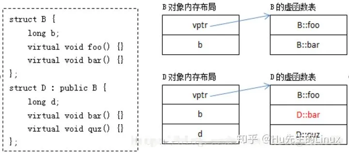
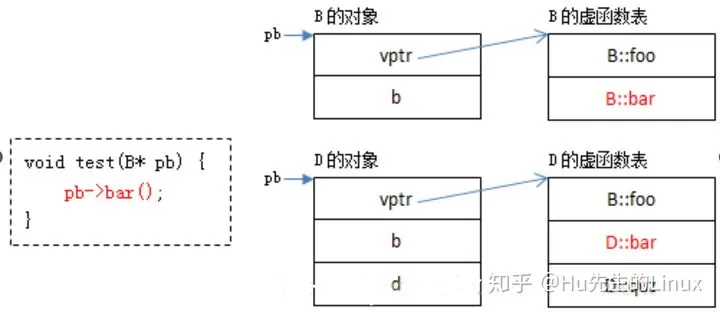
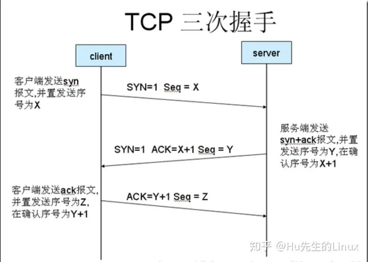
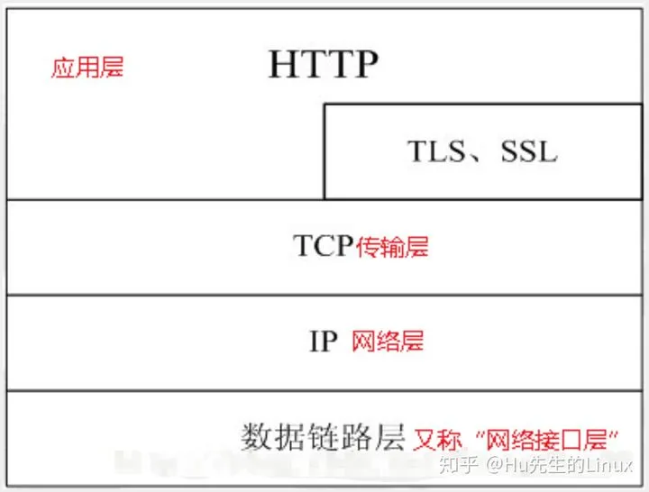
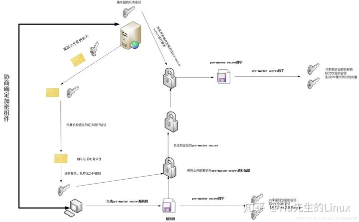
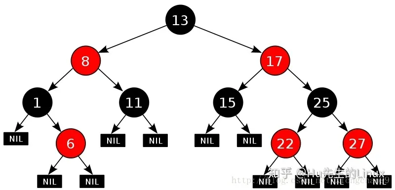
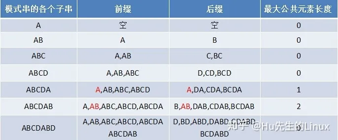

# 腾讯 C++ 笔试/面试题及答案

> 来源： CPP程序员 *2021-12-18 22:34*

## 问题点：

> 1、C和C++的特点与区别？
> 2、C++的多态
> 3、虚函数实现
> 4、C和C++内存分配问题
> 5、协程
> 6、CGI的了解
> 7、进程间通信方式和线程间通信方式
> 8、TCP握手与释放
> 9、http和https的区别？
> 10、虚拟内存的概念与介绍
> 11、单链表的反转算法
> 12、红黑树以及其查找复杂度
> 13、KPM字符串匹配
> 14、TCP超时等待、重传以及流量控制
> 15、数据库引擎
> 16、数据库索引

## 1、C和C++的特点与区别？

答：（1）C语言特点：

1.作为一种面向过程的结构化语言，易于调试和维护；

2.表现能力和处理能力极强，可以直接访问内存的物理地址；

3.C语言实现了对硬件的编程操作，也适合于应用软件的开发；

4.C语言还具有效率高，可移植性强等特点。

（2）C++语言特点：

1.在C语言的基础上进行扩充和完善，使C++兼容了C语言的面向过程特点，又成为了一种面向对象的程序设计语言；

2.可以使用抽象数据类型进行基于对象的编程；

3.可以使用多继承、多态进行面向对象的编程；

4.可以担负起以模版为特征的泛型化编程。

C++与C语言的本质差别：在于C++是面向对象的，而C语言是面向过程的。或者说C++是在C语言的基础上增加了面向对象程序设计的新内容，是对C语言的一次更重要的改革，使得C++成为软件开发的重要工具。

## 2、C++的多态

答：C++的多态性用一句话概括：在基类的函数前加上virtual关键字，在派生类中重写该函数，运行时将会根据对象的实际类型来调用相应的函数。如果对象类型是派生类，就调用派生类的函数；如果对象类型是基类，就调用基类的函数。

1）：用virtual关键字申明的函数叫做虚函数，虚函数肯定是类的成员函数；

2）：存在虚函数的类都有一个一维的虚函数表叫做虚表，类的对象有一个指向虚表开始的虚指针。虚表是和类对应的，虚表指针是和对象对应的；

3）：多态性是一个接口多种实现，是面向对象的核心，分为类的多态性和函数的多态性。；

4）：多态用虚函数来实现，结合动态绑定.；

5）：纯虚函数是虚函数再加上 = 0；

6）：抽象类是指包括至少一个纯虚函数的类；

纯虚函数：virtual void fun()=0;即抽象类，必须在子类实现这个函数，即先有名称，没有内容，在派生类实现内容。

## 3、虚函数实现

答：简单地说，每一个含有虚函数（无论是其本身的，还是继承而来的）的类都至少有一个与之对应的虚函数表，其中存放着该类所有的虚函数对应的函数指针。例：



其中：

B的虚函数表中存放着B::foo和B::bar两个函数指针。

D的虚函数表中存放的既有继承自B的虚函数B::foo，又有重写（override）了基类虚函数B::bar的D::bar，还有新增的虚函数D::quz。

虚函数表构造过程：

从编译器的角度来说，B的虚函数表很好构造，D的虚函数表构造过程相对复杂。下面给出了构造D的虚函数表的一种方式（仅供参考）：


虚函数调用过程

以下面的程序为例：



## 4、C和C++内存分配问题

答：（1）C语言编程中的内存基本构成

C的内存基本上分为4部分：静态存储区、堆区、栈区以及常量区。他们的功能不同，对他们使用方式也就不同。

1.栈 ——由编译器自动分配释放；

2.堆 ——一般由程序员分配释放，若程序员不释放，程序结束时可能由OS回收；

3.全局区（静态区）——全局变量和静态变量的存储是放在一块的，初始化的全局变量和静态变量在一块区域，未初始化的全局变量和未初始化的静态变量在相邻的另一块区域（C++中已经不再这样划分），程序结束释放；

4.另外还有一个专门放常量的地方，程序结束释放；

(a)函数体中定义的变量通常是在栈上；

(b)用malloc, calloc, realloc等分配内存的函数分配得到的就是在堆上；

(c)在所有函数体外定义的是全局量；

(d)加了static修饰符后不管在哪里都存放在全局区（静态区）；

(e)在所有函数体外定义的static变量表示在该文件中有效，不能extern到别的文件用；

(f)在函数体内定义的static表示只在该函数体内有效；

(g)另外，函数中的"adgfdf"这样的字符串存放在常量区。

（2）C++编程中的内存基本构造

在C++中内存分成5个区，分别是堆、栈、全局/静态存储区、常量存储区和代码区；

1、栈，就是那些由编译器在需要的时候分配，在不需要的时候自动清楚的变量的存储区，里面的变量通常是局部变量、函数参数等。

2、堆，就是那些由new分配的内存块，他们的释放编译器不去管，由我们的应用程序去控制，一般一个new就要对应一个delete。如果程序员没有释放掉，那么在程序结束后，操作系统会自动回收。

3、全局/静态存储区，全局变量和静态变量被分配到同一块内存中，在以前的C语言中，全局变量又分为初始化的和未初始化的，在C++里面没有这个区分了，他们共同占用同一块内存区。

4、常量存储区，这是一块比较特殊的存储区，他们里面存放的是常量，不允许修改（当然，你要通过非正当手段也可以修改）。

5、代码区 （.text段），存放代码（如函数），不允许修改（类似常量存储区），但可以执行（不同于常量存储区）。

内存模型组成部分：自由存储区，动态区、静态区；

根据c/c++对象生命周期不同，c/c++的内存模型有三种不同的内存区域，即：自由存储区，动态区、静态区。

自由存储区：局部非静态变量的存储区域，即平常所说的栈；

动态区：用new ，malloc分配的内存，即平常所说的堆；

静态区：全局变量，静态变量，字符串常量存在的位置；

注：代码虽然占内存，但不属于c/c++内存模型的一部分；

一个正在运行着的C编译程序占用的内存分为5个部分：代码区、初始化数据区、未初始化数据区、堆区 和栈区；

（1）代码区（text segment）：代码区指令根据程序设计流程依次执行，对于顺序指令，则只会执行一次（每个进程），如果反复，则需要使用跳转指令，如果进行递归，则需要借助栈来实现。注意：代码区的指令中包括操作码和要操作的对象（或对象地址引用）。如果是立即数（即具体的数值，如5），将直接包含在代码中；

（2）全局初始化数据区/静态数据区（Data Segment）：只初始化一次。

（3）未初始化数据区（BSS）：在运行时改变其值。

（4）栈区（stack）：由编译器自动分配释放，存放函数的参数值、局部变量的值等，其操作方式类似于数据结构中的栈。

（5）堆区（heap）：用于动态内存分配。

为什么分成这么多个区域？

主要基于以下考虑：

\#代码是根据流程依次执行的，一般只需要访问一次，而数据一般都需要访问多次，因此单独开辟空间以方便访问和节约空间。

\#未初始化数据区在运行时放入栈区中，生命周期短。

\#全局数据和静态数据有可能在整个程序执行过程中都需要访问，因此单独存储管理。

\#堆区由用户自由分配，以便管理。

## 5、协程

答：定义：协程是一种用户态的轻量级线程。

协程拥有自己的寄存器上下文和栈。协程调度切换时，将寄存器上下文和栈保存到其他地方，在切回来的时候，恢复先前保存的寄存器上下文和栈。因此：协程能保留上一次调用时的状态（即所有局部状态的一个特定组合），每次过程重入时，就相当于进入上一次调用的状态，换种说法：进入上一次离开时所处逻辑流的位置；

线程是抢占式，而协程是协作式；

协程的优点：

跨平台

跨体系架构

无需线程上下文切换的开销

无需原子操作锁定及同步的开销

方便切换控制流，简化编程模型

高并发+高扩展性+低成本：一个CPU支持上万的协程都不是问题。所以很适合用于高并发处理。

协程的缺点：

无法利用多核资源：协程的本质是个单线程,它不能同时将 单个CPU 的多个核用上,协程需要和进程配合才能运行在多CPU；

进行阻塞（Blocking）操作（如IO时）会阻塞掉整个程序：这一点和事件驱动一样，可以使用异步IO操作来解决。

## 6、CGI的了解

答：CGI：通用网关接口（Common Gateway Interface）是一个Web服务器主机提供信息服务的标准接口。通过CGI接口，Web服务器就能够获取客户端提交的信息，转交给服务器端的CGI程序进行处理，最后返回结果给客户端。

CGI通信系统的组成是两部分：一部分是html页面，就是在用户端浏览器上显示的页面。另一部分则是运行在服务器上的Cgi程序。

## 7、进程间通信方式和线程间通信方式

答：（1）进程间通信方式：

\# 管道( pipe )：管道是一种半双工的通信方式，数据只能单向流动，而且只能在具有亲缘关系的进程间使用。进程的亲缘关系通常是指父子进程关系。

\# 信号量( semophore ) ：信号量是一个计数器，可以用来控制多个进程对共享资源的访问。它常作为一种锁机制，防止某进程正在访问共享资源时，其他进程也访问该资源。因此，主要作为进程间以及同一进程内不同线程之间的同步手段。

\# 消息队列( message queue ) ：消息队列是由消息的链表，存放在内核中并由消息队列标识符标识。消息队列克服了信号传递信息少、管道只能承载无格式字节流以及缓冲区大小受限等缺点。

\# 共享内存( shared memory ) ：共享内存就是映射一段能被其他进程所访问的内存，这段共享内存由一个进程创建，但多个进程都可以访问。共享内存是最快的 IPC 方式，它是针对其他进程间通信方式运行效率低而专门设计的。它往往与其他通信机制，如信号两，配合使用，来实现进程间的同步和通信。

\# 套接字( socket ) ：套解口也是一种进程间通信机制，与其他通信机制不同的是，它可用于不同及其间的进程通信。

（2）线程间通信方式：

\#全局变量；

\#Messages消息机制；

\#CEvent对象（MFC中的一种线程通信对象，通过其触发状态的改变实现同步与通信）。

## 8、TCP握手与释放

答：（1）握手

\#第一次握手：主机A发送握手信号syn＝1和seq=x（随机产生的序列号）的数据包到服务器，主机B由SYN=1知道，A要求建立联机；

\#第二次握手：主机B收到请求后要确认联机信息，向A发送syn=1，ack=x（x是主机A的Seq）+1，以及随机产生的确认端序列号seq=y的包；

\#第三次握手：主机A收到后检查ack是否正确（ack=x+1），即第一次发送的seq+1，若正确，主机A会再发送ack=y+1，以及随机序列号seq=z，主机B收到后确认ack值则连接建立成功；

\#完成三次握手，主机A与主机B开始传送数据。

注：上述步骤中，第二和第三次确认包中都还包含一个标志位未予以说明，该标志位为1表示正常应答；

具体可见图片：



为什么需要“三次握手”？

“三次握手”的目的是“为了防止已失效的连接请求报文段突然又传送到了服务端，因而产生错误”。具体例如：client发出的第一个连接请求报文段并没有丢失，而是在某个网络结点长时间的滞留了，以致延误到连接释放以后的某个时间才到达server。本来这是一个早已失效的报文段。但server收到此失效的连接请求报文段后，就误认为是client再次发出的一个新的连接请求。于是就向client发出确认报文段，同意建立连接。

假设不采用“三次握手”，那么只要server发出确认，新的连接就建立了。由于现在client并没有发出建立连接的请求，因此不会理睬server的确认，也不会向server发送数据。但server却以为新的运输连接已经建立，并一直等待client发来数据。这样，server的很多资源就白白浪费掉了。采用“三次握手”的办法可以防止上述现象发生。例如刚才那种情况，client不会向server的确认发出确认。server由于收不到确认，就知道client并没有要求建立连接。主要目的防止server端一直等待，浪费资源。

（2）挥手

由于TCP连接是全双工的，因此每个方向都必须单独进行关闭。这原则是当一方完成它的数据发送任务后就能发送一个FIN来终止这个方向的连接。收到一个 FIN只意味着这一方向上没有数据流动，一个TCP连接在收到一个FIN后仍能发送数据。首先进行关闭的一方将执行主动关闭，而另一方执行被动关闭。

(1) TCP客户端发送一个FIN，用来关闭客户到服务器的数据传送(报文段4)；

(2) 服务器收到这个FIN，发回一个ACK，确认序号为收到的序号加1(报文段5)。和SYN一样，一个FIN将占用一个序号；

(3) 服务器关闭客户端的连接后，再发送一个FIN给客户端(报文段6)；

(4) 客户段收到服务端的FIN后，发回ACK报文确认，并将确认序号设置为收到序号加1(报文段7)；

注意：TCP连接的任何一方都可以发起挥手操作，上述步骤只是两种之一；

具体过程见图：


为什么是“四次挥手”？

因为当收到对方的FIN报文通知时，它仅仅表示对方没有数据发送给你了；但未必你所有的数据都全部发送给对方了，所以你可能还需要发送一些数据给对方，再发送FIN报文给对方来表示你同意现在可以关闭连接了，故这里的ACK报文和FIN报文多数情况下都是分开发送的，也就造成了4次挥手。

握手，挥手过程中各状态介绍：

（1）3次握手过程状态：

\#LISTEN: 这个也是非常容易理解的一个状态，表示服务器端的某个SOCKET处于监听状态，可以接受连接了。

\#SYN_SENT: 当客户端SOCKET执行CONNECT连接时，它首先发送SYN报文，因此也随即它会进入到了SYN_SENT状态，并等待服务端的发送三次握手中的第2个报文。SYN_SENT状态表示客户端已发送SYN报文。(发送端)

\#SYN_RCVD: 这个状态与SYN_SENT遥想呼应这个状态表示接受到了SYN报文，在正常情况下，这个状态是服务器端的SOCKET在建立TCP连接时的三次握手会话过程中的一个中间状态，很短暂，基本上用netstat你是很难看到这种状态的，除非你特意写了一个客户端测试程序，故意将三次TCP握手过程中最后一个ACK报文不予发送。因此这种状态时，当收到客户端的ACK报文后，它会进入到ESTABLISHED状态。(服务器端)

\#ESTABLISHED：这个容易理解了，表示连接已经建立了。

（2）4次挥手过程状态：

\#FIN_WAIT_1: 这个状态要好好解释一下，其实FIN_WAIT_1和FIN_WAIT_2状态的真正含义都是表示等待对方的FIN报文。而这两种状态的区别是：FIN_WAIT_1状态实际上是当SOCKET在ESTABLISHED状态时，它想主动关闭连接，向对方发送了FIN报文，此时该SOCKET即进入到FIN_WAIT_1状态。而当对方回应ACK报文后，则进入到FIN_WAIT_2状态，当然在实际的正常情况下，无论对方何种情况下，都应该马上回应ACK报文，所以FIN_WAIT_1状态一般是比较难见到的，而FIN_WAIT_2状态还有时常常可以用netstat看到。(主动方)

\#FIN_WAIT_2：上面已经详细解释了这种状态，实际上FIN_WAIT_2状态下的SOCKET，表示半连接，也即有一方要求close连接，但另外还告诉对方，我暂时还有点数据需要传送给你(ACK信息)，稍后再关闭连接。(主动方)

\#TIME_WAIT: 表示收到了对方的FIN报文，并发送出了ACK报文，就等2MSL后即可回到CLOSED可用状态了。如果FIN_WAIT_1状态下，收到了对方同时带FIN标志和ACK标志的报文时，可以直接进入到TIME_WAIT状态，而无须经过FIN_WAIT_2状态。(主动方)

\#CLOSING(比较少见): 这种状态比较特殊，实际情况中应该是很少见，属于一种比较罕见的例外状态。正常情况下，当你发送FIN报文后，按理来说是应该先收到(或同时收到)对方的ACK报文，再收到对方的FIN报文。但是CLOSING状态表示你发送FIN报文后，并没有收到对方的ACK报文，反而却也收到了对方的FIN报文。什么情况下会出现此种情况呢?其实细想一下，也不难得出结论：那就是如果双方几乎在同时close一个SOCKET的话，那么就出现了双方同时发送FIN报文的情况，也即会出现CLOSING状态，表示双方都正在关闭SOCKET连接。

\#CLOSE_WAIT: 这种状态的含义其实是表示在等待关闭。怎么理解呢?当对方close一个SOCKET后发送FIN报文给自己，你系统毫无疑问地会回应一个ACK报文给对方，此时则进入到CLOSE_WAIT状态。接下来呢，实际上你真正需要考虑的事情是察看你是否还有数据发送给对方，如果没有的话，那么你也就可以close这个SOCKET，发送FIN报文给对方，也即关闭连接。所以你在CLOSE_WAIT状态下，需要完成的事情是等待你去关闭连接。(被动方)

\#LAST_ACK: 这个状态还是比较容易好理解的，它是被动关闭一方在发送FIN报文后，最后等待对方的ACK报文。当收到ACK报文后，也即可以进入到CLOSED可用状态了。(被动方)

## 9、http和https的区别？

答：HTTPS协议是由SSL+HTTP协议构建的可进行加密传输、身份认证的网络协议，要比http协议安全。

HTTPS（Secure Hypertext Transfer Protocol）安全超文本传输协议，与http主要区别在于：

\#http是超文本传输协议，信息是明文传输，https 则是具有安全性的ssl加密传输协议；

\#http和https使用的是完全不同的连接方式用的端口也不一样,前者是80,后者是443；

下面具体介绍一下HTTP和HTTPS协议：

首先说明一下：HTTP和HTTPS协议是应用层协议；



上图充分表明：HTTP是应用层协议，并且HTTPS是在HTTP协议基础上添加SSL等加密策略后的协议；

TLS/SSL中使用了非对称加密，对称加密以及HASH算法。

（1）Http协议

1）HTTP协议和TCP协议之间的区别联系

①TPC/IP协议是传输层协议，主要解决数据如何在网络中传输，而HTTP是应用层协议，主要解决如何包装数据；

②HTTP的默认端口号是80，TCP/IP协议通信编程时端口号需要自己指定（例如socket编程）；

③HTTP协议是在TCP/IP协议基础上实现的，即HTTP数据包是经过TCP/IP协议实现传输的；

④HTTP是无状态的短连接协议，TCP是有状态的长连接协议；

HTTP是在有状态长连接TCP/IP协议的基础上实现的，为什么却是无状态短连接协议？

答：因为HTTP协议每次请求结束就会自动关闭连接，这样就变成了短连接；

短连接又导致了该次请求相关信息的丢失，也就造成了HTTP协议对于前期事务处理没有记忆能力，故为无状态协议。

2）HTTP协议其完整的工作过程可分为四步：

①连接：首先客户机与服务器需要建立连接（由TCP/IP握手连接实现）。只要单击某个超级链接，HTTP的工作开始；

②请求：建立连接后，客户机发送一个请求给服务器，请求方式的格式为：统一资源标识符（URL）、协议版本号，后边是MIME信息包括请求修饰符、客户机信息和可能的内容；

③应答：服务器接到请求后，给予相应的响应信息，其格式为一个状态行，包括信息的协议版本号、一个成功或错误的代码，后边是MIME信息包括服务器信息、实体信息和可能的内容。客户端接收服务器所返回的信息通过浏览器显示在用户的显示屏上；

④关闭：当应答结束后，浏览器和服务器关闭连接，以保证其他浏览器可以与服务器进行连接。

更完整的过程可能如下：

域名解析 --> 发起TCP的3次握手 --> 建立TCP连接后发起http请求 --> 服务器响应http请求，浏览器得到html代码 --> 浏览器解析html代码，并请求html代码中的资源（如js、css、图片等） --> 浏览器对页面进行渲染呈现给用户。

如果在以上过程中的某一步出现错误，那么产生错误的信息将返回到客户端，有显示屏输出。对于用户来说，这些过程是由HTTP自己完成的，用户只要用鼠标点击，等待信息显示就可以了。

（2）Https协议

HTTPS握手过程包括五步：

1）浏览器请求连接；

2）服务器返回证书：证书里面包含了网站地址，加密公钥，以及证书的颁发机构等信息。

3）浏览器收到证书后作以下工作：

a) 验证证书的合法性；

b) 生成随机（对称）密码，取出证书中提供的公钥对随机密码加密；

c) 将之前生成的加密随机密码等信息发送给网站；

4）服务器收到消息后作以下的操作：

a) 使用自己的私钥解密浏览器用公钥加密后的消息，并验证HASH是否与浏览器发来的一致；

b) 使用加密的随机对称密码加密一段消息，发送给浏览器；

5）浏览器解密并计算握手消息的HASH：如果与服务端发来的HASH一致，此时握手过程结束，之后所有的通信数据将由之前浏览器生成的随机密码并利用对称加密算法进行加密。

注意：服务器有两个密钥，一个公钥、一个私钥，只有私钥才可以解密公钥加密的消息；

如图：


或者如下图：



HTTPS协议、SSL、和数字证书的关系介绍：

概述：对于HTTPS协议，所有的消息都是经过SSL协议方式加密，而支持加密的文件正是数字证书；

（1）SSL

SSL常用的加密算法：对称密码算法、非对称密码算法、散列算法；

SSL的加密过程：需要注意的是非对称加解密算法的效率要比对称加解密要低的多。所以SSL在握手过程中使用非对称密码算法来协商密钥，实际使用对称加解密的方法对http内容加密传输；

（2）数字证书

数字证书是用于在INTERNET上标识个人或者机构身份的一种技术手段，它通过由一些公认的权威机构所认证，从而可以保证其安全地被应用在各种场合。证书里面包含了网站地址，加密公钥，以及证书的颁发机构等信息。

## 10、虚拟内存的概念与介绍

答：虚拟内存中，允许将一个作业分多次调入内存，需要时就调入，不需要的就先放在外存。因此，虚拟内存的实需要建立在离散分配的内存管理方式的基础上。虚拟内存的实现有以下三种方式：

\#请求分页存储管理

\#请求分段存储管理

\#请求段页式存储管理

虚拟内存的意义：

一，虚拟内存可以使得物理内存更加高效。虚拟内存使用置换方式，需要的页就置换进来，不需要的置换出去，使得内存中只保存了需要的页，提高了利用率，也避免了不必要的写入与擦除；

二，使用虚拟地址可以使内存的管理更加便捷。在程序编译的时候就会生成虚拟地址，该虚拟地址并不是对应一个物理地址，使得也就极大地减少了地址被占用的冲突，减少管理难度；

三，为了安全性的考虑。在使用虚拟地址的时候，暴露给程序员永远都是虚拟地址，而具体的物理地址在哪里，这个只有系统才了解。这样就提高了系统的封装性。

## 11、单链表的反转算法

答：思想：创建3个指针，分别指向上一个节点、当前节点、下一个节点，遍历整个链表的同时，将正在访问的节点指向上一个节点，当遍历结束后，就同时完成了链表的反转。

实现代码：

```cpp
ListNode* ReverseList(ListNode* pHead) {
    ListNode *p, *q, *r;
    if (pHead == NULL || pHead->next == NULL) {
        return pHead;
    } else {
        p = pHead;
        q = p->next;
        pHead->next = NULL;
        while (q != NULL) {
            r = q->next;
            q->next = p;
            p = q;
            q = r;
        }
        return p;
    }
}
```

## 12、红黑树以及其查找复杂度

答：（1）红黑树来源于二叉搜索树，其在关联容器如map中应用广泛，主要优势在于其查找、删除、插入时间复杂度小，但其也有缺点，就是容易偏向一边而变成一个链表。

红黑树是一种二叉查找树，但在每个结点上增加一个存储位表示结点的颜色，可以是Red或Black。也就是说，红黑树是在二叉查找树基础上进一步实现的；

红黑树的五个性质：

性质1. 节点是红色或黑色；

性质2. 根节点是黑色；

性质3 每个叶节点（指树的末端的NIL指针节点或者空节点）是黑色的；

性质4 每个红色节点的两个子节点都是黑色。(从每个叶子到根的所有路径上不能有两个连续的红色节点)；

性质5. 从任一节点到其每个尾端NIL节点或者NULL节点的所有路径都包含相同数目的黑色节点。

（注：上述第3、5点性质中所说的NIL或者NULL结点，并不包含数据，只充当树的路径结束的标志，即此叶结点非常见的叶子结点）。



因为一棵由n个结点随机构造的二叉查找树的高度为lgn，所以顺理成章，二叉查找树的一般操作的执行时间为O(lgn)。但二叉查找树若退化成了一棵具有n个结点的线性链后，则这些操作最坏情况运行时间为O(n)；

红黑树虽然本质上是一棵二叉查找树，但它在二叉查找树的基础上增加以上五个性质使得红黑树相对平衡，从而保证了红黑树的查找、插入、删除的时间复杂度最坏为O(log n)。

（2）左旋右旋

红黑树插入或删除后，一般就会改变红黑树的特性，要恢复红黑树上述5个性质，一般都要那就要做2方面的工作：

1、部分结点颜色，重新着色

2、调整部分指针的指向，即左旋、右旋。

左选右旋如图所示：


左旋，如图所示（左->右），以x->y之间的链为“支轴”进行，使y成为该新子树的根，x成为y的左孩子，而y的左孩子则成为x的右孩子。算法很简单，旋转后各个结点从左往右，仍然都是从小到大。

左旋代码实现，分三步:

（1） 开始变化，y的左孩子成为x的右孩子；

（2） y成为x的父结点；

（3） x成为y的左孩子；

右旋类似，不再累述；

## 13、KMP字符串匹配

（1）KMP匹配算法代码实现

```c++
int KmpSearch(char* s, char* p) {
    int i = 0;
    int j = 0;
    int sLen = strlen(s);
    int pLen = strlen(p);
    while (i < sLen && j < pLen) { 
        //①如果j = -1，或者当前字符匹配成功（即S[i] == P[j]），都令i++，j++        
        if (j == -1 || s[i] == p[j]) {
            i++;
            j++;
        } else {
            //②如果j != -1，且当前字符匹配失败（即S[i] != P[j]），则令 i 不变，j = next[j]
            // next[j]即为j所对应的next值
            j = next[j];
        }
    }
    if (j == pLen)
        return i - j;
    else
        return -1;
}
```

（2）next数组求取

上述（1）中最重要的就是：一旦不匹配，模式串不是向后移动一位，而是根据前面匹配信息移动多位。而这个多位获得就是根据next数组，下面有next数组的求取方式：

Next数组是根据模式串的前缀后缀获取的，如下：

①寻找前缀后缀最长公共元素长度

举个例子，如果给定的模式串为“abab”，那么它的各个子串的前缀后缀的公共元素的最大长度如下表格所示：


比如对于字符串aba来说，它有长度为1的相同前缀后缀a；而对于字符串abab来说，它有长度为2的相同前缀后缀ab（相同前缀后缀的长度为k + 1，k + 1 = 2）。

②求next数组

next 数组考虑的是除当前字符外的最长相同前缀后缀，所以通过第①步骤求得各个前缀后缀的公共元素的最大长度后，只要稍作变形即可：将第①步骤中求得的数组整体右移一位，然后第一个元素赋为-1即可（注意：字符串下标需要从0开始），如下表格所示：


比如对于aba来说，第3个字符a之前的字符串ab中有长度为0的相同前缀后缀，所以第3个字符a对应的next值为0；而对于abab来说，第4个字符b之前的字符串aba中有长度为1的相同前缀后缀a，所以第4个字符b对应的next值为1（相同前缀后缀的长度为k，k = 1）。

KMP的next 数组相当于告诉我们：当模式串中的某个字符跟文本串中的某个字符匹配失配时，模式串下一步应该跳到哪个位置（具体：保持测试串的下标i不变，使得匹配串的下标j=next[j]）。

前缀后缀长度求取以及next数组获取：

如果给定的模式串是：“ABCDABD”，从左至右遍历整个模式串，其各个子串的前缀后缀分别如下表格所示：



也就是说，原模式串子串对应的各个前缀后缀的公共元素的最大长度表为：

0 0 0 0 1 2 0；

故对应的next数组为：-1 0 0 0 0 1 2；

（注意：这里的字符串下标是从0开始的，若从1开始，next数组所有元素都对应要加1。）

求取next的实现代码：

```c++
int main() {
    string T;  // T为模式串
    cin >> T;    
    int len = T.size();    
    queue<int> MaxLen;    
    vector<int> next;    
    MaxLen.push(0);  //第一个元素都设为0    
    for (int i = 1; i < len; i++) {        
        int k = 1, maxLen = 0;        
        while (k <= i) {            
            if (T.substr(0, k) == T.substr(i - k + 1, k)) {                
                maxLen = k;            
            }            
            k++;        
        }        
        MaxLen.push(maxLen);    
    }    
    cout << endl;    
    next.push_back(-1);  //第一个元素都设为-1    
    while (MaxLen.size() > 1) {        
        int temp = MaxLen.front();        
        next.push_back(temp);        
        MaxLen.pop();        
        cout << temp << ' ';    
    }
}
```

## 14、TCP超时等待、重传以及流量控制

答：TCP等待时间需要设定，超过了就认为丢包，需要重传；

为了防止拥塞情况，一般会采用流量控制，其实现手段是用滑动窗口限制客户端发送分组数量；

## 15、数据库引擎

答：数据库引擎是用于存储、处理和保护数据的核心服务。利用数据库引擎可控制访问权限并快速处理事务，从而满足企业内大多数需要处理大量数据的应用程序的要求。

简言之，数据库引擎就是一段用于支撑所有数据库操作的核心程序，就如名称一样，是一个车的引擎功能；

常见的数据库引擎有：

（1）Microsoft JET (Joint Engineering Technologe) 用于Access和VB的内嵌数据库功能的核心元素；

（2）ODBC（Open DataBase Connectivity，开放数据库互连）是由Microsoft定义的一种数据库访问标准，它提供一种标准的数据库访问方法以访问不同平台的数据库。一个ODBC应用程序既可以访问在本地PC机上的数据库，也可以访问多种异构平台上的数据库，例如SQL Server、Oracle或者DB2；

（3）OLE DB是Microsoft开发的最新数据库访问接口，Microsoft将其定义为ODBC接班人；

（4）MYSQL支持三个引擎：ISAM、MYISAM和HEAP。另外两种类型INNODB和BERKLEY（BDB）也常常可以使用；

①ISAM执行读取操作的速度很快，而且不占用大量的内存和存储资源。ISAM的两个主要不足之处在于，它不 支持事务处理，也不能够容错；

②MyISAM是MySQL的ISAM扩展格式和缺省的数据库引擎MYISAM。除了提供ISAM里所没有的索引和字段管理的大量功能，MyISAM还使用一种表格锁定的机制，来优化多个并发的读写操作，其代价是你需要经常运行OPTIMIZE TABLE命令，来恢复被更新机制所浪费的空间；

③HEAP允许只驻留在内存里的临时表格。驻留在内存里让HEAP要比ISAM和MYISAM都快，但是它所管理的数据是不稳定的，而且如果在关机之前没有进行保存，那么所有的数据都会丢失。

## 16、数据库索引

答：定义：数据库索引是对数据库表中一列或多列的值进行排序的一种结构，使用索引可快速访问数据库表中的特定信息；

举例：employee 表的人员编号列（id）就是数据库索引，select * from employee where id=10000即可查找编号10000的人员信息。如果没有索引，必须遍历整个表直到id=10000；

数据库索引作用：

一，大大加快 数据的检索速度，这也是创建索引的最主要的原因；

二，保证数据库表中每一行数据的唯一性；

三，可以加速表和表之间的连接，特别是在实现数据的参考完整性方面特别有意义；

四，在使用分组和排序子句进行数据检索时，同样可以显著减少查询中分组和排序的时间；

五，通过使用索引，可以在查询的过程中，使用优化隐藏器，提高系统的性能。

数据库索引缺陷：

一，表的增删改查、创建索引和维护索引要耗费时间；

二，索引需要占物理空间；

数据库索引的两个特征：索引有两个特征，即唯一性索引和复合索引；

①唯一 性索引保证在索引列中的全部数据是唯一的，不会包含冗余数据；

②复合索引就是一个索引创建在两个列或者多个列上，搜索时需要两个或者多个索引列作为一个关键值；

数据库索引好比是一本书前面的目录，索引分为聚簇索引和非聚簇索引两类：

1）聚簇索引是按照数据存放的物理位置为顺序的，其多个连续行的访问速度更快；

2）非聚簇索引是按照数据存放的逻辑位置为顺序的，其单行访问速度更快；

局部性原理与磁盘预读

局部性原理：当一个数据被用到时，其附近的数据也通常会马上被使用。程序运行期间所需要的数据通常比较集中；

磁盘预读：正是由于局部性原理以及数据存储磁盘的读写速度慢的原因，每次对数据库进行读取都不是按需读取，而是读取多于需求数据区域内的数据到内存，用于后续使用，提高写读取数据速度；

注：磁盘预读一般都是每次读取逻辑上的一页，或物理上的一块，不管实际需求是多少；

数据库索引的实现通常使用B树及其变种B+树，下面进行B-/+Tree结构的数据库索引的性能分析：

（1）B树索引结构：

数据库系统的设计者巧妙利用了磁盘预读原理，将B树的一个节点的大小设为等于一个页，这样每个节点只需要一次I/O就可以完全载入。为了达到这个目的，在实际实现B-Tree还需要使用如下技巧：

——每次新建节点时，直接申请一个页的空间，这样就保证一个节点物理上也存储在一个页；B-Tree中一次检索最多需要h-1次I/O（磁盘IO不包括根节点，因为根节点常驻内存），渐进复杂度为O(h)=O(logdN)。一般实际应用中，出度d是非常大的数字，通常超过100，因此h非常小（通常不超过3）。

而红黑树这种结构，h明显要深的多。由于逻辑上很近的节点（父子）物理上可能很远，无法利用局部性，所以红黑树的I/O渐进复杂度也为O(h)，效率明显比B-Tree差很多。

所以，B树结构的数据库索引，在元素查找上效率很高；

（2）B+树的索引结构：

B+树则适当牺牲检索的时间复杂度（都必须检索到叶子结点），但改善了节点插入和删除的时间复杂度（类似用链表改善数组的效果），所以B+树属于一种折中选择。

来源 | 知乎